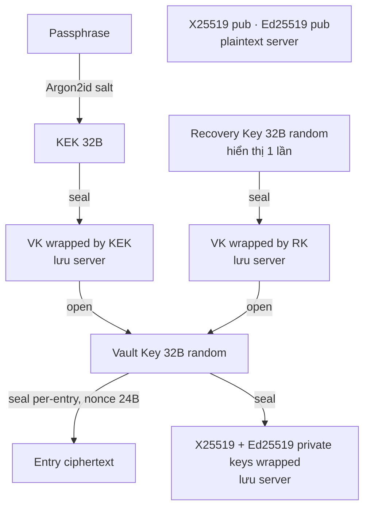
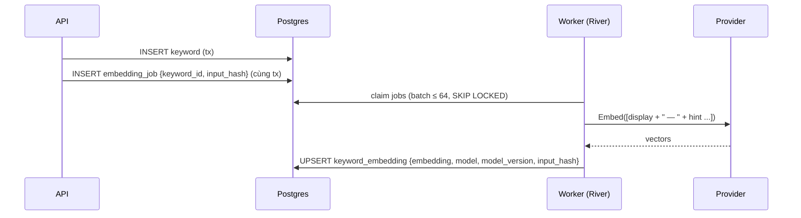

# save-all-by-keyword — Project Specification

> Phiên bản: 0.1 (draft) · Ngày: 2026-09-14 · Trạng thái: chờ review
>
> Tài liệu này là spec tổng thể cho sản phẩm **save-all-by-keyword**: lưu mọi thông tin dưới dạng **keyword → nhiều entry**, tìm kiếm cực nhanh (lexical + semantic), nội dung entry được **mã hoá đầu-cuối (E2E)** bằng key chỉ client nắm giữ.

## Mục lục

1. [Tổng quan, mục tiêu, non-goals, personas](#1-tổng-quan-mục-tiêu-non-goals-personas)
2. [Domain model](#2-domain-model)
3. [User stories & main flows](#3-user-stories--main-flows)
4. [Kiến trúc tổng thể](#4-kiến-trúc-tổng-thể)
5. [Mô hình mã hoá E2E](#5-mô-hình-mã-hoá-e2e)
6. [Search & suggestion design](#6-search--suggestion-design)
7. [UI/UX spec](#7-uiux-spec)
8. [Data model / Postgres schema](#8-data-model--postgres-schema)
9. [API design](#9-api-design)
10. [Non-functional requirements](#10-non-functional-requirements)
11. [Project structure & dev tooling](#11-project-structure--dev-tooling)
12. [Roadmap](#12-roadmap)
13. [Câu hỏi mở còn lại](#13-câu-hỏi-mở-còn-lại)
14. [Glossary](#14-glossary)

---

## 1. Tổng quan, mục tiêu, non-goals, personas

### 1.1 Tổng quan

**save-all-by-keyword** là web app cho phép người dùng lưu nhanh các mẩu thông tin (text) dưới một hoặc nhiều **keyword**, sau đó tìm lại bằng cách gõ vài ký tự. Điểm khác biệt:

- **Search-first**: một ô omnibox duy nhất vừa để tìm, vừa để thêm (`keyword: nội dung`).
- **Gợi ý thông minh**: autocomplete theo prefix, fuzzy (gõ sai chính tả vẫn ra), và **semantic** (gõ "mật khẩu wifi" vẫn ra keyword `wifi-password`) nhờ pgvector.
- **E2E encryption cho nội dung**: server chỉ nhìn thấy keyword; nội dung entry là ciphertext, key nằm ở browser người dùng.
- **Server-first, multi-device**: đăng nhập trên máy khác, nhập passphrase là có toàn bộ dữ liệu.

### 1.2 Mục tiêu (Goals)

| # | Mục tiêu | Đo lường |
|---|----------|----------|
| G1 | Thêm một entry mới trong ≤ 3 giây từ lúc focus omnibox | UX test |
| G2 | Gợi ý keyword hiển thị trong < 150 ms end-to-end khi gõ | p95, 100k keyword/user |
| G3 | Nội dung entry không bao giờ rời browser ở dạng plaintext | Code review + threat model §5.8 |
| G4 | Hỗ trợ đầy đủ tiếng Việt và tiếng Anh (UI + search) | i18n en/vi, embedding multilingual |
| G5 | Mô hình key không chặn tính năng chia sẻ (sharing) ở phase sau | Thiết kế §5.3 |

### 1.3 Non-goals (MVP)

- **Không** offline / PWA / local-first sync. App yêu cầu online.
- **Không** tìm kiếm full-text trong nội dung entry ở phía server (không thể — nội dung đã mã hoá).
- **Không** chia sẻ dữ liệu giữa user (Phase 3).
- **Không** lưu file/link/ảnh (chỉ text; schema chừa chỗ).
- **Không** native mobile app, browser extension (Phase 3).
- **Không** collaborative editing, comment, version history chi tiết.

### 1.4 Personas

| Persona | Mô tả | Nhu cầu chính |
|---------|-------|---------------|
| **Minh — Developer** | Lưu snippet lệnh, config, ghi chú kỹ thuật rải rác | Gõ `docker: lệnh xoá volume` là xong; tìm lại bằng `dock`, `xoá vol` |
| **Lan — Knowledge worker** | Lưu note họp, link đọc sau, ý tưởng | Semantic search: gõ "họp marketing tuần này" ra keyword `meeting-mkt` |
| **An — Privacy-conscious** | Lưu thông tin nhạy cảm (số hợp đồng, ghi chú cá nhân) | Đảm bảo server không đọc được nội dung; recovery key rõ ràng |

---

## 2. Domain model

### 2.1 Các thực thể

| Entity | Plaintext trên server? | Mô tả |
|--------|------------------------|-------|
| **User** | ✔ | Tài khoản; email, locale, auth providers |
| **AuthIdentity** | ✔ | Liên kết OAuth (google/github) hoặc password hash |
| **Session** | ✔ | Refresh token hash, device info, thời hạn |
| **Vault** | ✔ (chỉ metadata + wrapped keys) | Bộ key của user: `vault_key` được wrap bởi KEK (từ passphrase) và bởi Recovery Key; keypair X25519/Ed25519 (public plaintext, private wrapped) |
| **Keyword** | ✔ | Từ khoá per-user, unique theo `normalized`; có `display` giữ nguyên cách viết của user |
| **KeywordEmbedding** | ✔ | Vector của keyword (+ hint), kèm `model`, `model_version`, `dims` |
| **Entry** | ✘ body (ciphertext) · ✔ metadata (id, timestamps, type, size) | Nội dung người dùng lưu |
| **EntryKeyword** | ✔ | Bảng nối N–N Entry ↔ Keyword |
| **EmbeddingJob** | ✔ | Hàng đợi embed/re-embed |
| **AuditLog** | ✔ | Sự kiện bảo mật (login, đổi passphrase, export...) |

### 2.2 Quyết định thiết kế

**Keyword: `normalized` + `display`.**
`normalized` = NFC → lowercase → trim → collapse whitespace → bỏ dấu câu đầu/cuối. **Giữ dấu tiếng Việt** (không strip diacritics) vì `mã` ≠ `ma`; fuzzy/unaccent phục vụ ở tầng search (§6), không ở tầng identity. `display` là cách người dùng gõ lần đầu (có thể rename). Unique constraint: `(user_id, normalized)`.

**Entry ↔ Keyword là N–N (một entry có thể có nhiều keyword).** Lý do:

- Một mẩu thông tin thường thuộc nhiều ngữ cảnh (`wifi` + `nhà-bố-mẹ`). Nếu 1–N, user phải duplicate entry → dữ liệu lệch khi sửa.
- Rename/merge keyword không đụng vào ciphertext.
- Chi phí: một bảng nối; query "entries của keyword X" vẫn là join đơn giản, có index.
- Ràng buộc UX: mỗi entry phải có **≥ 1 keyword** (enforce ở API; nếu gỡ keyword cuối → hỏi xoá entry).

**Keyword có `hint` tùy chọn (plaintext, ≤ 120 ký tự).** Người dùng có thể mô tả ngắn keyword để embedding tốt hơn (ví dụ keyword `k8s` với hint "kubernetes commands"). Hint là **opt-in** và có cảnh báo rõ là server đọc được.

### 2.3 ER diagram

```mermaid
erDiagram
    USER ||--o{ AUTH_IDENTITY : has
    USER ||--o{ SESSION : has
    USER ||--|| VAULT : owns
    USER ||--o{ KEYWORD : owns
    USER ||--o{ ENTRY : owns
    USER ||--o{ AUDIT_LOG : generates
    KEYWORD ||--o| KEYWORD_EMBEDDING : has
    KEYWORD ||--o{ ENTRY_KEYWORD : tagged
    ENTRY ||--o{ ENTRY_KEYWORD : tagged
    KEYWORD ||--o{ EMBEDDING_JOB : queued

    USER {
        uuid id PK
        text email UK
        text locale
        timestamptz created_at
    }
    AUTH_IDENTITY {
        uuid id PK
        uuid user_id FK
        text provider "password|google|github"
        text provider_uid
        text password_hash "argon2id, chỉ khi provider=password"
    }
    SESSION {
        uuid id PK
        uuid user_id FK
        bytea refresh_token_hash
        text device_label
        timestamptz expires_at
    }
    VAULT {
        uuid user_id PK_FK
        int version
        jsonb kdf_params "argon2id m,t,p + salt"
        bytea vault_key_wrapped_by_kek
        bytea vault_key_wrapped_by_recovery
        bytea x25519_public
        bytea ed25519_public
        bytea private_keys_wrapped
    }
    KEYWORD {
        uuid id PK
        uuid user_id FK
        text normalized
        text display
        text hint
        int entry_count
        timestamptz last_used_at
    }
    KEYWORD_EMBEDDING {
        uuid keyword_id PK_FK
        vector embedding
        text model
        text model_version
        text input_hash
    }
    ENTRY {
        uuid id PK
        uuid user_id FK
        text content_type "text/plain"
        jsonb envelope "v, alg, key_id, nonce"
        bytea ciphertext
        int plaintext_len_bucket
        timestamptz created_at
        timestamptz updated_at
    }
    ENTRY_KEYWORD {
        uuid entry_id FK
        uuid keyword_id FK
        int position
    }
```

---

## 3. User stories & main flows

### 3.1 User stories (ưu tiên MVP)

- **US1** Là user mới, tôi đăng ký bằng email/password hoặc Google/GitHub, sau đó đặt **encryption passphrase** và nhận **recovery key**.
- **US2** Là user, tôi gõ `wifi: Abc123` vào omnibox và Enter → entry được tạo dưới keyword `wifi`.
- **US3** Là user, khi gõ `wi` tôi thấy gợi ý `wifi`, `wifi-office`, và cả `mạng nhà` (semantic) nếu có hint.
- **US4** Là user, tôi mở keyword để xem danh sách entry, sửa, xoá, gắn thêm keyword khác.
- **US5** Là user, đăng nhập trên máy mới, tôi nhập passphrase để **unlock vault**; dữ liệu hiện ra.
- **US6** Là user, tôi đổi passphrase mà không cần re-encrypt toàn bộ dữ liệu.
- **US7** Là user quên passphrase, tôi dùng recovery key để đặt passphrase mới.
- **US8** Là user, tôi export dữ liệu (encrypted backup, hoặc decrypted JSON có cảnh báo).
- **US9** Là user, tôi chọn ngôn ngữ giao diện en/vi.

### 3.2 Flow: Sign up → passphrase → recovery key

```mermaid
sequenceDiagram
    participant B as Browser
    participant A as Go API
    participant DB as Postgres
    B->>A: POST /auth/signup (email+pw) hoặc OAuth callback
    A->>DB: tạo user, auth_identity, session
    A-->>B: session cookie (HttpOnly)
    Note over B: Onboarding: nhập passphrase (≥ 12 ký tự, zxcvbn ≥ 3)
    B->>B: salt = random(16); KEK = Argon2id(passphrase, salt)
    B->>B: VK = random(32); RK = random(32)
    B->>B: kp = X25519+Ed25519 keygen
    B->>B: wrapK = seal(VK, KEK); wrapR = seal(VK, RK); wrapP = seal(priv, VK)
    B->>A: POST /vault {kdf_params, wrapK, wrapR, pubkeys, wrapP}
    A->>DB: insert vault
    Note over B: Hiển thị RK (base32 + BIP39 tùy chọn), bắt user xác nhận đã lưu
    B->>B: VK giữ trong memory (non-extractable), xoá passphrase
```

### 3.3 Flow: Unlock trên thiết bị mới

1. Đăng nhập (email hoặc OAuth) → session.
2. `GET /vault` → nhận `kdf_params`, `wrapK`.
3. Browser: `KEK = Argon2id(passphrase, salt)`; `VK = open(wrapK, KEK)`. Sai passphrase → AEAD fail → báo "Passphrase không đúng" (không phân biệt được với data hỏng, chấp nhận).
4. VK giữ trong memory tab (không lưu localStorage). Tùy chọn "Nhớ trên thiết bị này" → wrap VK bằng key WebCrypto non-extractable lưu trong IndexedDB (§5.6).

### 3.4 Flow: Add entry via omnibox

Cú pháp nhanh: `keyword: nội dung` hoặc `kw1, kw2: nội dung`.

1. Parse client-side: tách tại dấu `:` đầu tiên **không nằm trong URL** (`http://` được bảo vệ bằng regex `^\s*([^:]+?)\s*:\s*(?!//)(.+)$`).
2. Với mỗi keyword: `POST /keywords` (idempotent theo `normalized`) hoặc lấy id từ suggestion cache.
3. Encrypt: `envelope = {v:1, alg:"xchacha20poly1305", key_id, nonce}`; `ciphertext = seal(utf8(text), VK, nonce, aad=canonical(envelope))`.
4. `POST /entries {envelope, ciphertext, keyword_ids}` với header `Idempotency-Key`.
5. Server enqueue embedding job nếu keyword mới/rename.
6. UI: optimistic insert, toast "Đã lưu vào **wifi**" với action Undo (5 s).

Không có dấu `:` → coi là **search**.

### 3.5 Flow: Search & suggest

Gõ → debounce 120 ms → `GET /suggest?q=` → dropdown. Enter trên suggestion → mở keyword page. `Ctrl+Enter` → tạo keyword mới với chính text đang gõ. Chi tiết §6, §7.

### 3.6 Flow: View / edit / delete

- Keyword page liệt kê entries (mới nhất trước), decrypt lazy khi render.
- Edit inline: encrypt lại với **nonce mới**, `PUT /entries/:id` (optimistic concurrency bằng `If-Match: <updated_at>`).
- Delete: soft delete 30 ngày (`deleted_at`), có Undo; purge job.

### 3.7 Flow: Đổi passphrase (rewrap only)

1. Yêu cầu passphrase cũ (verify bằng cách unwrap VK — hoặc dùng VK đang có trong memory + re-auth).
2. `salt' = random`; `KEK' = Argon2id(new, salt')`; `wrapK' = seal(VK, KEK')`.
3. `PUT /vault/kek {kdf_params', wrapK'}`; server tăng `vault.version`, revoke các session khác (tùy chọn), ghi audit.
4. **Không** đụng entries. **Không** đổi recovery key (VK không đổi). Cho phép "Tạo recovery key mới" riêng.

### 3.8 Flow: Recovery

1. Đăng nhập bình thường (auth độc lập với vault).
2. Nhập recovery key → `VK = open(wrapR, RK)`.
3. Đặt passphrase mới → rewrap như §3.7. Đề nghị **tạo recovery key mới** (RK cũ đã gõ vào máy này).
4. Nếu mất cả passphrase và RK: **dữ liệu entry mất vĩnh viễn**; keywords vẫn còn. Cho phép "Reset vault" (xoá entries, tạo vault mới). Phải nêu rõ trong onboarding.

### 3.9 Flow: Export

- **Encrypted backup** (`.sabk.json`): toàn bộ keywords + entries ciphertext + vault wraps. Import lại được với passphrase/RK. Không cần VK để tạo (server tạo được).
- **Decrypted JSON**: client decrypt toàn bộ rồi tải xuống. Modal cảnh báo + re-auth. Ghi audit "export.decrypted".

---

## 4. Kiến trúc tổng thể

```mermaid
flowchart LR
    subgraph Client["Browser (Next.js app, client components)"]
        UI[UI / Omnibox]
        CR[Crypto module<br/>libsodium-wrappers<br/>Argon2id · XChaCha20-Poly1305 · X25519/Ed25519]
        UI --> CR
    end

    subgraph Edge["Next.js server (SSR)"]
        MK[Marketing / Docs / Pricing<br/>SSR + SEO + locale routing]
        SH[App shell<br/>SSR khung, không SSR dữ liệu]
    end

    subgraph API["Go API (chi)"]
        AU[Auth · Sessions]
        KW[Keywords · Suggest · Search]
        EN[Entries (ciphertext blobs)]
        VA[Vault keys]
        EX[Export]
        WK[Worker: embedding jobs]
        EP[Embedding Provider<br/>interface]
    end

    subgraph Data
        PG[(Postgres 16<br/>+ pgvector + pg_trgm)]
        RD[(Redis — optional<br/>rate limit / cache)]
    end

    subgraph Ext["Embedding providers (swappable)"]
        OA[OpenAI text-embedding-3-small]
        GE[Gemini embedding]
        CO[Cohere embed-multilingual-v3]
        SH2[Self-hosted bge-m3 / e5<br/>ONNX hoặc sidecar]
    end

    UI -- HTTPS JSON --> API
    MK -.-> UI
    AU & KW & EN & VA & EX --> PG
    WK --> PG
    WK --> EP
    EP --> OA & GE & CO & SH2
    KW -. cache .-> RD
```

### 4.1 Cái gì chạy ở đâu

| Thành phần | Chạy ở | Ghi chú |
|-----------|--------|---------|
| Marketing/landing/docs/pricing | Next.js SSR/SSG | SEO, `hreflang` en/vi, sitemap |
| App shell (`/app/*`) | Next.js, `noindex`, client components | Không SSR dữ liệu user (không có VK ở server) |
| **Toàn bộ crypto** | Browser (Web Worker) | Server không bao giờ nhận passphrase, KEK, VK, plaintext |
| Auth, sessions | Go API | Cookie HttpOnly, SameSite=Lax, refresh rotation |
| Keyword CRUD, suggest, search | Go API + Postgres | Lexical (pg_trgm, tsvector) + vector (pgvector) |
| Entry CRUD | Go API + Postgres | Server lưu blob opaque, validate kích thước & envelope schema |
| Embedding | Go worker → provider | Async qua job table (`SELECT … FOR UPDATE SKIP LOCKED`) hoặc River |
| Rate limit / cache suggest | Go in-memory (MVP) → Redis khi scale ngang | |

### 4.2 Backend stack (Go) — khuyến nghị

| Lớp | Chọn | Lý do ngắn |
|-----|------|-----------|
| HTTP router | **chi** (`go-chi/chi/v5`) | Chuẩn `net/http`, middleware composable, nhẹ, không magic; Gin/Echo nhanh hơn không đáng kể cho workload I/O-bound này |
| DB driver | **pgx v5** (pool) | Native Postgres, hỗ trợ `vector` qua `pgvector-go`, COPY, batch |
| Query layer | **sqlc** | SQL thật, type-safe compile-time, hợp với query pgvector/pg_trgm phức tạp mà ORM khó biểu đạt |
| Migration | **golang-migrate** (SQL files) | Đơn giản, chạy trong CI/CD và `make migrate` |
| Job queue | **River** (`riverqueue/river`) — Postgres-backed | Không thêm hạ tầng; transactional enqueue cùng insert keyword; retry/backoff sẵn |
| Validation | `go-playground/validator` | |
| Auth | `golang.org/x/oauth2` + `coreos/go-oidc`; password `alexedwards/argon2id` | |
| Config/log/metrics | `envconfig`, `log/slog`, OpenTelemetry + Prometheus | |
| Test | `testcontainers-go` (Postgres+pgvector image) | |

### 4.3 Frontend stack

Next.js 15 App Router, TypeScript, Tailwind + shadcn/ui (Radix), TanStack Query (cache + optimistic), `next-intl` (i18n), `libsodium-wrappers-sumo` chạy trong Web Worker, `cmdk` cho command-palette omnibox, Zod cho schema.

### 4.4 Embedding provider abstraction

```go
// apps/api/internal/embedding/provider.go
type Provider interface {
    // Name trả về định danh ổn định, ví dụ "openai/text-embedding-3-small@2024-01".
    Name() string
    Dims() int
    MaxBatch() int
    Embed(ctx context.Context, inputs []string) ([][]float32, error)
}
```

Implement: `openai`, `gemini`, `cohere`, `local` (HTTP tới sidecar `text-embeddings-inference` hoặc Ollama), `noop` (test). Chọn qua env `EMBEDDING_PROVIDER`. Mỗi vector lưu `model` + `model_version`; đổi provider → re-embed job toàn bộ (§6.6).

---

## 5. Mô hình mã hoá E2E

### 5.1 Phạm vi (scope) — tuyên bố rõ

| Dữ liệu | Trạng thái trên server | Lý do |
|---------|------------------------|-------|
| Entry body (text) | **Ciphertext** | Đây là thứ cần bảo vệ |
| Keyword `normalized`, `display`, `hint` | **Plaintext** | Server cần để lexical search, autocomplete, embedding, vector search |
| Entry id, timestamps, content_type, số keyword, `plaintext_len_bucket` | Plaintext | Vận hành, sắp xếp, phân trang |
| Email, locale, session | Plaintext | Auth |

**Trade-off được chấp nhận:** server (và attacker chiếm được DB) **biết user có những keyword gì và bao nhiêu entry mỗi keyword**, nhưng **không biết nội dung**. Keyword thường là nhãn ngắn ("wifi", "bank", "ý tưởng") — rủi ro rò rỉ ngữ nghĩa là có thật và phải được nêu trong Privacy statement (§10.4).

**Mitigations (không over-engineer ở MVP):**

- Onboarding tip: "Keyword hiển thị với server; đừng đặt keyword là bí mật. Ví dụ dùng `bank` thay vì `bank-vietcombank-0123`."
- `hint` là opt-in, có nhãn "server có thể đọc".
- **Future (Phase 2, câu hỏi mở):** flag `is_private` cho keyword → `display` được mã hoá, server chỉ lưu `blind_index = HMAC(VK_idx, normalized)` cho exact-match; keyword private **không** có autocomplete/semantic. Không làm ở MVP.
- Không log query string ở tầng access log (chỉ log độ dài, latency).

### 5.2 Nguyên lý

1. Passphrase, KEK, Vault Key, plaintext **không bao giờ** rời browser.
2. Một **Vault Key (VK)** đối xứng duy nhất mã hoá mọi entry → đổi passphrase chỉ **rewrap**, O(1).
3. Mọi ciphertext có **envelope phiên bản** để migrate thuật toán.
4. Khoá bất đối xứng được sinh **ngay từ đầu** (dù chưa dùng) để sharing sau không cần migrate.

### 5.3 Key hierarchy



| Key | Sinh ở | Lưu ở | Dùng để |
|-----|--------|-------|---------|
| Passphrase | user | không lưu | Derive KEK |
| KEK | browser, `crypto_pwhash` Argon2id | memory tạm | Wrap/unwrap VK |
| **VK** | browser, `randombytes(32)` | server dạng wrapped; browser memory | Encrypt entries, wrap private keys |
| RK | browser, `randombytes(32)` | user giữ (in/tải); server dạng wrapped-VK | Recovery |
| X25519 keypair | browser | pub: server plaintext; priv: wrapped by VK | **Future**: nhận key chia sẻ (sealed box) |
| Ed25519 keypair | browser | như trên | **Future**: ký chia sẻ, device enrollment |

**Sharing (Phase 3) không bị chặn:** để chia sẻ keyword K cho user B, A sinh `ShareKey_K`, re-encrypt (hoặc encrypt mới) các entry của K bằng `ShareKey_K`, rồi `crypto_box_seal(ShareKey_K, B.x25519_pub)`. Không đụng VK của ai. Cần schema cho `entry.key_id` khác VK → envelope đã có `key_id` (§5.5).

### 5.4 Thuật toán & tham số

| Mục | Chọn | Ghi chú |
|-----|------|---------|
| Thư viện | **libsodium** (`libsodium-wrappers-sumo`) trong Web Worker | Xem §5.7 |
| KDF | **Argon2id** (`crypto_pwhash_ALG_ARGON2ID13`), `opslimit=3`, `memlimit=64 MiB`, salt 16 B | ~0.5–1 s trên laptop; điều chỉnh được, tham số lưu trong `kdf_params` per-user để nâng cấp về sau. Fallback `memlimit=32 MiB` cho mobile yếu (đo lúc onboarding) |
| AEAD | **XChaCha20-Poly1305** (`crypto_aead_xchacha20poly1305_ietf`), key 32 B, nonce 24 B random | Nonce 24 B random → không lo va chạm, không cần counter đồng bộ đa thiết bị (lý do chọn thay AES-GCM nonce 12 B) |
| Wrap key | Cùng AEAD với AAD = `"vault-key-v1"` / `"priv-keys-v1"` | |
| Keypair | X25519 (`crypto_box`), Ed25519 (`crypto_sign`) | Sinh từ 2 seed riêng, cùng wrap một blob |
| Random | `randombytes_buf` | |
| Password login (server) | Argon2id (server-side, tham số riêng) | **Độc lập** với KDF vault |

### 5.5 Envelope format (versioned)

Lưu ở cột `entry.envelope` (jsonb) + `entry.ciphertext` (bytea):

```json
{
  "v": 1,
  "alg": "xchacha20poly1305-ietf",
  "key_id": "vk:7f3a…",          // id của VK (hash 8 byte của VK), tương lai: "sk:<share_key_id>"
  "nonce": "base64url(24 bytes)",
  "ct_enc": "utf8+deflate?"       // tùy chọn: nén trước khi mã hoá (xem lưu ý)
}
```

- **AAD** = chuỗi canonical JSON của envelope (không có ciphertext) + `entry_id`. Ràng buộc ciphertext vào entry, chống swap blob giữa entry.
- Plaintext = UTF-8 của body. **Không nén ở MVP** (nén trước mã hoá lộ thêm thông tin về nội dung qua kích thước; nếu bật sau, phải bật bằng cờ `ct_enc`).
- `plaintext_len_bucket` (plaintext) làm tròn lên bậc 256 B để giảm rò rỉ kích thước, dùng để hiển thị "~1 KB".
- Tăng `v` khi đổi alg/AAD scheme; client hỗ trợ đọc mọi `v` cũ, ghi luôn bằng `v` mới nhất (lazy migration khi edit).

### 5.6 Key lifecycle

| Sự kiện | Hành động |
|--------|-----------|
| Tạo vault | §3.2 |
| Unlock | Derive KEK → unwrap VK → giữ trong Worker memory. Auto-lock sau 15 phút không hoạt động (cấu hình) hoặc khi tab đóng |
| "Nhớ thiết bị này" (tùy chọn, mặc định off) | Sinh `DevKey` WebCrypto AES-GCM **non-extractable**, lưu `CryptoKey` object trong IndexedDB; lưu `seal(VK, DevKey)`. Lần sau unlock không cần passphrase. Bảo vệ khỏi đọc file thô của profile, **không** bảo vệ khỏi JS chạy trong origin. Revoke = xoá IndexedDB |
| Đổi passphrase | Rewrap only (§3.7). `vault.version++` |
| Đổi/renew recovery key | Sinh RK mới, `wrapR' = seal(VK, RK')`, `PUT /vault/recovery` |
| Recovery | §3.8 |
| Rotate VK (hiếm; nghi ngờ lộ VK) | Client tải toàn bộ entries, decrypt bằng VK cũ, encrypt bằng VK mới, upload theo batch với `key_id` mới; server giữ cả 2 wrap đến khi hoàn tất. Phase 2 |
| Xoá tài khoản | Xoá vault + entries + keywords; audit giữ 90 ngày (không chứa nội dung) |

### 5.7 libsodium vs WebCrypto

| Tiêu chí | libsodium-wrappers | WebCrypto |
|----------|-------------------|-----------|
| Argon2id | ✔ | ✘ (chỉ PBKDF2; phải thêm lib khác) |
| XChaCha20-Poly1305 | ✔ | ✘ (AES-GCM / không có ChaCha) |
| X25519 / Ed25519 | ✔ | X25519 mới có ở một số browser; Ed25519 chưa phổ biến |
| Non-extractable keys | ✘ (key là `Uint8Array`) | ✔ |
| Constant-time, audited | ✔ (WASM build của libsodium) | ✔ (native) |
| Kích thước | ~300 KB WASM (sumo) | 0 |

**Khuyến nghị:** **libsodium** cho toàn bộ primitives (một API nhất quán, đầy đủ Argon2id + XChaCha + keypair). **WebCrypto chỉ dùng** cho `DevKey` non-extractable trong tính năng "Nhớ thiết bị" (§5.6). Chạy libsodium trong **Web Worker** để: không block UI khi Argon2id, cô lập VK khỏi main thread (giảm bề mặt cho XSS đọc trực tiếp, dù không loại trừ).

### 5.8 Threat model

**Bảo vệ được:**

- Server/DB bị compromise, backup bị lộ, insider đọc DB → chỉ thấy keyword + metadata + ciphertext. Không có VK.
- Server bị ép cung cấp dữ liệu → như trên.
- Session token bị đánh cắp (không có VK) → attacker đọc/sửa/xoá keyword, xoá entry, **không đọc nội dung**; có thể thay wrapped keys → client phát hiện qua `vault.version` mismatch và AEAD fail.

**Không bảo vệ được (nêu rõ với user):**

- Browser/máy user bị malware, extension độc, XSS trong app → VK/plaintext lộ.
- Passphrase yếu + DB lộ → brute-force offline (Argon2id làm chậm, không ngăn tuyệt đối). Enforce zxcvbn ≥ 3.
- **Server phục vụ JS độc hại** (hoặc CDN/supply-chain bị tấn công): mô hình web E2E có giới hạn nội tại — user phải tin code tải về. Giảm rủi ro bằng CSP nghiêm, SRI, build reproducible, công khai hash bundle, tương lai: browser extension làm "trusted verifier". Không hứa hẹn hơn điều này.
- Rò rỉ metadata: tên keyword, số entry, thời điểm, kích thước bucket, tần suất truy cập.

---

## 6. Search & suggestion design

### 6.1 Phạm vi

- **MVP: search chỉ trên keyword** (`normalized`, `display`, `hint`). Nội dung entry là ciphertext → server không thể index.
- **Phase 2:** client-side content search trên entries **đã tải & decrypt** trong session (in-memory index bằng MiniSearch/FlexSearch trong Worker; không persist plaintext index). Giới hạn: chỉ tìm được trong entries đã fetch (fetch-all theo lô khi user bật tính năng, có cảnh báo về bộ nhớ).

### 6.2 Ba kênh truy hồi (retrieval channels)

| Kênh | Kỹ thuật | Bắt được |
|------|----------|----------|
| **Prefix** | `normalized LIKE q || '%'` với `text_pattern_ops` btree, hoặc trigram | `wi` → `wifi` |
| **Fuzzy / substring** | `pg_trgm` `similarity()` / `%` / `word_similarity()`, GIN trgm index; kết hợp `unaccent()` để `ma` khớp `mã` | `wfii` → `wifi`; `pass` → `wifi-password` |
| **Semantic** | pgvector `<=>` (cosine), HNSW index | `mật khẩu mạng` → `wifi-password` (hint "wifi password nhà") |
| **Recency/frequency (boost)** | `last_used_at`, `entry_count` | Ưu tiên keyword hay dùng |

### 6.3 SQL sketches

Lexical (một query, dùng CTE để tính điểm từng kênh):

```sql
-- $1 = user_id, $2 = normalized query, $3 = limit
WITH q AS (SELECT $2::text AS q, unaccent($2::text) AS qa)
SELECT k.id, k.display, k.entry_count, k.last_used_at,
       (k.normalized LIKE q.q || '%')::int                       AS prefix_hit,
       GREATEST(similarity(k.normalized, q.q),
                word_similarity(q.qa, k.normalized_unaccent))    AS trgm_score
FROM keyword k, q
WHERE k.user_id = $1
  AND k.deleted_at IS NULL
  AND (k.normalized LIKE q.q || '%'
       OR k.normalized_unaccent % q.qa
       OR q.qa <% k.normalized_unaccent)
ORDER BY prefix_hit DESC, trgm_score DESC, k.last_used_at DESC
LIMIT $3;
```

Semantic (query vector `$2` do API tính từ provider, có cache):

```sql
SELECT k.id, k.display, 1 - (e.embedding <=> $2::vector) AS cos_sim
FROM keyword_embedding e
JOIN keyword k ON k.id = e.keyword_id
WHERE k.user_id = $1 AND k.deleted_at IS NULL
  AND e.model = $3               -- chỉ so vector cùng model
ORDER BY e.embedding <=> $2::vector
LIMIT 20;
```

> Lưu ý: filter `user_id` trước HNSW có thể làm index kém hiệu quả với pgvector < 0.8. Với pgvector ≥ 0.8 dùng **iterative index scan** (`SET hnsw.iterative_scan = relaxed_order`). Với user rất lớn (100k keyword), HNSW per-table vẫn ổn; nếu cần, partition theo `user_id` hash.

### 6.4 Hybrid ranking

Chạy lexical và semantic **song song** (2 goroutine, mỗi cái timeout riêng: lexical 50 ms, semantic 80 ms). Gộp bằng **Reciprocal Rank Fusion** kèm hard-tier để đảm bảo thứ tự ưu tiên UX:

\[
\text{score}(k) = \text{tier}(k) \cdot 1000 + \sum_{c \in \{lex, sem\}} \frac{w_c}{60 + \text{rank}_c(k)} + w_r \cdot \text{recency}(k) + w_f \cdot \log(1+\text{entry\_count})
\]

- `tier`: 3 = prefix match, 2 = fuzzy (`trgm_score ≥ 0.35`), 1 = semantic only (`cos_sim ≥ 0.55`), 0 = chỉ recency (khi `q` rỗng).
- Mặc định `w_lex = 1.0`, `w_sem = 0.8`, `w_r = 0.05` (recency = `exp(-days_since_last_use/30)`), `w_f = 0.02`.
- Thứ tự UX cuối: **prefix > fuzzy > semantic > recent/frequent**; trong cùng tier xếp theo RRF.
- `q` rỗng (focus vào omnibox) → trả 8 keyword gần dùng nhất (không gọi embedding).
- `len(q) < 2` → chỉ prefix, không semantic (tiết kiệm embedding call, semantic vô nghĩa với 1 ký tự).
- Semantic chỉ chạy khi `len(q) ≥ 3` **và** debounce phía server (xem cache).

### 6.5 Indexing strategy

```sql
CREATE EXTENSION IF NOT EXISTS pg_trgm;
CREATE EXTENSION IF NOT EXISTS unaccent;
CREATE EXTENSION IF NOT EXISTS vector;

-- identity + prefix
CREATE UNIQUE INDEX keyword_user_norm_uq ON keyword (user_id, normalized);
CREATE INDEX keyword_user_norm_prefix ON keyword (user_id, normalized text_pattern_ops);
-- fuzzy
CREATE INDEX keyword_norm_trgm ON keyword USING gin (normalized_unaccent gin_trgm_ops);
-- recency
CREATE INDEX keyword_user_recent ON keyword (user_id, last_used_at DESC);
-- semantic
CREATE INDEX keyword_emb_hnsw ON keyword_embedding
  USING hnsw (embedding vector_cosine_ops) WITH (m = 16, ef_construction = 128);
```

`normalized_unaccent` là generated column: `GENERATED ALWAYS AS (unaccent(normalized)) STORED` (cần wrapper function `IMMUTABLE`). `SET hnsw.ef_search = 64` theo session cho query suggest.

### 6.6 Embedding pipeline



- **Input text** = `display` (+ `" — " + hint` nếu có). `input_hash = sha256(model || input)`; job skip nếu hash không đổi (rename chỉ đổi hoa/thường → không embed lại).
- Trigger: create, rename, đổi hint. Delete → xoá embedding (cascade).
- **Đổi model/provider:** `ReembedAll` job duyệt theo `user_id`, batch 64, rate-limit theo provider; cột `model` cho phép query chỉ so vector cùng model; khi ≥ 95 % đã re-embed → flip `active_model` config; xoá vector model cũ. Nếu **dims** thay đổi → tạo bảng `keyword_embedding_v2` với `vector(N)` mới, swap bằng view/rename (pgvector cần dims cố định để dùng HNSW).
- **Query embedding cache:** LRU in-process (→ Redis khi nhiều instance) key = `model || normalized(q)`, TTL 24 h. Đa số query ngắn lặp lại nhiều → hit rate cao.
- **Degraded mode:** provider timeout/5xx → circuit breaker (mở 60 s), suggest trả **lexical-only** kèm header `X-Suggest-Mode: lexical`; UI ẩn nhãn "gần nghĩa". Job embedding retry backoff 1 m → 1 h, tối đa 24 h, sau đó dead-letter + alert.

### 6.7 Embedding provider — so sánh & khuyến nghị

| Provider | Dims | Đa ngữ (vi/en) | Giá (ước, /1M tokens) | Latency (batch nhỏ) | Ghi chú |
|----------|------|----------------|------------------------|---------------------|---------|
| **OpenAI `text-embedding-3-small`** | 1536 (có thể cắt xuống 512/256 nhờ Matryoshka) | Tốt | ~$0.02 | 100–300 ms | Ổn định, rẻ, tài liệu tốt, hỗ trợ giảm dims |
| Google Gemini `gemini-embedding-001` | 3072 (MRL → 768/1536) | Rất tốt (MTEB multilingual top) | Free tier + trả phí thấp | 150–400 ms | Dims lớn nếu không cắt; quota free hữu ích cho dev |
| Cohere `embed-multilingual-v3.0` | 1024 | Rất tốt, hỗ trợ `input_type` | ~$0.10 | 100–300 ms | Đắt hơn 5×; chất lượng multilingual tốt |
| Self-hosted **bge-m3** (ONNX / TEI) | 1024 | Rất tốt cho vi | Chi phí máy (CPU 2 vCPU đủ cho <10 rps) | 20–80 ms local | Không gửi keyword ra ngoài (**privacy plus**); ops thêm một service; model 2.2 GB |
| Self-hosted `multilingual-e5-small/base` | 384/768 | Tốt | Rất rẻ | 10–40 ms | Nhẹ, chất lượng thấp hơn bge-m3 một chút |

**Khuyến nghị mặc định MVP: OpenAI `text-embedding-3-small`, `dimensions=512`.**
Lý do: rẻ nhất trong nhóm API, chất lượng en/vi đủ tốt cho input ngắn (keyword + hint), 512 dims giảm 3× bộ nhớ index so 1536 mà mất chất lượng rất ít; không cần ops thêm. Keyword vốn đã plaintext trên server nên gửi keyword cho provider không mở rộng đáng kể threat model — **nhưng phải ghi rõ trong Privacy statement** và cho self-host option.

**Lộ trình:** Phase 2 đánh giá **bge-m3 self-hosted** (qua `text-embeddings-inference` container) làm mặc định cho deployment coi trọng privacy (không keyword nào rời hạ tầng). Abstraction §4.4 + cột `model` khiến việc đổi chỉ là re-embed job.

### 6.8 Client behaviour

- Debounce **120 ms**, cancel request cũ (AbortController), giữ kết quả cũ hiển thị đến khi có kết quả mới (không nhấp nháy).
- Cache client theo `q` (TanStack Query, staleTime 30 s). Prefix của query đã có kết quả → lọc local ngay lập tức trong lúc chờ server.
- Keyboard: `↑/↓` chọn, `Enter` mở, `Tab` điền keyword vào ô + `: `, `Ctrl+Enter` tạo mới, `Esc` đóng.
- Highlight phần khớp; nhãn nhỏ "≈ gần nghĩa" cho kết quả tier semantic.

### 6.9 Performance targets

| Chỉ số | Mục tiêu |
|--------|----------|
| Suggest lexical-only, 100k keyword/user, 10M keyword toàn hệ | **p95 < 40 ms** server |
| Suggest hybrid (kể cả embedding query cache hit) | **p95 < 100 ms** server |
| Suggest hybrid, cache miss (gọi provider) | p95 < 350 ms; UI đã hiện lexical trước, semantic **merge vào** khi tới (streaming 2 pha, hoặc đơn giản: 2 request) |
| Embedding job lag (keyword mới có semantic) | p95 < 10 s |
| Entry create round-trip | p95 < 150 ms server |

---

## 7. UI/UX spec

### 7.1 Nguyên tắc

- **Một màn hình chính, một ô nhập.** Omnibox kiểu command-palette luôn ở trên cùng, focus bằng `/` hoặc `Ctrl+K`.
- Không có "form thêm entry" riêng ở luồng chính; `keyword: text` là cách thêm.
- Trạng thái vault (locked/unlocked) luôn nhìn thấy (icon khoá ở header).
- Mọi thao tác phá huỷ đều có Undo thay vì confirm dialog (trừ export decrypted, reset vault, xoá tài khoản).

### 7.2 Wireframe — Omnibox với suggestions

```
┌──────────────────────────────────────────────────────────────────────┐
│  ⌂ save-all-by-keyword                        🔓 Vault   EN ▾   ☾   👤 │
├──────────────────────────────────────────────────────────────────────┤
│                                                                      │
│   ┌──────────────────────────────────────────────────────────────┐   │
│   │ 🔍  wi▏                                                  ⌘K  │   │
│   └──────────────────────────────────────────────────────────────┘   │
│   ┌──────────────────────────────────────────────────────────────┐   │
│   │ ▸ **wi**fi                               12 entries · 2h ago │   │  ← prefix (tier 3)
│   │   **wi**fi-office                          3 entries · 5d    │   │
│   │   w-i-fi guest                        ~ fuzzy · 1 entry      │   │  ← tier 2
│   │   mạng nhà               ≈ gần nghĩa · hint: "wifi password" │   │  ← tier 1
│   │ ─────────────────────────────────────────────────────────────│   │
│   │   ＋ Tạo keyword "wi"                              Ctrl+Enter │   │
│   │   Gõ  wi: nội dung  để thêm entry nhanh                       │   │
│   └──────────────────────────────────────────────────────────────┘   │
│                                                                      │
│   Gần đây:  [docker] [meeting-mkt] [ý tưởng] [bank] [k8s]            │
│                                                                      │
└──────────────────────────────────────────────────────────────────────┘
   ↑↓ chọn · Enter mở · Tab điền · Esc đóng
```

Anatomy một suggestion row: icon tier (▸ prefix / ~ fuzzy / ≈ semantic) · `display` với phần khớp **bold** · meta phải (entry_count, relative time) · badge hint nếu match qua hint.

Khi text có dấu `:`, ô đổi trạng thái **Add mode**: viền màu accent, dropdown đổi thành preview:

```
   ┌──────────────────────────────────────────────────────────────┐
   │ ＋  wifi: Abc123@home▏                                        │
   └──────────────────────────────────────────────────────────────┘
   ┌──────────────────────────────────────────────────────────────┐
   │  Sẽ lưu vào   [wifi ✓ đã có]                                  │
   │  Nội dung     "Abc123@home"                     🔒 mã hoá E2E │
   │  Enter để lưu · Shift+Enter xuống dòng                        │
   └──────────────────────────────────────────────────────────────┘
```

### 7.3 Wireframe — Keyword detail

```
┌──────────────────────────────────────────────────────────────────────┐
│  ← Back        🔍 [ tìm hoặc thêm…                            ⌘K ]   │
├──────────────────────────────────────────────────────────────────────┤
│  # wifi                                    ✎ Rename  ⓘ Hint  ⋯      │
│  12 entries · tạo 12/03/2026 · hint: "wifi password nhà & office"    │
│  ─────────────────────────────────────────────────────────────────── │
│  ┌────────────────────────────────────────────────────────────────┐  │
│  │ + Thêm entry vào wifi…                                          │  │
│  └────────────────────────────────────────────────────────────────┘  │
│                                                                      │
│  ┌────────────────────────────────────────────────────────────────┐  │
│  │ Abc123@home                                           📋  ✎  🗑 │  │
│  │ hôm nay 09:12 · cũng trong: [nhà]                                │  │
│  └────────────────────────────────────────────────────────────────┘  │
│  ┌────────────────────────────────────────────────────────────────┐  │
│  │ Office5G / pass: Corp!2026                            📋  ✎  🗑 │  │
│  │ 5 ngày trước · cũng trong: [wifi-office] [công-ty]               │  │
│  └────────────────────────────────────────────────────────────────┘  │
│  ┌────────────────────────────────────────────────────────────────┐  │
│  │ ░░░░░░░░░░░░░░░░░░░░  (đang giải mã…)                            │  │
│  └────────────────────────────────────────────────────────────────┘  │
│                                     [ Tải thêm ]  12/12              │
└──────────────────────────────────────────────────────────────────────┘
```

- Entry card: nội dung (markdown-lite: link tự động, code inline), meta, actions hover/focus. Copy 📋 copy plaintext, toast "Đã copy".
- Edit inline (textarea autosize), `Ctrl+S`/`Ctrl+Enter` lưu, `Esc` huỷ.
- Chip "cũng trong:" click → chuyển keyword; `+` chip để gắn thêm keyword (mở mini-omnibox).
- Skeleton "đang giải mã" khi decrypt trong Worker (thường < 5 ms/entry, chỉ thấy khi batch lớn).

### 7.4 Wireframe — Unlock / passphrase

```
┌──────────────────────────────────────────────┐
│                🔒                             │
│        Vault đang khoá                        │
│  Nhập encryption passphrase để mở dữ liệu.    │
│  Passphrase không bao giờ được gửi lên server.│
│                                              │
│  ┌────────────────────────────────────┐ 👁    │
│  │ ••••••••••••••                     │      │
│  └────────────────────────────────────┘      │
│  [ ] Nhớ trên thiết bị này (30 ngày)          │
│                                              │
│  [        Mở khoá        ]                    │
│                                              │
│  Quên passphrase? → Dùng recovery key         │
│  Đăng nhập với: minh@example.com · Đăng xuất  │
└──────────────────────────────────────────────┘
```

Trạng thái: đang derive (progress bar "Đang tạo khoá… ~1s"), sai passphrase (shake + text đỏ, không lockout client vì brute-force offline không phụ thuộc UI), vault chưa tạo (điều hướng onboarding).

Khi vault locked mà user đang ở app: keyword list vẫn hiển thị (plaintext), entry card hiển thị `🔒 ••••••` + nút "Mở khoá để xem". Vẫn có thể search keyword khi locked. **Không** cho thêm entry khi locked (cần VK).

### 7.5 Wireframe — Onboarding recovery key

```
┌────────────────────────────────────────────────────────────┐
│  Bước 2/2 — Lưu Recovery Key                                │
│                                                            │
│  Đây là cách DUY NHẤT để lấy lại dữ liệu nếu bạn quên      │
│  passphrase. Chúng tôi không thể khôi phục giúp bạn.       │
│                                                            │
│  ┌──────────────────────────────────────────────────────┐  │
│  │  SABK-1-7Q3M-K9PA-2ZLC-8WXV-HN4R-TD6B-J5FG-YE2S-…    │  │
│  └──────────────────────────────────────────────────────┘  │
│  [ 📋 Copy ]  [ ⬇ Tải .txt ]  [ 🖨 In ]  [ Xem dạng 24 từ ] │
│                                                            │
│  Xác nhận: nhập nhóm ký tự thứ 3 và thứ 7                  │
│  [ ____ ]   [ ____ ]                                       │
│                                                            │
│  [x] Tôi hiểu rằng mất passphrase VÀ recovery key = mất    │
│      toàn bộ nội dung đã lưu.                              │
│                                                            │
│                            [ Bỏ qua (không khuyến nghị) ]  │
│                            [       Hoàn tất        ]       │
└────────────────────────────────────────────────────────────┘
```

Recovery key: 32 B → base32 Crockford, nhóm 4, prefix `SABK-1-` (version), checksum 2 ký tự cuối. Tùy chọn hiển thị **BIP39 24 từ** (cùng entropy 256 bit) cho người thích chép tay; import chấp nhận cả 2 dạng. "Bỏ qua" → banner đỏ persistent trong app đến khi hoàn tất.

### 7.6 Empty / error states

| Trạng thái | Hiển thị |
|-----------|----------|
| Chưa có keyword | Hero nhỏ trong omnibox area: "Gõ `ý tưởng: câu đầu tiên` để bắt đầu" + 3 ví dụ click-to-fill |
| Search không kết quả | "Không có keyword nào khớp `xyz`" + CTA tạo mới + gợi ý semantic nếu có |
| Keyword không có entry | "Chưa có entry. Thêm bằng ô trên." |
| Embedding degraded | Không báo lỗi; ẩn nhãn ≈; tooltip icon nhỏ "Gợi ý gần nghĩa tạm tắt" |
| Offline / API lỗi | Banner vàng "Mất kết nối — thay đổi chưa được lưu", retry tự động; **không** queue ghi offline ở MVP |
| Decrypt fail (AEAD) | Card đỏ "Không giải mã được entry này (dữ liệu hỏng hoặc key khác)" + link trợ giúp |
| Session hết hạn | Modal re-login; giữ VK trong Worker nếu tab còn sống |

### 7.7 Theme, responsive, a11y, shortcuts

- **Dark/light**: theo `prefers-color-scheme`, override lưu per-user. Token màu qua CSS variables (shadcn).
- **Responsive**: ≥ 1024 px hai cột (recent keywords bên trái, nội dung phải); < 768 px một cột, omnibox sticky top, dropdown full-width, bottom-sheet cho actions.
- **a11y**: omnibox theo pattern WAI-ARIA `combobox` + `listbox` (`aria-activedescendant`), focus ring rõ, contrast ≥ 4.5:1, `prefers-reduced-motion`, mọi action có label, toast dùng `aria-live=polite`. Test bằng axe trong CI.
- **Shortcuts**: `/` hoặc `Ctrl/⌘+K` focus omnibox · `Esc` blur/đóng · `↑↓ Enter Tab` trong dropdown · `Ctrl+Enter` tạo keyword mới · `Ctrl+S` lưu edit · `L` (khi không focus input) lock vault · `?` bảng shortcut.
- **i18n**: `next-intl`; marketing routes `/(marketing)/[locale]/…` với `en` mặc định (`/` = en, `/vi/...`), `hreflang`, sitemap per-locale. App routes `/app/*` **không** có locale trong URL; locale lấy từ `user.locale` (fallback `Accept-Language`, fallback `en`). Ngày giờ/số qua `Intl`. Chuỗi UI trong `messages/en.json`, `messages/vi.json`; CI fail nếu thiếu key.

---

## 8. Data model / Postgres schema

```sql
CREATE EXTENSION IF NOT EXISTS pgcrypto;   -- gen_random_uuid
CREATE EXTENSION IF NOT EXISTS pg_trgm;
CREATE EXTENSION IF NOT EXISTS unaccent;
CREATE EXTENSION IF NOT EXISTS vector;

CREATE FUNCTION immutable_unaccent(text) RETURNS text
  LANGUAGE sql IMMUTABLE PARALLEL SAFE AS $$ SELECT public.unaccent('public.unaccent', $1) $$;

CREATE TABLE app_user (
  id            uuid PRIMARY KEY DEFAULT gen_random_uuid(),
  email         citext UNIQUE NOT NULL,
  email_verified_at timestamptz,
  locale        text NOT NULL DEFAULT 'en' CHECK (locale IN ('en','vi')),
  theme         text NOT NULL DEFAULT 'system',
  created_at    timestamptz NOT NULL DEFAULT now(),
  deleted_at    timestamptz
);

CREATE TABLE auth_identity (
  id            uuid PRIMARY KEY DEFAULT gen_random_uuid(),
  user_id       uuid NOT NULL REFERENCES app_user(id) ON DELETE CASCADE,
  provider      text NOT NULL CHECK (provider IN ('password','google','github')),
  provider_uid  text,                         -- sub / id từ OAuth
  password_hash text,                         -- argon2id PHC string, chỉ provider=password
  created_at    timestamptz NOT NULL DEFAULT now(),
  UNIQUE (provider, provider_uid),
  UNIQUE (user_id, provider)
);

CREATE TABLE session (
  id                 uuid PRIMARY KEY DEFAULT gen_random_uuid(),
  user_id            uuid NOT NULL REFERENCES app_user(id) ON DELETE CASCADE,
  refresh_token_hash bytea NOT NULL UNIQUE,    -- sha256(token)
  device_label       text,
  ip_hash            bytea,
  user_agent         text,
  created_at         timestamptz NOT NULL DEFAULT now(),
  last_seen_at       timestamptz NOT NULL DEFAULT now(),
  expires_at         timestamptz NOT NULL,
  revoked_at         timestamptz
);
CREATE INDEX session_user_idx ON session (user_id) WHERE revoked_at IS NULL;

CREATE TABLE vault (
  user_id                      uuid PRIMARY KEY REFERENCES app_user(id) ON DELETE CASCADE,
  version                      int  NOT NULL DEFAULT 1,       -- tăng mỗi lần rewrap
  kdf                          jsonb NOT NULL,                -- {"alg":"argon2id13","ops":3,"mem":67108864,"salt":"b64"}
  vault_key_id                 text  NOT NULL,                -- "vk:<8-byte hex>"
  vault_key_wrapped_by_kek     bytea NOT NULL,                -- nonce||ct
  vault_key_wrapped_by_recovery bytea,                        -- NULL nếu user bỏ qua RK
  recovery_key_version         int  NOT NULL DEFAULT 1,
  x25519_public                bytea NOT NULL,
  ed25519_public               bytea NOT NULL,
  private_keys_wrapped         bytea NOT NULL,                -- seal(x25519_priv||ed25519_seed, VK)
  created_at                   timestamptz NOT NULL DEFAULT now(),
  updated_at                   timestamptz NOT NULL DEFAULT now()
);

CREATE TABLE keyword (
  id                  uuid PRIMARY KEY DEFAULT gen_random_uuid(),
  user_id             uuid NOT NULL REFERENCES app_user(id) ON DELETE CASCADE,
  normalized          text NOT NULL CHECK (length(normalized) BETWEEN 1 AND 100),
  display             text NOT NULL CHECK (length(display) BETWEEN 1 AND 100),
  normalized_unaccent text GENERATED ALWAYS AS (immutable_unaccent(normalized)) STORED,
  hint                text CHECK (length(hint) <= 120),
  entry_count         int  NOT NULL DEFAULT 0,
  last_used_at        timestamptz NOT NULL DEFAULT now(),
  created_at          timestamptz NOT NULL DEFAULT now(),
  updated_at          timestamptz NOT NULL DEFAULT now(),
  deleted_at          timestamptz
);
CREATE UNIQUE INDEX keyword_user_norm_uq   ON keyword (user_id, normalized) WHERE deleted_at IS NULL;
CREATE INDEX keyword_user_norm_prefix      ON keyword (user_id, normalized text_pattern_ops) WHERE deleted_at IS NULL;
CREATE INDEX keyword_norm_trgm             ON keyword USING gin (normalized_unaccent gin_trgm_ops);
CREATE INDEX keyword_user_recent           ON keyword (user_id, last_used_at DESC) WHERE deleted_at IS NULL;

CREATE TABLE keyword_embedding (
  keyword_id     uuid PRIMARY KEY REFERENCES keyword(id) ON DELETE CASCADE,
  embedding      vector(512) NOT NULL,
  model          text NOT NULL,             -- "openai/text-embedding-3-small"
  model_version  text NOT NULL,             -- "2024-01-25" hoặc hash config
  input_hash     bytea NOT NULL,            -- sha256(model||input)
  embedded_at    timestamptz NOT NULL DEFAULT now()
);
CREATE INDEX keyword_emb_hnsw ON keyword_embedding
  USING hnsw (embedding vector_cosine_ops) WITH (m = 16, ef_construction = 128);
CREATE INDEX keyword_emb_model_idx ON keyword_embedding (model);

CREATE TABLE entry (
  id                   uuid PRIMARY KEY DEFAULT gen_random_uuid(),
  user_id              uuid NOT NULL REFERENCES app_user(id) ON DELETE CASCADE,
  content_type         text NOT NULL DEFAULT 'text/plain',   -- chừa chỗ: text/markdown, application/x-url, file ref
  envelope             jsonb NOT NULL,                        -- {v, alg, key_id, nonce}
  ciphertext           bytea NOT NULL CHECK (octet_length(ciphertext) <= 262144), -- 256 KiB MVP
  plaintext_len_bucket int  NOT NULL,                         -- ceil(len/256)*256
  created_at           timestamptz NOT NULL DEFAULT now(),
  updated_at           timestamptz NOT NULL DEFAULT now(),
  deleted_at           timestamptz
);
CREATE INDEX entry_user_updated_idx ON entry (user_id, updated_at DESC) WHERE deleted_at IS NULL;
CREATE INDEX entry_purge_idx        ON entry (deleted_at) WHERE deleted_at IS NOT NULL;

CREATE TABLE entry_keyword (
  entry_id    uuid NOT NULL REFERENCES entry(id) ON DELETE CASCADE,
  keyword_id  uuid NOT NULL REFERENCES keyword(id) ON DELETE CASCADE,
  position    smallint NOT NULL DEFAULT 0,
  created_at  timestamptz NOT NULL DEFAULT now(),
  PRIMARY KEY (entry_id, keyword_id)
);
CREATE INDEX entry_keyword_kw_idx ON entry_keyword (keyword_id, created_at DESC);

-- embedding_job: dùng bảng của River (river_job) nếu chọn River; sketch nếu tự viết:
CREATE TABLE embedding_job (
  id          bigserial PRIMARY KEY,
  keyword_id  uuid NOT NULL REFERENCES keyword(id) ON DELETE CASCADE,
  input_hash  bytea NOT NULL,
  attempts    int NOT NULL DEFAULT 0,
  run_after   timestamptz NOT NULL DEFAULT now(),
  last_error  text,
  created_at  timestamptz NOT NULL DEFAULT now(),
  UNIQUE (keyword_id)                     -- coalesce: rename nhiều lần → 1 job
);
CREATE INDEX embedding_job_due_idx ON embedding_job (run_after);

CREATE TABLE audit_log (
  id          bigserial PRIMARY KEY,
  user_id     uuid REFERENCES app_user(id) ON DELETE SET NULL,
  event       text NOT NULL,     -- auth.login, auth.failed, vault.create, vault.rewrap, vault.recovery_used, export.decrypted, ...
  ip_hash     bytea,
  user_agent  text,
  meta        jsonb,
  created_at  timestamptz NOT NULL DEFAULT now()
);
CREATE INDEX audit_user_time_idx ON audit_log (user_id, created_at DESC);

CREATE TABLE idempotency_key (
  user_id     uuid NOT NULL,
  key         text NOT NULL,
  response    jsonb NOT NULL,
  created_at  timestamptz NOT NULL DEFAULT now(),
  PRIMARY KEY (user_id, key)
);
```

Ghi chú:

- `entry_count` cập nhật bằng trigger trên `entry_keyword` (hoặc trong tx của API); `last_used_at` cập nhật khi tạo entry/mở keyword (throttle 1 lần/5 phút để tránh write storm).
- Row Level Security **không** dùng ở MVP (API luôn filter `user_id`); cân nhắc bật RLS + `SET LOCAL app.user_id` ở Phase 2 làm defense-in-depth.
- Purge job: `DELETE FROM entry WHERE deleted_at < now() - interval '30 days'`.

---

## 9. API design

REST + JSON qua HTTPS, base `/api/v1`. (Alternative: **ConnectRPC** cho type-safe client sinh tự động — cân nhắc Phase 2 nếu thêm extension/mobile; MVP dùng REST + OpenAPI 3.1 generate TS client bằng `openapi-typescript`.)

### 9.1 Conventions

- Auth: cookie `sabk_session` (HttpOnly, Secure, SameSite=Lax, path `/api`), access token JWT ngắn hạn (10 phút) trong cookie riêng + refresh rotation. CSRF: double-submit header `X-CSRF-Token` cho mọi method không an toàn.
- Lỗi: RFC 9457 `application/problem+json`: `{type, title, status, detail, code, errors[]}`.
- Pagination: **cursor** (`?cursor=&limit=` ≤ 100), response `{items, next_cursor}`.
- Idempotency: header `Idempotency-Key` (UUID) cho `POST /entries`, `POST /keywords`, `POST /vault*`; lưu 24 h.
- Rate limit (per user / per IP với anonymous): `suggest` 20 rps burst 40; write 10 rps; auth 5/phút/IP; export 3/giờ. Header `RateLimit-*` (IETF draft) + 429.
- Versioning: path `/v1`; envelope `v` độc lập.
- Binary: `ciphertext` truyền base64url trong JSON (MVP). Nếu entry lớn → Phase 2 `application/octet-stream` endpoint riêng.

### 9.2 Endpoints

| Nhóm | Method & path | Mô tả |
|------|---------------|-------|
| Auth | `POST /auth/signup` | email+password → user + session |
| | `POST /auth/login` | email+password |
| | `GET /auth/oauth/{google\|github}/start` → redirect | PKCE + state |
| | `GET /auth/oauth/{provider}/callback` | tạo/link user |
| | `POST /auth/refresh` · `POST /auth/logout` · `GET /auth/me` | |
| | `GET /auth/sessions` · `DELETE /auth/sessions/{id}` | quản lý thiết bị |
| Vault | `GET /vault` | kdf, wraps, public keys, version |
| | `POST /vault` | tạo lần đầu (409 nếu đã có) |
| | `PUT /vault/kek` | rewrap sau đổi passphrase (`If-Match: version`) |
| | `PUT /vault/recovery` | RK mới |
| | `DELETE /vault` | reset vault (xoá entries), re-auth required |
| Keywords | `GET /keywords?cursor&limit&sort=recent\|alpha` | |
| | `POST /keywords` `{display, hint?}` | trả 200 nếu `normalized` đã tồn tại (upsert-like) |
| | `GET /keywords/{id}` · `PATCH /keywords/{id}` `{display?, hint?}` · `DELETE /keywords/{id}` | delete: 409 nếu còn entry chỉ thuộc keyword này, trừ `?cascade=true` |
| | `POST /keywords/{id}/merge` `{into_keyword_id}` | gộp keyword |
| | `GET /suggest?q=&limit=8` | hybrid suggest |
| | `GET /search?q=&cursor&limit` | search keyword đầy đủ (nhiều kết quả hơn suggest, cùng ranking) |
| Entries | `GET /entries?keyword_id=&cursor&limit` | ciphertext blobs, mới nhất trước |
| | `POST /entries` `{envelope, ciphertext, plaintext_len_bucket, keyword_ids[]}` | |
| | `GET /entries/{id}` · `PUT /entries/{id}` (`If-Match`) · `DELETE /entries/{id}` · `POST /entries/{id}/restore` | |
| | `PUT /entries/{id}/keywords` `{keyword_ids[]}` | gắn/gỡ keyword (≥ 1) |
| | `GET /entries/changes?since=<cursor>` | delta sync cho multi-device (Phase 2 polish; MVP trả tất cả thay đổi sau timestamp) |
| Export | `POST /exports` `{kind:"encrypted"}` → 202 + job id · `GET /exports/{id}` → file | decrypted export là client-side, chỉ log `POST /audit/export-decrypted` |
| Meta | `GET /healthz` · `GET /readyz` · `GET /metrics` (internal) | |

### 9.3 Ví dụ

**`GET /api/v1/suggest?q=wi&limit=5`**

```json
{
  "query": "wi",
  "mode": "hybrid",
  "items": [
    {"id":"6d1…","display":"wifi","tier":"prefix","score":3021.4,"entry_count":12,"last_used_at":"2026-09-14T02:12:00Z","match":{"field":"display","ranges":[[0,2]]}},
    {"id":"a90…","display":"wifi-office","tier":"prefix","score":3015.9,"entry_count":3,"last_used_at":"2026-09-09T08:00:00Z","match":{"field":"display","ranges":[[0,2]]}},
    {"id":"c31…","display":"w-i-fi guest","tier":"fuzzy","score":2010.2,"entry_count":1,"last_used_at":"2026-08-01T00:00:00Z","match":null},
    {"id":"f77…","display":"mạng nhà","tier":"semantic","score":1009.1,"entry_count":2,"last_used_at":"2026-07-20T00:00:00Z","match":{"field":"hint","ranges":[]}}
  ]
}
```

**`POST /api/v1/entries`** (header `Idempotency-Key: 5c0…`)

```json
{
  "keyword_ids": ["6d1…"],
  "content_type": "text/plain",
  "envelope": {"v":1,"alg":"xchacha20poly1305-ietf","key_id":"vk:7f3a1c9e02b4d6f8","nonce":"Qm9vbV9ub25jZV8yNF9ieXRlc19oZXJl"},
  "ciphertext": "base64url…",
  "plaintext_len_bucket": 256
}
```

Response `201`:

```json
{"id":"e12…","created_at":"2026-09-14T09:12:31Z","updated_at":"2026-09-14T09:12:31Z","keywords":[{"id":"6d1…","display":"wifi"}]}
```

**`PUT /api/v1/vault/kek`** (header `If-Match: "3"`)

```json
{"kdf":{"alg":"argon2id13","ops":3,"mem":67108864,"salt":"…"},"vault_key_wrapped_by_kek":"base64url…"}
```

→ `200 {"version":4}`; `412` nếu version lệch (thiết bị khác vừa đổi).

**Lỗi**

```json
{"type":"https://sabk.app/errors/validation","title":"Validation failed","status":422,"code":"VALIDATION","errors":[{"field":"keyword_ids","message":"at least one keyword required"}]}
```

---

## 10. Non-functional requirements

### 10.1 Performance

Xem §6.9. Thêm: TTFB landing (SSG) < 200 ms; app shell LCP < 2 s trên 4G; libsodium WASM tải lazy sau login (~300 KB gzip ~120 KB); Argon2id derive ≤ 1.5 s trên thiết bị mục tiêu (đo và hạ `mem` nếu > 3 s).

### 10.2 Security checklist

- [ ] **CSP** nghiêm: `default-src 'self'; script-src 'self' 'wasm-unsafe-eval'; connect-src 'self'; frame-ancestors 'none'; object-src 'none'`; không inline script (dùng nonce cho Next.js).
- [ ] **SRI** cho mọi asset không được Next hash sẵn; công khai hash bundle mỗi release (`/.well-known/build-manifest`).
- [ ] Cookies `HttpOnly; Secure; SameSite=Lax`; CSRF token; refresh token rotation + reuse detection (revoke cả chuỗi).
- [ ] Password login: Argon2id server-side (`m=64MiB,t=3,p=1`), breached-password check (k-anonymity HIBP) tùy chọn, email verification.
- [ ] Vault KDF: Argon2id client `ops=3, mem=64MiB` (tối thiểu `mem=32MiB`), salt 16 B random; tham số lưu per-user; policy nâng dần.
- [ ] Passphrase policy: ≥ 12 ký tự, zxcvbn ≥ 3, không gửi lên server (kể cả để kiểm tra).
- [ ] Rate limit theo §9.1; lockout tăng dần cho login sai; CAPTCHA (Turnstile) sau 5 lần.
- [ ] OAuth: PKCE, `state`, `nonce`, chỉ chấp nhận email verified từ provider; link account chỉ khi đã đăng nhập.
- [ ] Server **validate** envelope schema, kích thước ciphertext ≤ 256 KiB, `key_id` khớp `vault.vault_key_id` (hoặc share key hợp lệ ở Phase 3).
- [ ] Audit log các sự kiện §8; hiển thị "Hoạt động bảo mật" cho user.
- [ ] Headers: HSTS preload, `X-Content-Type-Options`, `Referrer-Policy: same-origin`, `Permissions-Policy` tối thiểu, COOP/COEP để dùng SharedArrayBuffer nếu cần cho Argon2 nhanh hơn.
- [ ] Dependency scanning (Dependabot/Renovate), `govulncheck`, `npm audit` trong CI; SBOM.
- [ ] Secrets qua env/secret manager; không có secret trong repo; `.env.example`.
- [ ] Không log query `q`, không log body entries; access log chỉ path pattern + status + latency.
- [ ] Pentest / third-party review mô hình crypto trước GA.

### 10.3 Observability

- OpenTelemetry traces (API → DB → provider), Prometheus metrics: `suggest_latency_seconds{mode}`, `embedding_job_lag_seconds`, `embedding_provider_errors_total`, `vault_unlock_failures_total` (không có user id), `entries_created_total`.
- Structured logs `slog` JSON, request id; Sentry cho FE (scrub mọi field có thể chứa plaintext: chỉ gửi error type + stack).
- Alerts: p95 suggest > 200 ms 5 phút; provider circuit open > 10 phút; job dead-letter > 0; 5xx > 1 %.

### 10.4 Privacy statement (tóm tắt cho user, để trong docs/marketing)

> Chúng tôi **không thể đọc nội dung** bạn lưu: nội dung được mã hoá trên thiết bị của bạn bằng khoá chỉ bạn có. Chúng tôi **có thể thấy** tên keyword, mô tả hint (nếu bạn nhập), thời gian tạo/sửa, số lượng và kích thước xấp xỉ entry, email và thông tin đăng nhập. Tên keyword và hint được gửi cho nhà cung cấp embedding (mặc định OpenAI, không dùng để train theo điều khoản API) để tạo gợi ý "gần nghĩa"; bạn có thể tắt semantic suggest trong Settings. Nếu bạn mất cả passphrase và recovery key, chúng tôi không thể khôi phục nội dung.

### 10.5 Backup & DR

- Postgres: WAL archiving + base backup hàng ngày (pgBackRest hoặc managed), PITR 7 ngày, restore test hàng tháng. Backup chứa ciphertext → an toàn hơn, nhưng vẫn mã hoá at-rest.
- RPO 15 phút, RTO 2 giờ (MVP).
- Vector có thể **tái tạo** từ keyword → không cần ưu tiên backup `keyword_embedding` (nhưng re-embed 10M keyword tốn tiền/thời gian → vẫn backup).

---

## 11. Project structure & dev tooling

### 11.1 Monorepo layout

```
save-all-by-keyword/
├─ apps/
│  ├─ web/                      # Next.js 15 (App Router)
│  │  ├─ app/
│  │  │  ├─ (marketing)/[locale]/{page,pricing,docs}/…   # SSR/SSG, SEO
│  │  │  └─ app/…                                        # authed app, noindex
│  │  ├─ features/{omnibox,keyword,entry,vault,auth}/
│  │  ├─ lib/crypto/            # libsodium worker + envelope codec (unit-tested, no React)
│  │  ├─ lib/api/               # generated client từ OpenAPI
│  │  ├─ messages/{en,vi}.json
│  │  └─ e2e/                   # Playwright
│  └─ api/                      # Go module
│     ├─ cmd/{api,worker,migrate}/
│     ├─ internal/
│     │  ├─ http/               # chi router, handlers, middleware
│     │  ├─ auth/  vault/  keyword/  entry/  suggest/  export/
│     │  ├─ embedding/{provider.go,openai,gemini,cohere,local,noop}
│     │  ├─ jobs/               # River workers
│     │  └─ db/{migrations/*.sql, queries/*.sql, sqlc generated}
│     ├─ api/openapi.yaml
│     └─ sqlc.yaml
├─ packages/
│  └─ shared-types/             # (tùy chọn) JSON schema envelope, error codes
├─ docs/
│  ├─ SPEC.md                   # tài liệu này
│  ├─ adr/                      # Architecture Decision Records (0001-go-chi.md, 0002-libsodium.md, …)
│  └─ threat-model.md
├─ infra/
│  ├─ docker-compose.yml        # postgres (pgvector/pgvector:pg16), api, worker, web, (tei optional)
│  └─ k8s/ hoặc fly.toml        # tuỳ chọn deploy
├─ .github/workflows/{web.yml,api.yml,e2e.yml}
├─ Makefile  ·  Taskfile.yml
├─ pnpm-workspace.yaml  ·  turbo.json
└─ README.md
```

### 11.2 Docker Compose (dev)

```yaml
services:
  db:
    image: pgvector/pgvector:pg16
    environment: { POSTGRES_USER: sabk, POSTGRES_PASSWORD: sabk, POSTGRES_DB: sabk }
    ports: ["5432:5432"]
    volumes: [dbdata:/var/lib/postgresql/data]
  api:
    build: ./apps/api
    command: ["/api"]
    env_file: .env
    depends_on: [db]
    ports: ["8080:8080"]
  worker:
    build: ./apps/api
    command: ["/worker"]
    env_file: .env
    depends_on: [db]
  web:
    build: ./apps/web
    environment: { NEXT_PUBLIC_API_URL: http://localhost:8080 }
    ports: ["3000:3000"]
  # tei:  # tuỳ chọn self-hosted embedding
  #   image: ghcr.io/huggingface/text-embeddings-inference:cpu-latest
  #   command: ["--model-id", "BAAI/bge-m3"]
volumes: { dbdata: {} }
```

`EMBEDDING_PROVIDER=noop` mặc định trong dev để không cần API key; `make dev` chạy compose + `pnpm dev`.

### 11.3 CI outline

| Workflow | Bước |
|----------|------|
| `api.yml` | `go vet`, `staticcheck`, `govulncheck`, `sqlc diff`, unit tests, integration tests với testcontainers (pgvector), build image |
| `web.yml` | `pnpm lint`, `tsc --noEmit`, unit (Vitest) cho `lib/crypto` (**test vectors cố định**), i18n key parity check, build, Lighthouse CI cho marketing |
| `e2e.yml` | Compose up → Playwright: signup → passphrase → add entry → unlock trên context mới → search; axe a11y |
| release | Tag `v*` trên `main` → build & push images, sinh SBOM, publish bundle hashes |

### 11.4 Conventions

- Branching: `develop` (integration) → `main` (release). Feature branch `feat/<scope>-<short>`, PR vào `develop`, squash merge. Hotfix từ `main`, merge ngược về `develop`.
- Commit: Conventional Commits (`feat:`, `fix:`, `docs:`, `chore:`).
- Go: `gofumpt`, `golangci-lint`; package theo domain, không `utils`. TS: ESLint + Prettier, strict mode.
- Mọi thay đổi crypto/envelope phải có ADR + test vector + review 2 người.
- Migration: forward-only, tên `NNNN_description.up.sql/.down.sql`.

---

## 12. Roadmap

### Phase 1 — MVP (8–10 tuần)

| Milestone | Nội dung | Done when |
|-----------|----------|-----------|
| M1 Skeleton (tuần 1–2) | Monorepo, compose, CI, Go API health, Next shell, next-intl en/vi, landing SSG | `make dev` chạy, landing en/vi deploy preview |
| M2 Auth (tuần 2–3) | Email/password, Google, GitHub, sessions, CSRF, rate limit, audit | E2E login/logout pass |
| M3 Vault (tuần 3–5) | libsodium worker, onboarding passphrase + RK, unlock, đổi passphrase, recovery, auto-lock | Test vectors pass; unlock trên browser context mới |
| M4 Keywords & Entries (tuần 5–6) | CRUD, omnibox `kw: text`, keyword page, edit/delete/undo, N–N keyword | US2, US4 pass |
| M5 Suggest (tuần 6–8) | Lexical (trgm/prefix), embedding pipeline + OpenAI provider, hybrid RRF, degraded mode, cache | p95 targets §6.9 trên dataset 100k synthetic |
| M6 Polish & launch (tuần 8–10) | Empty/error states, a11y audit, dark mode, encrypted export, privacy page, pentest nội bộ | Beta mở cho 50 user |

### Phase 2 — Mở rộng (sau MVP, ~8 tuần)

- Client-side content search (in-memory index trong Worker) trên entries đã tải.
- Multi-device polish: delta sync `/entries/changes`, realtime (SSE) thông báo thay đổi, quản lý thiết bị, "Nhớ thiết bị".
- Import (encrypted backup + JSON), decrypted export UI.
- Keyword `is_private` (blind index) — nếu user cần (câu hỏi mở Q3).
- Self-hosted embedding (bge-m3 qua TEI) làm provider thứ hai; benchmark chất lượng vi/en.
- Keyword merge/rename UX, bulk actions, RLS defense-in-depth, ConnectRPC evaluation.

### Phase 3 — Sharing & mở rộng nội dung

- Chia sẻ keyword read-only giữa user qua X25519 sealed box + ShareKey; accept/revoke; UI "shared with me".
- Content types: link (unfurl **client-side** để không lộ URL), markdown, file nhỏ (encrypted blob storage S3-compatible).
- Browser extension: quick-save + trusted verifier cho bundle hash.
- Public API tokens (scoped) cho automation.

---

## 13. Câu hỏi mở còn lại

| # | Câu hỏi | Gợi ý mặc định nếu không phản hồi |
|---|---------|-----------------------------------|
| Q1 | Cho phép user **bỏ qua** recovery key khi onboarding, hay bắt buộc? | Cho phép, nhưng banner đỏ persistent |
| Q2 | Có cần **email verification** trước khi tạo vault không (chống spam + đảm bảo recovery liên lạc)? | Có, nhưng cho dùng app ngay, chặn export cho đến khi verify |
| Q3 | Có làm **keyword private** (blind index, mất autocomplete) ở Phase 2 không? | Chờ feedback beta |
| Q4 | Mặc định **gửi keyword cho OpenAI** có chấp nhận được với đối tượng user mục tiêu, hay self-host bge-m3 từ đầu? | OpenAI mặc định + toggle tắt semantic; self-host Phase 2 |
| Q5 | Giới hạn kích thước một entry (đề xuất 256 KiB ciphertext) và số keyword/entry (đề xuất 10)? | Như đề xuất |
| Q6 | Free/paid tiers cho trang pricing: giới hạn gì (số entry? semantic suggest chỉ paid?) | Free 1.000 entry, semantic bật cho tất cả |
| Q7 | Tên miền & brand, tên hiển thị sản phẩm (giữ `save-all-by-keyword` hay tên ngắn)? | — |
| Q8 | "Nhớ thiết bị này" có trong MVP hay Phase 2? | Phase 2 (giảm bề mặt ở MVP) |
| Q9 | Auto-lock mặc định 15 phút — quá ngắn/quá dài? | 15 phút, cấu hình 5–120 |
| Q10 | Có cho user tự chọn KDF mem thấp hơn trên mobile yếu không, hay tự động đo? | Tự động đo, tối thiểu 32 MiB |

---

## 14. Glossary

| Thuật ngữ | Nghĩa |
|-----------|-------|
| **Keyword** | Nhãn plaintext do user đặt, unique per-user theo dạng `normalized`; có `display` và `hint` |
| **Entry** | Một mẩu nội dung (text ở MVP) được mã hoá E2E, gắn với ≥ 1 keyword |
| **Hint** | Mô tả ngắn plaintext, opt-in, giúp embedding/semantic suggest |
| **Omnibox** | Ô nhập duy nhất vừa search vừa add (`keyword: text`) |
| **E2E (end-to-end encryption)** | Mã hoá/giải mã chỉ diễn ra trên thiết bị user; server chỉ giữ ciphertext |
| **Passphrase** | Cụm mật khẩu riêng (khác password đăng nhập) dùng derive KEK |
| **KEK (Key Encryption Key)** | Khoá derive từ passphrase bằng Argon2id, chỉ dùng để wrap/unwrap VK |
| **VK (Vault Key)** | Khoá đối xứng 256-bit random mã hoá mọi entry |
| **Recovery Key (RK)** | Khoá 256-bit random hiển thị một lần, cũng wrap VK; dùng khi quên passphrase |
| **Wrap / seal** | Mã hoá một khoá bằng khoá khác (AEAD) |
| **Envelope** | Metadata phiên bản đi kèm ciphertext: `v, alg, key_id, nonce` |
| **AEAD** | Authenticated Encryption with Associated Data — XChaCha20-Poly1305 ở đây |
| **Argon2id** | Hàm derive khoá từ mật khẩu, chống GPU/ASIC brute-force |
| **pgvector** | Extension Postgres lưu vector và tìm kiếm ANN (HNSW) |
| **pg_trgm** | Extension Postgres tìm kiếm fuzzy bằng trigram |
| **HNSW** | Chỉ mục ANN (Hierarchical Navigable Small World) cho vector |
| **RRF (Reciprocal Rank Fusion)** | Cách gộp nhiều bảng xếp hạng: \(\sum 1/(k+\text{rank})\) |
| **Tier** | Mức ưu tiên UX của suggestion: prefix > fuzzy > semantic > recent |
| **Embedding** | Vector số biểu diễn nghĩa của text, dùng cho semantic search |
| **Re-embed** | Tính lại toàn bộ vector khi đổi model/provider |
| **Degraded mode** | Suggest chỉ lexical khi provider embedding lỗi |
| **Blind index** | HMAC của giá trị để exact-match trên dữ liệu mã hoá (ý tưởng keyword private) |
| **Sealed box** | `crypto_box_seal` libsodium: mã hoá cho public key X25519 người nhận (dùng cho sharing tương lai) |
| **SSR / SSG** | Server-Side Rendering / Static Site Generation trong Next.js |
| **River** | Job queue Postgres-backed cho Go |
| **sqlc** | Sinh code Go type-safe từ SQL |
