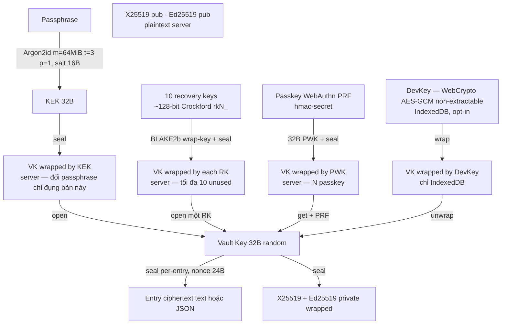
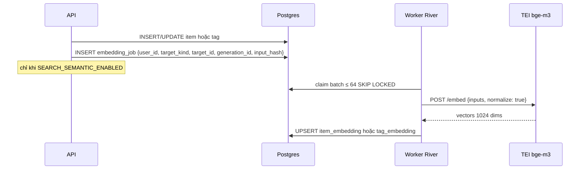

# engram — Project Specification

> Phiên bản: 0.6 · Ngày: 2026-09-15 · Trạng thái: chốt tên sản phẩm **engram**; `mockups/` là **tiêu chuẩn thiết kế** ràng buộc cho §7 (xem §1.1, §7.0, §13 Q1)
>
> Tài liệu này là spec tổng thể cho sản phẩm **engram** (repo `save-all-by-keyword`): lưu thông tin theo **mục (Item)** — một `name`, nhiều **tag**, nhiều **entry có kiểu** — tìm lại cực nhanh (lexical + semantic trên name và tag), **chỉ thân entry** được **mã hoá đầu-cuối (E2E)**.

## Mục lục

1. [Tổng quan, mục tiêu, non-goals, personas](#1-tổng-quan-mục-tiêu-non-goals-personas)
2. [Domain model](#2-domain-model)
3. [User stories & main flows](#3-user-stories--main-flows)
4. [Kiến trúc tổng thể](#4-kiến-trúc-tổng-thể)
5. [Mô hình mã hoá E2E](#5-mô-hình-mã-hoá-e2e)
6. [Search & suggestion design](#6-search--suggestion-design)
7. [UI/UX spec](#7-uiux-spec)
8. [Data model / Postgres schema](#8-data-model--postgres-schema)
9. [API design](#9-api-design)
10. [Non-functional requirements](#10-non-functional-requirements)
11. [Project structure & dev tooling](#11-project-structure--dev-tooling)
12. [Roadmap](#12-roadmap)
13. [Câu hỏi mở còn lại](#13-câu-hỏi-mở-còn-lại)
14. [Glossary](#14-glossary)

---

## 1. Tổng quan, mục tiêu, non-goals, personas

### 1.1 Tổng quan

**engram** là web app (online-only) cho phép người dùng lưu nhanh các mẩu thông tin dưới một **mục (Item)**: một tên mô tả (`name`), kèm **nhiều tag**, và **nhiều entry** — mỗi entry có **kiểu lưu** (`text` hoặc `json` ở MVP). Tìm lại bằng cách gõ vài ký tự vào một ô omnibox.

Điểm khác biệt:

- **Search-first**: một ô omnibox vừa tìm **tên mục** và **tag**, vừa thêm nhanh (`name: nội dung`). Gõ `#tag` để lọc / gán tag.
- **Gợi ý thông minh** trên **hai corpus** (item name và tag): prefix, fuzzy, và **semantic** (gõ "mật khẩu wifi" ra mục `wifi-password` hoặc tag `mạng-nhà`) nhờ pgvector. Cùng một model, cùng một semantic toggle.
- **E2E chỉ cho thân entry**: server thấy `name`, tag, kiểu entry, timestamps; **không** thấy text hay JSON. Key chỉ nằm ở browser.
- **Entry có kiểu**: `text` (văn bản tự do) và `json` (tài liệu JSON, UI render **bảng lồng nhau**). Schema sẵn cho `link` / `file` / `image` (không làm ở MVP).
- **Server-first, multi-user, multi-device**: đăng nhập máy khác, **unlock vault** bằng passphrase, **passkey (PRF)**, hoặc **một recovery key** (rồi đặt passphrase mới).
- **Miễn phí, embedding self-host**: không gói trả phí; vector chạy TEI trong hạ tầng sản phẩm (`BAAI/bge-m3`). Name và tag **không** gửi ra nhà cung cấp AI bên thứ ba.

**Tên sản phẩm: `engram`** — dấu vết vật lý mà một ký ức để lại. Viết thường trong mọi ngữ cảnh (`engram`, không `Engram`). Chốt ở v0.6, thay cho tên tạm cũ; lý do chọn và các tên đã loại nằm trong [README](../README.md#tên). **Tên repo giữ `save-all-by-keyword`** vì lịch sử, và thư mục gốc trong §11.1 giữ nguyên. Chưa tra domain và nhãn hiệu — phải kiểm trước khi đăng ký gì.

Thực thể chính **không** còn là "keyword". Xem §2 và §14.

### 1.2 Mục tiêu (Goals)

| # | Mục tiêu | Đo lường |
|---|----------|----------|
| G1 | Thêm một text entry mới trong ≤ 3 giây từ lúc focus omnibox | UX test |
| G2 | Gợi ý lexical name/tag hiển thị p95 < 150 ms từ lúc gửi request; semantic bổ sung sau không làm nhảy hàng | 100k item + 20k tag / user; đo riêng debounce 120 ms và hybrid §6.9 |
| G3 | Thân entry (text hoặc JSON) không bao giờ rời browser ở dạng plaintext | Code review + threat model §5.8 |
| G4 | Hỗ trợ đầy đủ tiếng Việt và tiếng Anh (UI + search) | i18n en/vi, embedding multilingual |
| G5 | Mô hình key không chặn chia sẻ Item ở phase sau | Thiết kế §5.3 |
| G6 | Import JSON và xem/sửa như bảng lồng nhau mà **không mất** JSON gốc | UX test + round-trip JSON |

### 1.3 Non-goals (MVP)

- **Không** offline / PWA / local-first sync. App yêu cầu online.
- **Không** tìm kiếm full-text trong thân entry ở phía server (không thể — body đã mã hoá). Client-side content search là Phase 2.
- **Không** chia sẻ dữ liệu giữa user (Phase 3).
- **Không** kiểu `link` / `file` / `image` (schema chừa chỗ; Phase 2).
- **Không** native mobile app, browser extension (Phase 3).
- **Không** collaborative editing, comment, version history chi tiết.
- **Không** BIP39 / mnemonic 12–24 từ (đã loại — dễ nhầm, UX tệ; dùng 10 recovery key entropy cao, §5.9).
- **Không** email khôi phục, không câu hỏi bí mật, không KMS ngoài: chỉ khi không còn passphrase, RK dùng được, passkey, DevKey hoặc VK trong phiên đang mở mới không còn đường unlock trực tiếp. Kiểm tra backup trước khi reset; reset vault xoá entry, giữ item/tag. Email thông báo bảo mật không phải phương thức khôi phục.
- **Không** login-with-passkey ở MVP (Phase 2). **Không** WebAuthn largeBlob; **không** đăng ký passkey khi thiếu PRF.
- **Không** pricing / gói / tier: sản phẩm miễn phí; marketing chỉ landing + docs.
- **Không** embedding API bên thứ ba: không OpenAI, không Gemini, không Cohere. Provider duy nhất: `tei` \| `noop`.
- **Không** "private name" / blind index: `name` và tag luôn plaintext — không có roadmap mã hoá tên.
- **Không** quan hệ entry ↔ nhiều item: một entry thuộc **đúng một** Item.

### 1.4 Personas

| Persona | Mô tả | Nhu cầu chính |
|---------|-------|---------------|
| **Minh — Developer** | Lưu snippet, config, JSON API sample | Gõ `docker: lệnh xoá volume`; import `compose.json` thành bảng; tag `ops`, `home-lab` |
| **Lan — Knowledge worker** | Note họp, ý tưởng, danh sách có cấu trúc | Semantic: "họp marketing tuần này" ra mục `meeting-mkt`; lọc `#okrs` |
| **An — Privacy-conscious** | Số hợp đồng, ghi chú nhạy cảm | Server không đọc body; hiểu `name`/tag là plaintext; giữ passphrase, **10 recovery key**, và passkey |

---

## 2. Domain model

### 2.1 Vì sao gọi là **Item** (mục), không phải Keyword / Key

"Keyword" / "key" gợi một **khoá tra cứu unique** — sai với sản phẩm: người dùng mô tả một **mục thông tin** (`name` = tiêu đề / mô tả chính), gắn **nhiều nhãn**, rồi nhét **nhiều mẩu nội dung có kiểu** vào đó. `name` **được phép trùng**.

| Ứng viên | Vì sao không chọn làm mặc định |
|----------|--------------------------------|
| **Keyword / Key** | Sai nghĩa: không phải chìa khoá, không unique, không phải kênh search duy nhất |
| **Note** | Nghèo: một Note thường là một body; ở đây một mục có nhiều entry typed (kể cả bảng JSON) |
| **Record** | Nghe như một hàng DB / form cố định, không khớp "bó thông tin + tag" |

**Chọn trong spec: `Item` (EN) / mục (VI).** URL `/items/:id`, bảng `item`, API `/items`. Đây là khuyến nghị có chủ đích, chưa khoá brand-language cuối — xem Q1 §13.

Thuật ngữ **keyword** chỉ còn trong glossary: *cũ, đã thay bằng `Item.name` + `Tag`*.

### 2.2 Các thực thể

| Entity | Plaintext trên server? | Mô tả |
|--------|------------------------|-------|
| **User** | ✔ | Tài khoản; email, locale, theme, `auto_lock_minutes`, `settings` |
| **AuthIdentity** | ✔ | OAuth (google/github) hoặc password hash |
| **Session** | ✔ | Refresh token hash, device info, thời hạn |
| **Vault** | ✔ (metadata + wrapped keys) | `vault_key` wrap bởi KEK (passphrase); **thêm** tối đa 10 wrap bởi recovery key và N wrap bởi passkey PRF. Keypair X25519/Ed25519 (pub plaintext, priv wrapped). Mọi đường unlock lấy được VK đều có quyền tạo KEK wrap mới, kèm re-auth tài khoản (§3.9) |
| **Item** | ✔ `name`, `hint?`, timestamps, counts | Mục per-user. `name` = mô tả chính / title. **Trùng `name` được phép.** Disambiguate ở UI bằng tag + `created_at` |
| **Tag** | ✔ `display`, `normalized` | Nhãn first-class, tái sử dụng giữa các item. Unique per-user theo `normalized` (khác `item.name`) |
| **ItemTag** | ✔ | N–N Item ↔ Tag |
| **Entry** | ✘ body (ciphertext) · ✔ `type`, `position`, envelope meta, size, timestamps | Một mẩu thuộc **đúng một** item. MVP `type`: `text` \| `json` |
| **ItemEmbedding** | ✔ | Vector của `item.name` (+ hint), `model`, `model_version`, `dims` = 1024 |
| **TagEmbedding** | ✔ | Vector của `tag.display` / `normalized` (cùng model) |
| **EmbeddingJob** | ✔ | Hàng đợi embed/re-embed (River); target = item hoặc tag |
| **AuditLog** | ✔ | Sự kiện bảo mật (login, đổi passphrase, recover RK, regenerate/rotate RK, passkey register/revoke, export, reset vault…) |
| **VaultRecoveryKey** | ✔ `lookup_hash`, wrap · ✘ plaintext RK | 10 slot; mỗi RK bọc **trực tiếp** một bản VK. Single-use. Không lưu bí mật RK |
| **VaultPasskey** | ✔ `cred_id`, `prf_salt`, `vk_wrap`, `pubkey?`, meta | WebAuthn; PRF → wrap VK. Nhiều passkey / user. Không fallback secret phía server |
| **DeviceKey** (client-only) | — không có trên server | `DevKey` WebCrypto non-extractable + `seal(VK, DevKey)` trong IndexedDB khi bật "Nhớ thiết bị này" (§5.6) |

**Settings** (cột `app_user.settings` jsonb + cột riêng): `semantic_suggest` (default `true`), `auto_lock_minutes` (default `15`; `0` = never).

### 2.3 Quan hệ

```
User  1 ─── 1  Vault
Vault 1 ─── N  VaultRecoveryKey   // tối đa 10 hàng unused
Vault 1 ─── N  VaultPasskey
User  1 ─── N  Item
User  1 ─── N  Tag
Item  N ─── N  Tag     (item_tag)
Item  1 ─── N  Entry   // entry thuộc đúng một item; không còn N–N entry↔keyword
```

- Xoá Item → soft-delete entries của item đó; gỡ `item_tag`.
- Xoá Tag → gỡ khỏi mọi item; **không** xoá item.
- Reset vault → xoá **entries** (+ vault cũ, recovery key, passkey wrap) → tạo vault mới (10 RK mới, onboard lại); **giữ Item + Tag** (plaintext, không phụ thuộc VK).

### 2.4 Quyết định thiết kế

**`Item.name` — plaintext, trùng được.**
User muốn nhiều mục cùng tên (hai "wifi": nhà vs công ty). Server **không** unique `name`. UI phân biệt bằng chip tag + ngày tạo. Trade-off giống keyword cũ: plaintext để search/suggest chạy được.

Chuẩn hoá để search, **không** để identity:

`name_normalized` = NFC → lowercase → trim → collapse whitespace → bỏ dấu câu đầu/cuối. **Giữ dấu tiếng Việt** (`mã` ≠ `ma`). Fuzzy/unaccent ở tầng search (§6).

Độ dài: `name` 1–200 ký tự. `hint` opt-in, ≤ 120 ký tự, plaintext, có nhãn "server đọc được" — dùng khi tên quá ngắn/viết tắt (`k8s`) để embedding tốt hơn.

**`Tag` — first-class, unique theo `normalized`.**
Catalog per-user. `display` giữ cách viết lần đầu (hoặc lần rename). Cùng thuật toán normalize như name. Unique `(user_id, normalized) WHERE deleted_at IS NULL`. Đổi `display` mà `normalized` trùng tag khác → `409 TAG_CONFLICT` (merge tag = Phase 2).

**Giới hạn (ý kiến, dùng xuyên spec):**

| Giới hạn | Giá trị | Lý do |
|----------|---------|-------|
| Tag / item | **20** | Chip UI; quá nhiều tag làm filter mất nghĩa |
| Entry / item | **200** | Mục là một bó, không phải dump vô hạn; vẫn dư cho journal + nhiều bảng |
| Plaintext / entry | **256 KiB** | Số byte UTF-8 thực sự mã hoá; JSON đo trên text sau edit, không qua `JSON.stringify` |
| Tag `display` | 1–50 ký tự | Nhãn, không phải đoạn văn |
| Catalog tag / user | không cứng; alert vận hành ~ 20k | |
| Item / user | không cứng; alert ~ 50k | |

Xác nhận 20 / 200: Q3 §13.

**Entry typed, body luôn ciphertext.**
`type` là plaintext: UI biết cần renderer text hay bảng **trước khi** decrypt. **Cấu trúc JSON chỉ có sau khi client decrypt** — server chỉ lưu `type='json'` + blob. Không gửi JSON plaintext lên server, kể cả lúc import.

**JSON (group / table)** — luôn giữ document gốc:

- Lưu đúng UTF-8 JSON user import/sửa (không "bình thường hoá" mất key order / số / `null` một cách thầm).
- Source of truth = text gốc + cây cú pháp giữ source span và từng occurrence của property. Table-edit splice đúng vùng thay đổi; byte ngoài edit giữ nguyên (§3.7), không serialize lại toàn bộ JS object.
- Object → một bảng field/value.
- Array → hàng; array-of-object → cột = hợp các key.
- Object-trong-ô / array-trong-ô → bảng lồng, expandable.
- Import nhanh: dán hoặc file `.json`; nhận object, array, array lồng, cả JSON primitive; validate cú pháp JSON strict + size; rồi encrypt như text. Giữ cả key trùng, thứ tự key và lexeme số; không dùng giá trị JS `Number` làm nguồn lưu.

**Không** validate JSON Schema ở MVP (freeform). Schema per-item = mở, xem Q2.

**Search surfaces:**

| Hành động | Kết quả |
|-----------|---------|
| Gõ trong omnibox | Hybrid trên **item names** và **tags** |
| Chọn một tag | Lọc danh sách item có tag đó |
| Chọn một item | Mở chi tiết: chip tag + danh sách entry |
| `#tag` | Chỉ corpus tag (lọc hoặc gán, tuỳ context) |
| `name: text` | Quick-add text entry (quy tắc trùng tên §3.4) |

**Embedding:** chỉ `item.name` (+ hint) và `tag.display`/`normalized`. Không embed body đã mã hoá. Re-embed khi đổi name/hint hoặc đổi tag display.

### 2.5 ER diagram

```mermaid
erDiagram
    USER ||--o{ AUTH_IDENTITY : has
    USER ||--o{ SESSION : has
    USER ||--|| VAULT : owns
    VAULT ||--o{ VAULT_RECOVERY_KEY : wraps_vk
    VAULT ||--o{ VAULT_PASSKEY : wraps_vk
    USER ||--o{ ITEM : owns
    USER ||--o{ TAG : owns
    USER ||--o{ AUDIT_LOG : generates
    ITEM ||--o{ ITEM_TAG : tagged
    TAG ||--o{ ITEM_TAG : labels
    ITEM ||--o{ ENTRY : contains
    ITEM ||--o| ITEM_EMBEDDING : has
    TAG ||--o| TAG_EMBEDDING : has
    ITEM ||--o{ EMBEDDING_JOB : queued
    TAG ||--o{ EMBEDDING_JOB : queued

    USER {
        uuid id PK
        text email UK
        text locale
        int auto_lock_minutes "0 = never"
        jsonb settings "semantic_suggest"
        timestamptz created_at
    }
    AUTH_IDENTITY {
        uuid id PK
        uuid user_id FK
        text provider "password|google|github"
        text provider_uid
        text password_hash "argon2id, chỉ provider=password"
    }
    SESSION {
        uuid id PK
        uuid user_id FK
        bytea refresh_token_hash
        text device_label
        timestamptz expires_at
    }
    VAULT {
        uuid user_id PK_FK
        int version
        jsonb kdf "argon2id m=64MiB,t=3,p=1 + salt"
        text vault_key_id
        bytea vault_key_wrapped_by_kek
        bytea x25519_public
        bytea ed25519_public
        bytea private_keys_wrapped
    }
    VAULT_RECOVERY_KEY {
        uuid id PK
        uuid vault_id FK
        bytea lookup_hash UK
        bytea wrap "VK wrapped by RK"
        timestamptz used_at "null = unused"
        timestamptz created_at
    }
    VAULT_PASSKEY {
        uuid id PK
        uuid user_id FK
        bytea cred_id UK
        bytea pubkey "Phase 2 login"
        bytea prf_salt
        bytea vk_wrap
        bytea aaguid
        text name
        timestamptz created_at
    }
    ITEM {
        uuid id PK
        uuid user_id FK
        text name
        text name_normalized
        text hint
        int entry_count
        timestamptz last_used_at
        timestamptz created_at
    }
    TAG {
        uuid id PK
        uuid user_id FK
        text display
        text normalized
        int item_count
        timestamptz last_used_at
    }
    ITEM_TAG {
        uuid item_id FK
        uuid tag_id FK
    }
    ENTRY {
        uuid id PK
        uuid user_id FK
        uuid item_id FK
        text type "text|json|link|file|image"
        int position
        jsonb envelope
        bytea ciphertext
        int plaintext_len_bucket
    }
    ITEM_EMBEDDING {
        uuid user_id PK, FK
        uuid item_id PK, FK
        vector embedding "1024"
        text model
        text model_version
        text input_hash
    }
    TAG_EMBEDDING {
        uuid user_id PK, FK
        uuid tag_id PK, FK
        vector embedding "1024"
        text model
        text model_version
        text input_hash
    }
```

---

## 3. User stories & main flows

### 3.1 User stories (ưu tiên MVP)

- **US1** Là user mới, tôi đăng ký email/password hoặc Google/GitHub, đặt **encryption passphrase**, **lưu 10 recovery key** (bắt buộc — tải/in/copy + checkbox), optionally **thêm passkey**.
- **US2** Là user, tôi gõ `wifi: Abc123` vào omnibox → text entry được thêm vào mục `wifi` (tạo mới nếu chưa có; nếu trùng tên xem §3.4).
- **US3** Là user, khi gõ `wi` tôi thấy mục `wifi`, `wifi-office` **và** tag `wifi-khách`; từ 3 ký tự trở lên có thể thêm `mạng nhà` ở vùng Gần nghĩa nếu bật ≈.
- **US4** Là user, tôi mở một mục, thấy chip tag + danh sách entry theo `position`, sửa/xoá entry, thêm/gỡ tag.
- **US5** Là user, tôi import một file/đoạn JSON vào mục → một entry `type=json`, UI hiện bảng lồng nhau, vẫn xem được JSON gốc.
- **US6** Là user, tôi sửa một ô trong bảng lồng nhau (kể cả hàng trong array lồng) → document JSON được cập nhật, encrypt lại, JSON gốc không mất field không nhìn thấy trên bảng.
- **US7** Là user, tên mục trùng: omnibox và trang mục luôn hiện tag + ngày tạo; quick-add khi có nhiều khớp hỏi tôi chọn mục hoặc tạo mới.
- **US8** Là user, gõ `#nhà` để lọc các mục có tag đó; trên trang mục tôi gán/gỡ tag từ catalog (suggest giống name).
- **US9** Là user, máy mới: đăng nhập → **unlock vault** bằng passphrase **hoặc** passkey (không gõ passphrase).
- **US10** Là user, đổi passphrase mà không re-encrypt entries; recovery key và passkey **vẫn mở được** (chúng bọc VK, không bọc KEK).
- **US11** Là user, bật "Nhớ thiết bị này" (opt-in, mặc định tắt); "Quên thiết bị này" bất cứ lúc nào.
- **US12** Là user, chọn locale en/vi và auto-lock 5 / **15** / 60 / never.
- **US13** Là user quên passphrase: dùng passkey / DevKey / VK trong phiên đang mở để đặt passphrase mới sau re-auth, hoặc dán **một** RK → mở vault → re-auth + **bắt buộc đặt passphrase mới** → consume key trên live server → được nhắc regenerate slot trống. Chỉ đề xuất **Reset vault** khi đã kiểm tra các đường unlock và backup; reset xoá entries, **giữ items + tags**.
- **US14** Là user, export encrypted backup hoặc decrypted JSON (cảnh báo).
- **US15** Là user, xem số recovery key còn lại (không xem lại bí mật); regenerate slot thiếu hoặc xoay cả 10 (vault đã unlock + re-auth tài khoản; không cần passphrase cũ).
- **US16** Là user, thêm nhiều passkey (Windows Hello, điện thoại, YubiKey); thu hồi từ Settings.
- **US17** Là user, sau auto-lock: máy đã nhớ → mở im lặng; không nhớ nhưng có passkey → prompt WebAuthn; không thì gõ passphrase.

### 3.2 Flow: Sign up → passphrase → 10 recovery key → (tuỳ chọn) passkey

Onboarding **không hoàn tất** nếu chưa sinh và xác nhận 10 recovery key. API `POST /vault` **từ chối** nếu thiếu đúng 10 wrap RK. **Không** BIP39.

```mermaid
sequenceDiagram
    participant B as Browser
    participant A as Go API
    participant DB as Postgres
    B->>A: POST /auth/signup (email+pw) hoặc OAuth callback
    A->>DB: tạo user, auth_identity, session
    A-->>B: session cookie (HttpOnly)
    Note over B: Bước 1: passphrase (≥ 12 ký tự, zxcvbn ≥ 3) ×2
    B->>B: salt = random(16); KEK = Argon2id(passphrase, salt, m=64MiB,t=3,p=1)  [Web Worker]
    B->>B: VK = random(32)
    B->>B: kp = X25519+Ed25519 keygen
    B->>B: wrapK = seal(VK, KEK); wrapP = seal(priv, VK)
    Note over B: Sinh 10 RK (Crockford, ~128-bit, prefix rkN_)
    loop i = 1..10
        B->>B: RKi = rk{i}_ + Crockford(random 16B)
        B->>B: lookup_i = BLAKE2b-256("sabk.rk.lookup.v1" || RKi)
        B->>B: wrap_i = seal(VK, BLAKE2b-256("sabk.rk.wrap.v1" || RKi))
    end
    Note over B: Bước 2: lưới 10 key — Tải / In / Sao chép; checkbox bắt buộc
    B->>A: POST /vault {kdf, wrapK, pubkeys, wrapP, recovery_keys[10]}
    A->>DB: insert vault + 10 vault_recovery_key
    Note over B: Bước 3 (tuỳ chọn): Add a passkey — WebAuthn create + PRF
    opt PRF available
        B->>A: POST /vault/passkeys {cred_id, pubkey, prf_salt, vk_wrap, …}
    end
    B->>B: VK trong Worker memory; xoá passphrase, KEK, plaintext RK
    opt user tick "Nhớ thiết bị này"
        B->>B: DevKey = WebCrypto AES-GCM non-extractable; IndexedDB ← {DevKey, seal(VK, DevKey)}
    end
```

Nút "Tạo vault" / Continue **disabled** đến khi checkbox "Tôi đã lưu 10 recovery key ở nơi an toàn". `POST /vault` chỉ sau khi tick — wrap RK chưa lên server trước lúc user thấy lưới.

Nếu `AUTH_REQUIRE_EMAIL_VERIFICATION=true` (mặc định **false**), user email/password phải verify email trước khi tạo vault; OAuth coi verified nếu provider trả `email_verified`.

Cảnh báo (một lần, bước 2): chụp màn hình / người nhìn trộm có thể lấy RK. In hoặc tải file, cất offline — đừng để screenshot trên máy chung.

### 3.3 Flow: Unlock trên thiết bị mới

1. Đăng nhập → session (cookie). **Unlock vault là bước riêng** — không thay login ở MVP.
2. `GET /vault` → `vault_key_id`, `version`, `kdf_params`, `wrapK`, `recovery_keys_remaining`, danh sách passkey (id, name, aaguid).
3. User chọn:
   - **Passphrase:** Worker `KEK = Argon2id(passphrase, salt)` (đúng params trên vault, **không** hạ 64 MiB); `VK = open(wrapK, KEK)`. Sai → AEAD fail → "Passphrase không đúng" / "Incorrect passphrase".
   - **Passkey:** `navigator.credentials.get()` + PRF → unwrap `vk_wrap` (§3.13). Không gõ passphrase.
   - **Recovery key:** chỉ từ link "Quên passphrase" (§3.10), không phải nút unlock hàng ngày.
4. VK ở Worker memory. Nếu tick **"Nhớ thiết bị này"** → `DevKey` + `seal(VK, DevKey)` trong IndexedDB (§5.6). Lần sau trên thiết bị này: unlock **im lặng** bằng DevKey.

### 3.4 Flow: Quick-add `name: text`

Cú pháp: `name: nội dung` (một `name`). Mở rộng: `name #tag1 #tag2: nội dung` — gán tag khi tạo/append.

1. Parse client: tách tại `:` đầu tiên **không nằm trong URL** (`^\s*([^:]+?)\s*:\s*(?!//)(.+)$`). Phần trái: token `name` + các `#tag`.
2. Không có `:` → **search** (§3.5).
3. Khớp item theo `name_normalized` **chính xác**:
   - **0** → `POST /items` tạo mục mới, gán tag nếu có.
   - **1** → append entry vào mục đó.
   - **nhiều** → dialog: liệt kê từng item (name + tag chips + `created_at`) + hành động **Tạo mục mới cùng tên**. Không đoán.
4. Tag trong cú pháp: `POST /tags` upsert theo `normalized`, rồi `PUT` item tags (hợp với tag đã có, trần 20).
5. Client sinh `entry_id` UUID v4 trước khi encrypt. Tạo envelope đủ 5 field theo §5.5 (`ct_enc="utf8"`), nonce mới 24 B; encrypt UTF-8 text với AAD JCS + ID theo đúng byte contract tại §5.5.
6. `POST /items/{id}/entries` `{id:entry_id, type:"text", envelope, ciphertext, …}` + `Idempotency-Key`. Server giữ nguyên ID; retry dùng lại ID, ciphertext và idempotency key, không sinh ID khác sau khi seal.
7. Server tăng `entry_count`, `last_used_at`; enqueue embed nếu item mới / name mới.
8. UI optimistic + toast "Đã lưu vào **wifi**" + Undo 5 s.

Quick-add **chỉ** tạo `type=text`. JSON đi qua modal import (§3.6) hoặc type picker trên trang mục. Nếu clipboard/paste trong ô add là JSON hợp lệ, hiện banner "Phát hiện JSON — [Lưu như bảng]" — không tự đổi type.

`Ctrl+Enter` khi không có `:` → tạo **item mới** với `name` = text đang gõ (kể cả khi đã có item trùng tên).

### 3.5 Flow: Search & suggest

Gõ → debounce 120 ms → `GET /suggest?q=` → dropdown hỗn hợp item + tag.

- Enter trên **item** → mở `/items/:id`.
- Enter trên **tag** → `/items?tag_id=`.
- Gõ bắt đầu bằng `#` (hoặc token `#…`) → `scope=tag`.
- `Tab` trên item → điền `name: ` (add mode).
- `Tab` trên tag → điền `#display ` (tiếp tục lọc/gán).

Chi tiết ranking §6, UI §7.

### 3.6 Flow: Import JSON thành entry bảng

1. Từ trang mục (hoặc command "Import JSON"): modal dán **hoặc** chọn file `.json`.
2. Client đọc UTF-8 strict (từ chối byte UTF-8 lỗi, không âm thầm thay bằng U+FFFD); parse thành cây cú pháp có source span bằng `jsonc-parser` hoặc tương đương, cấu hình strict JSON: không comment, không trailing comma, không nội dung thừa. Từ chối nếu sai cú pháp hoặc text UTF-8 > 256 KiB. Không round-trip qua `JSON.parse`/`JSON.stringify` để validate hoặc đo size.
3. Preview: renderer bảng lồng (§7.4) + tab "JSON gốc".
4. User xác nhận item đích (mặc định mục đang mở) + tag tuỳ chọn.
5. Plaintext = **chuỗi JSON gốc** (paste/file). "Format trước khi lưu" chỉ sửa whitespace ngoài string bằng token edits; vẫn giữ key order, key trùng và lexeme số. Đo lại size sau format.
6. Sinh UUID trước khi encrypt giống text; `POST /items/{id}/entries` `{id, type:"json", envelope, ciphertext, plaintext_len_bucket}`.
7. Server **không** parse JSON; chỉ check `type`, envelope, size.

Một lần import = **một** entry chứa cả document (kể cả array 500 object). Không tách phần tử thành nhiều entry.

### 3.7 Flow: Sửa bảng JSON lồng nhau

1. Client đã decrypt → giữ **text gốc + cây cú pháp có source span** trong Worker/memory của card. Numeric cell đọc lexeme từ text, không convert sang JS `Number` rồi ghi ngược.
2. Table-edit dùng định danh node/property occurrence và source span trên revision hiện tại. JSON Pointer chỉ dùng khi không mơ hồ; object có key trùng hiện từng occurrence theo thứ tự gốc với nhãn phân biệt, không gộp thành JS object. Array-of-object có key trùng dùng bảng field/value cho hàng đó.
3. Sửa ô / thêm hàng / thêm field / xoá hàng → tạo text edits `{offset, length, content}` rồi apply splice (ví dụ `jsonc-parser.applyEdits`). Offset là UTF-16 code-unit của chuỗi hiện tại, theo contract của parser; sau splice phải encode lại UTF-8 để đo/encrypt, không dùng offset byte cũ sau khi text thay đổi. Chỉ thay token được sửa và dấu phẩy/whitespace cấu trúc cần thiết; byte ngoài các span đó giữ nguyên. Không gọi `JSON.stringify(document)`; không mặc định pretty-print cả document.
4. Raw-edit giữ đúng text user; format explicit chỉ sửa whitespace ngoài string. Sau mỗi edit, parse strict lại text và dựng lại span; không áp span cũ lên revision mới. Giá trị số mới validate bằng grammar JSON number, giữ nguyên lexeme hợp lệ kể cả ngoài miền số JS.
5. Đo UTF-8 text kết quả ≤ 256 KiB; encrypt nonce mới với cùng entry ID và envelope §5.5; `PUT /entries/:id` + `If-Match: updated_at`.
6. Field không hiện trên bảng, key trùng, key số nguyên, `null`, `9007199254740993`, `1e400`, `-0` và cách viết escape **không đổi** khi sửa một ô khác. Fixture bắt buộc kiểm tra byte ngoài span, không chỉ so sánh object sau parse.

### 3.8 Flow: View / edit / delete

- Trang item: entries theo `position` tăng (user kéo thả để reorder → `PATCH /items/{id}/entries/reorder`).
- Decrypt lazy khi render.
- Text: edit inline. JSON: bảng hoặc raw.
- Xoá: soft delete 30 ngày, Undo; purge job.
- Gán tag: mini-omnibox trên chip `+`, cùng engine suggest tag; trần 20 → tooltip, không thêm chip 21.

### 3.9 Flow: Đổi passphrase (rewrap only)

1. **Quyền rewrap thuộc về người giữ VK**: unlock bằng passphrase, passkey, DevKey hoặc VK còn trong phiên mở đều đủ; **không yêu cầu passphrase cũ**. Trước khi lưu, re-auth tài khoản bằng password đăng nhập hoặc OAuth (§9.1), độc lập với phương thức unlock vault.
2. `salt' = random`; `KEK' = Argon2id(new, salt', 64MiB, t=3, p=1)`; `wrapK' = seal(VK, KEK')`.
3. `PUT /vault/kek {kdf, wrapK'}` + `If-Match: version` + re-auth grant; `vault.version++`; audit `vault.rewrap`, tạo thông báo bảo mật trong app và enqueue email tới địa chỉ đã verified nếu có. Email không chứa bí mật, không cấp quyền recovery; lỗi gửi không rollback rewrap.
4. **Không** đụng entries. **Không** đụng wrap RK hay wrap passkey — chúng bọc VK trực tiếp, vẫn mở được. DevKey wrap vẫn valid (bọc VK). UI đề nghị "Đăng xuất phiên khác"; IndexedDB máy khác tự xoá khi gặp session revoke.

Regenerate/rotate RK và recovery complete dùng cùng re-auth policy; không có rào "phải biết passphrase cũ" để đi vòng qua. VK cho quyền đọc toàn bộ body; re-auth giúp chặn thay đổi bằng session bị bỏ quên, audit/thông báo giúp phát hiện. Không tuyên bố chống XSS đã điều khiển được phiên và VK. Trạng thái "vault unlocked" là tiền điều kiện phía client, không phải bằng chứng mà server xác minh được từ một wrap opaque (§5.8).

### 3.10 Flow: Quên passphrase → một recovery key → passphrase mới

**Không** email khôi phục, không câu hỏi bí mật, không BIP39. Có **10 recovery key** single-use (§5.9).

1. Link "Tôi quên passphrase" → giải thích: server **không** đọc body; nếu có passkey, thiết bị đang nhớ hoặc phiên còn VK thì unlock rồi đặt passphrase mới theo §3.9. Nếu không, dùng **một** RK chưa dùng; reset là lựa chọn cuối sau khi kiểm tra backup.
2. User dán một RK (chấp nhận có/không dấu gạch; normalize Crockford). Client **không** thử lần lượt 10 wrap.
3. `lookup = BLAKE2b-256("sabk.rk.lookup.v1" || rk_normalized)` → `POST /vault/unlock/recovery` `{lookup_hash}`.
4. Server tìm hàng `used_at IS NULL` đúng `lookup_hash` **của vault user đang đăng nhập** → trả `{recovery_key_id, wrap}`. Không khớp → `401 RECOVERY_KEY_INVALID` (không tiết lộ còn bao nhiêu). Rate limit chặt.
5. Client `VK = open(wrap, BLAKE2b-256("sabk.rk.wrap.v1" || rk_normalized))`. Sai (lỗi hiếm) → không consume.
6. Re-auth tài khoản và **bắt buộc đặt passphrase mới** (cùng rule ≥ 12, zxcvbn ≥ 3) → `POST /vault/recover/complete` `{recovery_key_id, kdf, vault_key_wrapped_by_kek}` + `If-Match: version` + `Idempotency-Key`. Trong cùng tx: khoá vault/RK thuộc user hiện tại, kiểm tra RK còn unused và version khớp, rewrap KEK, tăng version, **DELETE** hàng RK, audit `vault.recover` + `recovery_key.consume`, tạo thông báo như §3.9. Hai request cạnh tranh không được cùng consume; retry request đã commit trả lại kết quả đã lưu, không rewrap lần nữa.
7. Prompt: regenerate slot trống — client sinh key mới, hiện **chỉ** những key đó, POST wrap. Các RK còn lại không hiện lại. User có thể bỏ qua (còn 9) nhưng UI nhắc "nên đủ 10".
8. Passkey **vẫn hoạt động** (VK không đổi). DevKey máy khác vẫn valid.

Còn passkey / thiết bị đang "nhớ" / phiên đang unlock (không có RK): lấy VK bằng phương thức đó → re-auth tài khoản → đặt passphrase mới (§3.9). Không cần export rồi reset chỉ vì quên passphrase cũ.

**Last resort — không còn passphrase, RK dùng được, passkey, DevKey hay VK trong phiên mở:** kiểm tra encrypted backup và bí mật có thể mở backup (§3.11). Nếu vẫn không lấy lại được VK, **Reset vault**: re-auth → xoá entries + vault + RK + passkey → onboard passphrase + 10 RK mới. **Items + tags giữ nguyên.** Audit `vault.reset`. Reset xoá nội dung đang lưu trên server; không xoá các bản backup người dùng đã giữ.

### 3.11 Flow: Export

- **Encrypted backup** (`.sabk.json`): items, tags, item_tag, entries ciphertext (giữ nguyên ID/envelope), vault (`vault_key_id`, `version`, `kdf`, `wrapK`, pubkeys, `wrapP`), **các hàng RK** (`lookup_hash` + wrap, không plaintext), **các passkey wrap** (`cred_id`, `prf_salt`, `vk_wrap`, `pubkey`). Server tạo được (không cần VK). Đây là snapshot: passphrase/RK/PRF tương ứng với wrap trong backup vẫn mở snapshot dù sau đó live server đã đổi hoặc xoá wrap. Passkey còn phải thực hiện được PRF với credential, salt và RP tương ứng.
- **Decrypted JSON**: client decrypt mọi entry rồi tải. Modal cảnh báo + re-auth. Audit `export.decrypted`.

Import backup UI ở Phase 2: không chép lại các RK/passkey wrap từ snapshot vào live vault. Client unlock backup, decrypt rồi encrypt lại vào vault đích với ID/envelope hợp lệ, giữ bộ unlock đang dùng của vault đích; vault mới onboard bộ wrap mới. Không lấy `version` trong backup làm bằng chứng thu hồi toàn cục; giới hạn rollback của backup/PITR xem §5.9 và §10.5.

### 3.12 Flow: Regenerate / xoay recovery key

- `GET /vault/recovery-keys` → `{remaining, slots: 10}` — **không** trả bí mật.
- **Regenerate** (vault đã unlock + re-auth tài khoản): client sinh RK cho slot trống (`10 - remaining`), hiện **chỉ key mới**, checkbox, rồi `POST /vault/recovery-keys/regenerate` `{recovery_keys:[{lookup_hash, wrap}…]}`. Server không bao giờ thấy plaintext. Khoá vault trong tx để hai request không vượt 10 slot; `If-Match: version`, tăng version và audit `recovery_key.regenerate`.
- **Rotate all** (vault unlock + re-auth tài khoản, **không cần passphrase cũ**): client sinh 10 key, lưới đủ 10, checkbox; `POST /vault/recovery-keys/rotate` thay toàn bộ unused trong tx với `If-Match: version`, tăng version. Audit `recovery_key.rotate`, thông báo bảo mật như §3.9. Passkey và VK không đổi; đây là xoay RK trên live server, không phải rotate VK (§5.9).

### 3.13 Flow: Đăng ký passkey (sau khi vault unlock)

1. Onboarding bước 3 hoặc Settings › Passkeys › "Add a passkey". Nhiều credential: laptop Hello, điện thoại, YubiKey.
2. `POST /vault/passkeys/register/options` → `PublicKeyCredentialCreationOptions`: `rp.id` = `key.zone17th.click` (dev: `localhost`); extension **`prf`** với `eval.first = prf_salt` ngẫu nhiên 32 B; `userVerification: required`; `residentKey: preferred` (Phase 2 chỉ dùng lại credential nếu thực sự discoverable).
3. `navigator.credentials.create()`. Đọc `getClientExtensionResults().prf`: `enabled !== true` → lỗi unsupported; `enabled=true` nhưng chưa có `results.first` **không** có nghĩa là thiếu PRF. Khi đó gọi `navigator.credentials.get()` với credential vừa tạo, challenge mới, `userVerification: required`, `prf.eval.first` cùng salt. Server chỉ lưu credential sau khi có output và tạo wrap thành công. Cancel/thiếu output ở bước `get` → lỗi đăng ký, có thể thử lại; không fallback largeBlob/server-held secret.
4. `PWK = results.first` (32 B); `vk_wrap = seal(VK, PWK, AAD="vault-key-passkey-v1")`. Kiểm tra unwrap được đúng VK trước khi lưu; PWK không persist hay gửi server.
5. `POST /vault/passkeys` `{cred_id, pubkey, prf_salt, vk_wrap, aaguid, name}` + re-auth grant. Audit `passkey.register`.

### 3.14 Flow: Unlock bằng passkey

1. Đã có session. User bấm "Unlock with passkey" (hoặc auto-lock trên máy **chưa** nhớ thiết bị).
2. `POST /vault/unlock/passkey/options` → `allowCredentials` + `prf.evalByCredential` map base64url credential ID tới `{first: prf_salt}` + `vk_wrap` từng credential; `userVerification: required`. Với một credential có thể dùng `prf.eval` tương ứng; không dùng một salt chung cho nhiều wrap.
3. `navigator.credentials.get()` + PRF → `PWK` → `open(vk_wrap, PWK)`. Không gửi PWK lên server.
4. Fail PRF / user cancel / AEAD → lỗi i18n; vẫn còn ô passphrase.

### 3.15 Flow: Thu hồi passkey

Settings: danh sách name / aaguid / ngày. `DELETE /vault/passkeys/{id}` cần re-auth tài khoản, xoá `cred_id` + wrap trên live server. Audit `passkey.revoke`. Các passkey khác và RK không đổi. Thao tác này không xoá credential khỏi authenticator và không vô hiệu hoá bản `vk_wrap` đã copy: credential còn thực hiện được PRF vẫn có thể mở bản wrap đó để lấy VK. Giới hạn giống consume/rotate RK (§5.9); rotate VK là Phase 2.

---

## 4. Kiến trúc tổng thể

```mermaid
flowchart LR
    subgraph Client["Browser (Next.js app, client components)"]
        UI[UI / Omnibox / JSON tables]
        CR[Crypto module<br/>libsodium-wrappers<br/>Argon2id · XChaCha20-Poly1305 · X25519/Ed25519 · BLAKE2b]
        WA[WebAuthn PRF<br/>passkey unlock]
        UI --> CR
        UI --> WA
    end

    subgraph Edge["Next.js server (SSR)"]
        MK[Landing / Docs<br/>SSR + SEO + locale routing]
        SH[App shell<br/>SSR khung, không SSR dữ liệu]
    end

    subgraph API["Go API (chi)"]
        AU[Auth · Sessions]
        IT[Items · Tags · Suggest · Search]
        EN[Entries ciphertext + type]
        VA[Vault keys · RK wraps · passkeys]
        EX[Export]
        WK[Worker: embedding jobs]
        EP[Embedding Provider<br/>tei | noop]
    end

    subgraph Data
        PG[(Postgres 16<br/>+ pgvector + pg_trgm)]
        RD[(Redis — optional<br/>rate limit / cache)]
    end

    subgraph Emb["Self-hosted embedding (compose profile semantic / cùng VPC)"]
        TEI[TEI container CPU<br/>BAAI/bge-m3 · 1024 dims<br/>HTTP :8081]
    end

    NG[nginx reverse proxy<br/>key.zone17th.click · TLS] --> Edge
    NG --> API
    UI -- HTTPS JSON --> NG
    MK -.-> UI
    AU & IT & EN & VA & EX --> PG
    WK --> PG
    WK --> EP
    IT -- query embedding --> EP
    EP -- HTTP nội bộ --> TEI
    IT -. cache .-> RD
```

Toàn bộ chạy trong hạ tầng sản phẩm. **Không** có network call ra dịch vụ AI bên thứ ba. Chỉ `item.name` / `tag.display` đi Postgres → Go → TEI nội bộ.

### 4.1 Cái gì chạy ở đâu

| Thành phần | Chạy ở | Ghi chú |
|-----------|--------|---------|
| Landing + docs (không có trang pricing) | Next.js SSR/SSG | SEO, `hreflang` en/vi, sitemap |
| App shell (`/app/*`) | Next.js, `noindex`, client components | Không SSR dữ liệu user (không có VK) |
| **Toàn bộ crypto** | Browser (Web Worker) | Server không nhận passphrase, KEK, VK, plaintext RK, plaintext body |
| **WebAuthn + PRF** | Browser (main thread → authenticator) | Unlock/register passkey; PWK không lên server. RP ID `key.zone17th.click` |
| JSON parse / bảng lồng / import file | Browser | Server không thấy JSON |
| Auth, sessions | Go API | Cookie HttpOnly, SameSite=Lax, refresh rotation |
| Item / Tag CRUD, suggest, search | Go API + Postgres | Lexical (pg_trgm, prefix) + vector (pgvector) trên **hai** bảng |
| Entry CRUD | Go API + Postgres | Blob opaque + `type` + `position`; validate size & envelope |
| Embedding (index) | Go worker (River) → TEI | Async; CPU image; compose profile `semantic`; không public |
| Embedding (query) | Go API → TEI | Sync khi suggest; LRU + circuit breaker (§6.6) |
| Rate limit / cache suggest | Go in-memory (MVP) → Redis khi scale ngang | |
| Reverse proxy / TLS | nginx trước Next.js + Go API | Domain tạm `key.zone17th.click`; cấu hình khi deploy (§11.5) |

### 4.2 Backend stack (Go)

| Lớp | Chọn | Lý do ngắn |
|-----|------|-----------|
| HTTP router | **chi** (`go-chi/chi/v5`) | `net/http`, middleware composable, nhẹ |
| DB driver | **pgx v5** (pool) | Native Postgres, `pgvector-go`, COPY, batch |
| Query layer | **sqlc** | SQL thật, type-safe; hợp pgvector/pg_trgm |
| Migration | **golang-migrate** (SQL files) | CI + `make migrate` |
| Job queue | **River** (`riverqueue/river`) | Không thêm infra; enqueue cùng insert item/tag |
| Validation | `go-playground/validator` | |
| Auth | `golang.org/x/oauth2` + `coreos/go-oidc`; password `alexedwards/argon2id` | |
| Config/log/metrics | `envconfig`, `log/slog`, OpenTelemetry + Prometheus | |
| Test | `testcontainers-go` (Postgres+pgvector) | |

### 4.3 Frontend stack

Next.js **15** App Router, TypeScript, Tailwind + shadcn/ui (Radix), TanStack Query, `next-intl`, `libsodium-wrappers-sumo` trong Web Worker, `cmdk` cho omnibox, Zod. JSON table: renderer riêng + `jsonc-parser` cho cây cú pháp/source span và text edits (strict JSON, không dùng JS object làm source of truth); virtualize khi nhiều hàng.

### 4.4 Embedding provider abstraction

```go
// apps/api/internal/embedding/provider.go
type Provider interface {
    Name() string // ví dụ "tei/BAAI/bge-m3@<model-revision>"
    Dims() int
    MaxBatch() int
    Embed(ctx context.Context, inputs []string) ([][]float32, error)
}
```

MVP: **`tei`** (`POST /embed`, đọc `/info` lúc boot: `model_id`, `model_sha`, dims → `model_version`) và **`noop`** (vector 0, dev/test không TEI). Env: `EMBEDDING_PROVIDER=tei|noop`, `TEI_URL`.

Đổi model (fallback host: `intfloat/multilingual-e5-base`, 768 dims, cần prefix `query:`/`passage:` qua `TEI_INPUT_PREFIX_*`) qua shadow tables + cutover §6.6; không đổi query model trước khi index mới sẵn sàng. **Không** implement provider gọi API bên thứ ba.

---

## 5. Mô hình mã hoá E2E

### 5.1 Phạm vi — tuyên bố rõ

| Dữ liệu | Trên server | Lý do |
|---------|-------------|-------|
| Entry body (`text` hoặc JSON UTF-8) | **Ciphertext** | Thứ cần bảo vệ |
| `item.name`, `name_normalized`, `hint` | **Plaintext** | Search, suggest, embedding |
| `tag.display`, `tag.normalized` | **Plaintext** | Search, filter, embedding, catalog |
| `entry.type`, `position`, id, timestamps, `plaintext_len_bucket`, số entry/tag | Plaintext | Renderer, sort, vận hành |
| Email, locale, session, settings | Plaintext | Auth / UX |

**Trade-off chấp nhận:** attacker có DB biết user có **những tên mục và tag nào**, cấu trúc (bao nhiêu entry, type gì, khi nào) — **không** biết chữ trong entry hay JSON.

**Không có "private name".** Search/suggest đòi server đọc name và tag. Bí mật để trong **body**.

**Mitigations:**

- Onboarding: "Tên mục và tag server đọc được. Đừng đặt bí mật vào đó — dùng `bank`, không dùng `bank-vietcombank-0123`."
- `hint` opt-in, nhãn "server có thể đọc".
- Embedding **chỉ** TEI self-host: name/tag không rời hạ tầng.
- Không log `q` (chỉ độ dài + latency).

### 5.2 Nguyên lý

1. Passphrase, KEK, VK, plaintext recovery key, PWK (PRF), plaintext body **không** rời browser.
2. Một **VK** mã hoá mọi entry (text và JSON như nhau) → đổi passphrase = **rewrap O(1)** chỉ `wrapK`.
3. Envelope **versioned**.
4. Keypair bất đối xứng sinh **lúc tạo vault** (sharing Phase 3 không migrate).
5. VK có **nhiều bản wrap độc lập** trên server: `wrapK` (KEK), tối đa 10 wrap RK, N wrap passkey. Mỗi RK / mỗi passkey bọc **VK trực tiếp** (không bọc qua KEK). Người giữ VK có quyền tạo wrap KEK/RK/passkey mới; mutation nhạy cảm cần re-auth tài khoản (§9.1), không bắt passphrase cũ.

### 5.3 Key hierarchy



| Key | Sinh ở | Lưu ở | Dùng để |
|-----|--------|-------|---------|
| Passphrase | user | không lưu | Derive KEK |
| KEK | Worker, `crypto_pwhash` Argon2id | memory tạm | Wrap/unwrap **một** bản VK (`wrapK`) |
| **VK** | `randombytes(32)` | server: wrap KEK + wrap từng RK + wrap từng passkey; Worker memory | Encrypt mọi entry body; wrap private keys |
| Recovery key (×10) | `randombytes(16)` → Crockford + prefix `rkN_` | **không** trên server; chỉ `lookup_hash` + wrap | Unwrap VK khi quên passphrase; single-use |
| PWK | WebAuthn PRF (32 B) | không lưu; `prf_salt` + `vk_wrap` trên server | Unlock vault không gõ passphrase |
| DevKey (opt-in) | WebCrypto `generateKey(AES-GCM, extractable=false)` | IndexedDB `sabk.device`; **không** lên server | Unlock im lặng |
| X25519 / Ed25519 | browser | pub: server; priv: wrapped by VK | **Phase 3**: share Item |

**Sharing (Phase 3) không bị chặn:** A sinh `ShareKey_I` cho Item I, re-encrypt entries của I bằng `ShareKey_I`, `crypto_box_seal(ShareKey_I, B.x25519_pub)`. Không đụng VK. Envelope đã có `key_id` (`vk:…` / sau này `sk:…`).

### 5.4 Thuật toán & tham số

| Mục | Chọn | Ghi chú |
|-----|------|---------|
| Thư viện | **libsodium** (`libsodium-wrappers-sumo`) trong Web Worker | §5.7 |
| KDF | **Argon2id** cố định: `memlimit = 64 MiB`, `opslimit = 3`, `parallelism = 1`, salt 16 B | Mọi thiết bị giống nhau. **Không** fallback thấp hơn. Params lưu trên `vault.kdf`; chỉ được **nâng** sau này (unlock params cũ → rewrap params mới) |
| AEAD | **XChaCha20-Poly1305** IETF, key 32 B, nonce 24 B random | Text và JSON cùng alg |
| Wrap | Cùng AEAD; AAD `"vault-key-v1"` (KEK), `"vault-key-rk-v1"` (RK), `"vault-key-passkey-v1"` (PRF), `"priv-keys-v1"` | |
| Lookup RK | **BLAKE2b-256** domain-separated `"sabk.rk.lookup.v1" \|\| rk` | Không Argon2id — RK đã ~128-bit. Không lưu plaintext RK |
| RK → wrap key | BLAKE2b-256 `"sabk.rk.wrap.v1" \|\| rk` (32 B) | Tách domain với lookup; không dùng 16 B raw làm key AEAD |
| Keypair | X25519, Ed25519 | Hai seed, một blob wrap |
| Password login | Argon2id server-side, params riêng | Độc lập KDF vault |

JSON plaintext = UTF-8 của document. **Không nén** ở MVP; envelope v1 luôn có `ct_enc="utf8"`.

### 5.5 Envelope format (versioned)

`entry.envelope` (jsonb) + `entry.ciphertext` (bytea):

```json
{
  "v": 1,
  "alg": "xchacha20poly1305-ietf",
  "key_id": "vk:7f3a…",
  "nonce": "base64url(24 bytes)",
  "ct_enc": "utf8"
}
```

- Envelope v1 là object **đúng 5 field bắt buộc**: `v` integer `1`, `alg="xchacha20poly1305-ietf"`, `key_id` string, `nonce` string base64url không padding của đúng 24 B, `ct_enc="utf8"`. Reject field thiếu/thừa, key trùng, kiểu sai hoặc Unicode/UTF-8 lỗi; thứ tự field trong JSON request không quan trọng và được JCS lại. Không tự thêm default sau encrypt. Request validator phải phát hiện key trùng trước khi chuyển sang map/`jsonb`.
- **Canonical** = RFC 8785 JSON Canonicalization Scheme (**JCS**). **AAD bytes** = `UTF8("sabk.entry.v1") || 0x00 || UTF8(JCS(envelope)) || 0x00 || ASCII(entry_id)`, với `entry_id` UUID lowercase dạng có hyphen (`8-4-4-4-12`). Không gồm ciphertext. Client sinh UUID v4 **trước** encrypt; server validate và giữ nguyên ID đó, không tự cấp ID mới.
- `jsonb` được phép đổi thứ tự field khi lưu/trả; cả hai phía luôn validate schema rồi JCS lại object để có cùng AAD. Không dùng `JSON.stringify` theo insertion order hoặc raw JSON bytes làm canonical. `ct_enc` luôn được lưu/trả, không loại khỏi response.
- Test vector bắt buộc: ID, envelope, JCS bytes, AAD hex, VK, nonce, plaintext, ciphertext; round-trip qua Postgres `jsonb` và đảo thứ tự field vẫn decrypt được. Đổi ID hoặc bất kỳ field envelope nào phải fail validation/AEAD; thiếu `ct_enc` không được tự chữa. JCS chỉ áp dụng envelope, **không** áp dụng body JSON (§3.7).
- `plaintext_len_bucket` = `ceil(len/256)*256` — hiển thị "~1 KB", giảm rò rỉ size.
- Trần plaintext 256 KiB; server: `plaintext_len_bucket ≤ 262144` và `octet_length(ciphertext) ≤ 263168` (slack AEAD).
- Client đọc mọi `v` cũ, ghi `v` mới nhất khi edit.

`type` **không** nằm trong envelope — cột riêng, plaintext.

### 5.6 Key lifecycle

| Sự kiện | Hành động |
|--------|-----------|
| Tạo vault | §3.2 — 10 RK bắt buộc + checkbox đã lưu; passkey optional |
| Unlock | Passphrase → KEK → unwrap `wrapK` **hoặc** passkey PRF → unwrap `vk_wrap` **hoặc** DevKey. VK trong Worker. Mất khi đóng tab |
| **Auto-lock** | Mặc định **15 phút** idle; user chọn **5 / 15 / 60 / Never** (`auto_lock_minutes`, 0 = never). Phím `L` / nút 🔒 / "Lock now". Lock = `sodium_memzero` VK + xoá cache plaintext entries. **Name, tag, type, list item vẫn hiện**; body hiện `🔒 ••••••`. Không tạo/sửa entry khi locked |
| **"Nhớ thiết bị này"** (MVP, opt-in, **mặc định off**) | Lúc unlock, nếu tick: DevKey non-extractable + wrap VK trong IndexedDB cùng `vault.version`. Lần sau unwrap, không hỏi passphrase/passkey. Vault reset / `key_id` khác → xoá IDB. "Quên thiết bị này" = xoá IDB. Logout **không** tự xoá; session revoke → client xoá khi `401 reason=revoked` |
| **Auto-lock × nhớ thiết bị × passkey** | Auto-lock **vẫn** chạy (che màn hình, xoá VK memory). Tương tác kế tiếp: máy đã nhớ → **re-unlock im lặng** (DevKey); chưa nhớ + có passkey → prompt WebAuthn; không thì ô passphrase. Trên máy đã nhớ, auto-lock chỉ là "che nội dung"; bảo vệ thật = khoá màn hình OS |
| Đổi passphrase | Rewrap `wrapK` (§3.9). RK + passkey **không** vô hiệu |
| Quên passphrase | Passkey / DevKey / VK trong phiên mở → re-auth + passphrase mới; hoặc RK unused → re-auth + passphrase mới + consume RK (§3.10). Kiểm tra mọi đường unlock và backup trước reset |
| Regenerate / rotate RK | Unlock + re-auth tài khoản, không cần passphrase cũ. Không hiện lại key cũ; xoá wrap chỉ có hiệu lực trên live server |
| Đăng ký / thu hồi passkey | Unlock; PRF bắt buộc; revoke xoá wrap + cred_id |
| Recover bằng RK rồi passphrase mới | Passkey **vẫn** mở được (VK không đổi) |
| Rotate VK | Phase 2: cần key registry/trạng thái migration, sinh VK/key_id mới, decrypt/encrypt lại batch, tạo lại DevKey / RK / passkey wrap. Trong lúc migrate phải giữ khả năng đọc key cũ và chặn writer cũ ghi lại sau cutover; chỉ hoàn tất khi dữ liệu hiện tại dùng VK mới. Wrap cũ không mở được ciphertext dùng VK mới, nhưng vẫn mở được ciphertext/backup cũ dùng VK cũ; không thu hồi được plaintext/VK đã bị lấy |
| Xoá tài khoản | Xoá vault + RK + passkey + entries + items + tags; audit 90 ngày |

Rủi ro "Nhớ thiết bị": XSS / người ngồi máy / malware trong origin unwrap được VK không cần passphrase. `extractable=false` chặn copy bytes DevKey, không chặn **dùng** key. Chỉ bật trên máy cá nhân có lock màn hình.

### 5.7 libsodium vs WebCrypto

Dùng **libsodium** cho Argon2id, XChaCha20-Poly1305, X25519/Ed25519, BLAKE2b (một API, WASM audited). **WebCrypto** cho DevKey non-extractable. **WebAuthn** (browser API, không libsodium) cho passkey + PRF; PWK đưa vào Worker để unwrap. Worker: khỏi block UI, cô lập VK khỏi main thread (giảm bề mặt XSS đọc trực tiếp — không loại trừ XSS).

### 5.8 Threat model

**Bảo vệ được:**

- DB/backup/insider: thấy name, tag, type, metadata, ciphertext, `lookup_hash` RK, wrap RK/passkey — không VK, không body, không invert RK từ hash, không có PWK.
- Session bị cắp (không VK): đọc/sửa/xoá item & tag, xoá entry, không đọc body; thay wrap → client thấy `vault.version` / AEAD fail. Không unwrap được RK/passkey nếu không có bí mật tương ứng.

**Không bảo vệ được:**

- Malware, extension độc, XSS → lộ VK/plaintext. Máy đã nhớ → JS trong origin unlock không cần passphrase. Passkey trên máy đã unlock session: XSS gọi `get()` nếu user chạm authenticator / UV đã cache.
- Passphrase yếu + DB lộ → brute-force offline (Argon2id 64 MiB/3/1 làm chậm). zxcvbn ≥ 3. RK ~128-bit: không brute-force thực tế.
- Không còn bất kỳ đường lấy lại VK nào (passphrase, RK + wrap tương ứng, passkey + PRF wrap, DevKey, phiên đang unlock hoặc backup mở được) → không đọc lại được body.
- **DB bị đánh cắp + bản in RK unused** → attacker hash lookup + unwrap VK. Server **không** invert `lookup_hash` thành RK, không decrypt từ hash. (Shoulder-surf / screenshot lúc hiện lưới 10 key — cùng lớp rủi ro; nói một lần ở onboarding.)
- **RK đã consume/rotate + wrap cũ trong backup** → vẫn lấy được VK cũ; để đọc entry không có trong backup, attacker cần **thêm ciphertext tương ứng** (DB dump mới hoặc session truy cập được). Nếu VK chưa rotate thì ciphertext mới vẫn dùng VK đó. Tương tự, passkey bị revoke nhưng còn thực hiện được PRF + `vk_wrap` đã copy vẫn lấy được VK. Xoá row không thu hồi bí mật hay wrapper đã sao chép.
- Server không kiểm tra được wrap opaque có chứa đúng VK hoặc client thực sự đã unlock. Re-auth là control phía server cho mutation nhạy cảm; client xác minh wrap mở đúng VK. Audit/email giúp phát hiện thay đổi, không bảo vệ trước attacker đã kiểm soát phiên/VK và hoàn tất được re-auth.
- **Name và tag không được bảo vệ** — theo thiết kế.
- Server phát JS độc (supply-chain): giới hạn nội tại của web E2E. CSP, SRI, hash bundle; tương lai extension verifier.
- Metadata: tên, tag, số entry, `type`, thời điểm, size bucket, số RK còn lại, số passkey.

### 5.9 Recovery keys (10 key, high-entropy)

**Không** BIP39. Mỗi key độc lập, ~128 bit, bọc **trực tiếp** VK (không RecoveryKEK trung gian).

| Mục | Quy ước |
|-----|---------|
| Số lượng | Đúng **10** lúc tạo vault; luôn *tối đa* 10 unused |
| Entropy | 16 B CSPRNG / key |
| Format | Prefix `rk{n}_` (`n` = 1…10 lúc sinh) + Crockford Base32, nhóm 4: `rk1_A1B2-C3D4-E5F6-G7H8-J9K0-MNPQ-RS` (26 ký tự Crockford ≈ 130 bit). Normalize: uppercase Crockford, bỏ hyphen, giữ prefix |
| Server lưu | `id`, `vault_id`, `lookup_hash` **UNIQUE**, `wrap`, `used_at` (null = unused), `created_at`. **Không** plaintext RK, không salt Argon2id |
| Lookup | Client gửi `BLAKE2b-256("sabk.rk.lookup.v1" \|\| rk_normalized)`. Không thử 10 wrap trên client |
| Wrap | `seal(VK, BLAKE2b-256("sabk.rk.wrap.v1" \|\| rk_normalized), AAD="vault-key-rk-v1")` |
| Single-use | **Chỉ trên live server**: recover + passphrase mới committed → **DELETE** hàng; request mới không dùng RK đó qua API được nữa. Không cam kết vô hiệu hoá wrap đã export/copy hoặc VK đã unwrap; retry idempotent không tính là lần consume mới |
| Regenerate | Client sinh slot thiếu, hiện **chỉ** key mới, POST wrap; server không thấy plaintext |
| Rotate all | Cần unlock + re-auth tài khoản; thay cả 10 trên live server, không rotate VK |
| Đổi passphrase | Không đụng wrap RK |
| UX bắt buộc | Lưới 10; Tải `.txt` / In / Sao chép; checkbox; không xong onboarding nếu thiếu |

Không còn RK unused vẫn có thể dùng passkey, DevKey hoặc phiên còn VK để đặt passphrase mới sau re-auth. Chỉ reset sau khi kiểm tra các đường đó và backup (§3.10).

**Backup / thu hồi:** backup là snapshot độc lập; RK đã consume có thể mở wrap cũ trong snapshot và dữ liệu mã hoá bằng VK đó. Backup không chứa các entry phát sinh sau snapshot; đọc các entry này còn cần ciphertext của chúng. Passkey revoke cũng chỉ xoá wrap trên live server, không làm bản copy mất tác dụng khi credential còn PRF. Muốn loại VK cũ khỏi dữ liệu đang dùng phải **rotate VK** (Phase 2); dữ liệu/backup cũ vẫn không thể thu hồi bằng mật mã. Import không hồi sinh wrap cũ (§3.11); restore DB bằng PITR có thể rollback trạng thái consume/revoke (§10.5).

Copy lỗi recover (en/vi): `recovery.invalid` — "That recovery key is not valid." / "Recovery key không đúng hoặc đã dùng."; `recovery.need_new_passphrase` — "Set a new passphrase to finish recovery." / "Đặt passphrase mới để hoàn tất khôi phục."

### 5.10 Passkey (WebAuthn) — unlock first-class

Passkey là **phương thức mở vault** ở MVP, ngang hàng passphrase — **không** thay cookie login.

| Mục | Quyết định |
|-----|------------|
| Phase 1 (MVP) | **Vault unlock** qua `get()` + **PRF**. Login vẫn email/password hoặc OAuth |
| Phase 2 | Login-with-passkey (discoverable credential). `pubkey` **đã lưu từ MVP** để khỏi migrate. Dùng lại credential nếu authenticator thực sự tạo discoverable credential; `residentKey: preferred` không đảm bảo điều đó |
| PRF | Bắt buộc (`prf` / CTAP2 `hmac-secret`). `create()` có thể chỉ trả `enabled=true`; gọi `get()` tiếp để lấy output khi cần. 32 B → PWK → wrap VK (AAD `"vault-key-passkey-v1"`). Salt ngẫu nhiên 32 B / credential lưu `prf_salt`; nhiều credential dùng `evalByCredential` |
| Không PRF | **Từ chối** đăng ký. Không fallback server-held secret, không largeBlob (non-goal) |
| Nhiều máy | N credential / user (Hello, điện thoại, YubiKey) |
| Origin / RP ID | Production origin `https://key.zone17th.click`, RP ID `key.zone17th.click`. Dev: `http://localhost` / `localhost` |
| Thu hồi | Re-auth tài khoản; Settings xoá wrap + `cred_id` trên live server. Bản wrap đã copy vẫn dùng được nếu credential còn PRF; không tương đương rotate VK |
| Đổi passphrase / recover RK | Passkey **còn hạn** (VK không đổi) |
| Auto-lock | Prompt WebAuthn để mở lại; DevKey vẫn thắng trên máy đã nhớ |

**i18n register / unlock (en + vi) — key message:**

| Key | en | vi |
|-----|----|----|
| `passkey.prf_unsupported` | This browser or authenticator does not support the WebAuthn PRF extension. You cannot register a passkey. Keep using your passphrase and recovery keys. | Trình duyệt hoặc khoá bảo mật không hỗ trợ phần mở rộng PRF của WebAuthn. Không thể đăng ký passkey. Hãy tiếp tục dùng passphrase và recovery key. |
| `passkey.register_cancelled` | Passkey registration was cancelled. | Đã huỷ đăng ký passkey. |
| `passkey.register_failed` | Could not register this passkey. Try another authenticator. | Không đăng ký được passkey này. Thử khoá hoặc thiết bị khác. |
| `passkey.unlock_cancelled` | Passkey prompt was cancelled. | Đã huỷ mở khoá bằng passkey. |
| `passkey.unlock_failed` | Could not unlock with this passkey. Use your passphrase or a recovery key. | Không mở vault bằng passkey này. Dùng passphrase hoặc recovery key. |
| `passkey.unlock_prf_missing` | Authenticator did not return PRF. Cannot unlock with passkey. | Authenticator không trả PRF. Không mở vault bằng passkey. |
| `passkey.none_registered` | No passkeys yet. Add one in Settings after unlock. | Chưa có passkey. Thêm trong Settings sau khi mở vault. |
| `passkey.revoked` | Passkey removed. | Đã gỡ passkey. |

---

## 6. Search & suggestion design

### 6.1 Phạm vi

- **MVP: hai corpus plaintext** — `item.name` (+ hint) và `tag.display`/`normalized`. Body ciphertext → server không index.
- **Phase 2:** client-side search trên entry đã decrypt trong session (MiniSearch/FlexSearch trong Worker, không persist index).

Chọn tag → **filter** item (`GET /items?tag_id=`), không "mở tag như một trang nội dung". Chọn item → mở entries.

### 6.2 Ba kênh × hai corpus

| Kênh | Kỹ thuật | Ví dụ |
|------|----------|--------|
| **Prefix** | `normalized LIKE q \|\| '%'` + `text_pattern_ops` | `wi` → item `wifi`, tag `wifi-khách` |
| **Fuzzy / substring** | `pg_trgm` `similarity` / `%` / `word_similarity` + `unaccent` | `wfii` → `wifi`; `ma` → `mã` |
| **Semantic** | pgvector `<=>` cosine, HNSW 1024 dims | `mật khẩu mạng` → item `wifi-password` hoặc tag `mạng-nhà` |
| **Tie-break** | `last_used_at`, `entry_count` / `item_count` | Chỉ phá hoà relevance, không cộng score |

Cùng model `bge-m3`, cùng ngưỡng, cùng toggle semantic. Query embed **một lần**, so với **cả** `item_embedding` và `tag_embedding`.

Khi `q` có leading `#` (sau trim): **chỉ** corpus tag; UI ở chế độ filter/assign.

### 6.3 SQL sketches

Lexical items:

```sql
-- $1 user_id, $2 normalized q, $3 limit
WITH q AS (SELECT $2::text AS q, immutable_unaccent($2::text) AS qa)
SELECT i.id, i.name, i.entry_count, i.last_used_at, i.created_at,
       (i.name_normalized LIKE q.q || '%')::int AS prefix_hit,
       GREATEST(similarity(i.name_normalized, q.q),
                word_similarity(q.qa, i.name_unaccent)) AS trgm_score
FROM item i, q
WHERE i.user_id = $1 AND i.deleted_at IS NULL
  AND (i.name_normalized LIKE q.q || '%'
       OR i.name_unaccent % q.qa
       OR q.qa <% i.name_unaccent)
ORDER BY prefix_hit DESC, trgm_score DESC, i.last_used_at DESC, i.entry_count DESC, i.id
LIMIT $3;
```

Lexical tags: cùng hình trên `tag.normalized` / `tag_unaccent`.

Semantic (items; tags tương tự; `e` là bảng generation đang active):

```sql
SELECT i.id, i.name, 1 - (e.embedding <=> $2::vector) AS cos_sim
FROM item_embedding e
JOIN item i ON i.id = e.item_id AND i.user_id = e.user_id
WHERE e.user_id = $1 AND i.deleted_at IS NULL
  AND e.model = $3 AND e.model_version = $4
ORDER BY e.embedding <=> $2::vector
LIMIT 20;
```

**Chọn exact hay ANN theo kích thước corpus của user:** mặc định `SEARCH_EXACT_MAX_VECTORS=5000` cho từng corpus, là ngưỡng khởi đầu phải benchmark trên host đích. Dưới ngưỡng: lấy vector của user qua index B-tree `(user_id, target_id)` vào `MATERIALIZED` CTE rồi tính/sort cosine **exact**, không dùng HNSW cho nhánh đó. Không cam kết số ms chỉ từ kích thước vector.

Trên ngưỡng: query bảng embedding hash-partition theo `user_id` (§8), HNSW riêng từng partition; predicate `e.user_id=$1` giúp partition pruning. Một hash partition vẫn chứa nhiều user: trong HNSW, filter user là **post-filter**, không phải pre-filter. pgvector ≥ 0.8 dùng `SET LOCAL hnsw.iterative_scan = relaxed_order`, `hnsw.ef_search=64`, `hnsw.max_scan_tuples=20000` làm mức khởi đầu. Iterative scan tiếp tục để bù kết quả bị lọc nhưng có thể chạm scan/time budget; sort lại candidates theo cosine trước response. Nếu thiếu kết quả, chỉ fallback exact trong budget còn lại; không coi ANN là exact hay đảm bảo đủ K. Benchmark recall@20 so với exact, p95/p99 latency, tỷ lệ thiếu K và chạm trần trên nhiều tenant, phân bố lệch và cả hai corpus; dùng kết quả để tune ngưỡng, partition count và scan budget.

Gắn tag chips cho mỗi item hit: `SELECT tag_id, display FROM item_tag JOIN tag … WHERE item_id IN (…) LIMIT 20` — cần để disambiguate tên trùng trong dropdown.

### 6.4 Hybrid ranking

Chạy lexical item/tag song song (timeout 50 ms / nhánh). Nhánh semantic gọi TEI một lần (budget tối đa 300 ms), rồi hai query vector song song (budget còn lại, tối đa 80 ms / nhánh); tổng hybrid cache miss ≤ 350 ms server. UI nhận lexical trước qua `semantic=0`, semantic đến sau không được di chuyển hàng đã hiện.

**MVP dùng thứ tự theo tier và các tiêu chí lần lượt, không cộng RRF/recency thành một score.** Quy tắc trên cùng snapshot dữ liệu:

- `tier`: prefix > fuzzy (`trgm ≥ 0.35`) > semantic only (`cos ≥ 0.55`); `q` rỗng dùng recent riêng.
- Prefix/fuzzy trong từng corpus: `tier DESC`, `trgm_score DESC`, `last_used_at DESC`, `count DESC`, `id ASC`. Recency/count chỉ phá hoà khi relevance bằng nhau, không cộng trọng số để lấn át relevance. `count` = `entry_count` (item) hoặc `item_count` (tag).
- Semantic only: bỏ mọi `(kind,id)` đã có trong lexical, xếp `cos_sim DESC`, `last_used_at DESC`, `count DESC`, `id ASC`. Điểm semantic của một lexical hit không thay đổi vị trí hit đó. Không so trộn numeric score giữa corpus item và tag.
- Dropdown: lexical **Tags**, lexical **Items**, rồi một vùng **Gần nghĩa** ở cuối (row có `kind`). Khi merge, giữ nguyên thứ tự và node identity của toàn bộ lexical rows, chỉ append/remove vùng semantic; selection bám `(kind,id)`, không bám row index. Không chèn semantic tag lên trước lexical item đã hiện. Quota lexical xác định từ request đầu; nếu đã đủ `limit`, bỏ semantic thừa thay vì loại lexical.
- `q` rỗng: tối đa 8 item + 4 tag theo `last_used_at DESC, id ASC`, vẫn tôn trọng `limit`; không gọi TEI.
- `len(q) < 2`: chỉ prefix, cả hai corpus.
- Semantic khi `len(q) ≥ 3` và `semantic_effective`.

```
semantic_effective = SEARCH_SEMANTIC_ENABLED   -- env, default true
                  && user.settings.semantic_suggest  -- default true
                  && request.semantic != 0
                  && circuit_breaker.closed
                  && len(q) >= 3
```

Tắt semantic → lexical-only trên **cả hai** corpus; không gọi TEI cho query; không đọc bảng embedding cho query. Prefix/fuzzy **không đảo thứ tự** khi bật/tắt ≈ hoặc khi response semantic đến — chỉ thêm/bớt vùng Gần nghĩa. Đổi query mới tạo snapshot/lexical list mới; response cũ bị bỏ qua.

`GET /suggest?q=#nhà` hoặc `q=nhà&scope=tag`: chỉ tag.

### 6.5 Indexing strategy

```sql
CREATE UNIQUE INDEX tag_user_norm_uq ON tag (user_id, normalized) WHERE deleted_at IS NULL;
CREATE INDEX tag_user_norm_prefix ON tag (user_id, normalized text_pattern_ops) WHERE deleted_at IS NULL;
CREATE INDEX tag_norm_trgm ON tag USING gin (tag_unaccent gin_trgm_ops);
CREATE INDEX tag_user_recent ON tag (user_id, last_used_at DESC) WHERE deleted_at IS NULL;

CREATE INDEX item_user_name_prefix ON item (user_id, name_normalized text_pattern_ops) WHERE deleted_at IS NULL;
CREATE INDEX item_name_trgm ON item USING gin (name_unaccent gin_trgm_ops);
CREATE INDEX item_user_recent ON item (user_id, last_used_at DESC) WHERE deleted_at IS NULL;
-- không UNIQUE trên name_normalized — trùng tên là hợp lệ

CREATE INDEX item_emb_hnsw ON item_embedding
  USING hnsw (embedding vector_cosine_ops) WITH (m = 16, ef_construction = 128);
CREATE INDEX tag_emb_hnsw ON tag_embedding
  USING hnsw (embedding vector_cosine_ops) WITH (m = 16, ef_construction = 128);
-- Hai bảng hash-partition theo user_id (§8); lệnh trên tạo index riêng ở từng partition.
-- Mỗi generation/model dùng bảng và bộ HNSW riêng, không trộn model trong một index.
```

Generated `unaccent` columns: `IMMUTABLE` wrapper. `hnsw.ef_search = 64` lúc suggest.

### 6.6 Embedding pipeline



| Target | Input text |
|--------|------------|
| Item | `name` + (`" — "` + `hint` nếu có) |
| Tag | `display` (nếu `display` khác `normalized` rõ rệt, vẫn chỉ `display` — đó là thứ user nhận) |

`input_hash = SHA256(UTF8(JCS({model, model_version, input_prefix, input})))`; generation chứa cả model revision, dims và cấu hình preprocessing. Skip chỉ khi hash và model/version đều khớp. Worker đọc input mới nhất trước embed; trước UPSERT phải so lại hash hiện tại trong tx, không ghi vector từ job cũ đè lên rename mới. Sai hash → enqueue lại. Index cập nhật async theo mục tiêu lag §6.9; khi deployment vừa bật lại, catch-up có thể tạm thời chưa phủ input mới.

Trigger: tạo/đổi `item.name`/`hint`; tạo/đổi `tag.display`. Gán/gỡ `item_tag` **không** re-embed (văn bản không đổi). Soft-delete → xoá vector trong mọi generation và không enqueue; hard-delete → FK cascade. Restore item/tag → enqueue input hiện tại cho các generation còn nhận mutation.

`SEARCH_SEMANTIC_ENABLED=false` (cấp **deployment**): không enqueue. Bật lại → `ReembedAll` cho item/tag active có **vector thiếu hoặc `input_hash` khác hash hiện tại hoặc `model`/`model_version` khác generation active**. Tắt `user.settings.semantic_suggest` vẫn chạy embed job (§6.10), không cần backfill khi user bật lại.

**Đổi model/revision/preprocessing luôn dùng shadow tables**, kể cả dims không đổi: tạo `item_embedding_v2` / `tag_embedding_v2` với vector(N), partition và HNSW riêng. Không đổi PK thành `(item_id, model)` để trộn hai model vào một HNSW. Backfill batch 64, concurrency TEI mặc định 2; query vẫn dùng generation cũ. Trong lúc build, mutation enqueue cho cả generation active và pending; retry/delete phải xử lý cả hai, kết quả job kiểm tra input hash trước ghi.

Cutover khi **cả hai corpus** pending đã phủ mọi item/tag active tại watermark kiểm tra, xử lý kịp mutation đến watermark và qua kiểm tra index/recall; không flip ở 95%. Atomically đổi một cấu hình `active_generation` gồm provider/query model+revision+prefix, dims và tên hai bảng đã allowlist. Mỗi request pin một generation cho query embedding, cache và cả hai truy vấn; không trộn vector query mới với index cũ. Mutation sau watermark vẫn được chuyển tới generation mới. Giữ generation cũ cập nhật trong cửa sổ rollback, chỉ drop sau khi xác nhận ổn định; tăng dims cũng theo đúng quy trình này.

Query embedding cache: LRU key `generation_id || normalized(q)`, TTL 24 h; generation đổi → namespace mới. `ReembedAll` là sửa thiếu/stale trong một generation; thay model dùng quy trình shadow/cutover riêng.

Degraded: TEI > 300 ms / 5xx / refused → circuit 60 s → lexical-only, `semantic: false, semantic_reason: "degraded"`. Job retry 1 m → 1 h, dead-letter sau 24 h.

### 6.7 Model — self-host

**Quyết định:** TEI (CPU) trong Docker Compose, Go HTTP nội bộ. API bên thứ ba **loại**.

| Tiêu chí | **BAAI/bge-m3** (mặc định) | multilingual-e5-base (fallback host) |
|----------|---------------------------|--------------------------------------|
| Dims | **1024** | 768 |
| vi/en ngắn | Tốt nhất trong nhóm so sánh | Tốt, kém hơn trên từ đơn / code-switch |
| Prefix query/passage | Không | Có — dễ quên |
| RAM CPU fp32 | ~2.3 GB + runtime | ~1.1 GB + runtime |
| Latency 1 input ngắn, 2 vCPU | ~40–90 ms | ~20–40 ms |

Chọn **bge-m3**, `normalize: true`, cosine. Host nhỏ: đổi e5-base qua shadow/cutover §6.6, hoặc `SEARCH_SEMANTIC_ENABLED=false`. `model` = `"tei/BAAI/bge-m3"`, `model_version` = `model_sha` từ `GET /info`.

### 6.8 Client behaviour

- Debounce 120 ms, AbortController, giữ kết quả cũ (không flicker).
- TanStack cache theo user + `q` + `scope` + semantic setting/request mode, staleTime 30 s; prefix đã có → lọc local ngay. Hai response lexical/semantic cùng query merge theo §6.4, không thay cả list làm nhảy selection.
- Keyboard: `↑↓` · `Enter` mở (item) hoặc lọc (tag) · `Tab` điền · `Ctrl+Enter` tạo item mới · `Esc`.
- Highlight khớp; badge `≈` chỉ khi `semantic: true`.
- Row item: name + tối đa 3 chip tag + `created_at` nếu trùng name trong payload · `entry_count`.
- Row tag: `#display` · `item_count`.
- Đọc `features.semantic_available` + `settings.semantic_suggest` để hiện toggle `≈`.

### 6.9 Performance targets

| Chỉ số | Mục tiêu |
|--------|----------|
| Suggest lexical-only, 100k item + 20k tag / user | **p95 < 40 ms** server |
| Hybrid, query-embed cache hit | **p95 < 100 ms** server |
| Hybrid, cache miss (TEI CPU) | p95 < 350 ms; UI hiện lexical trước (`semantic=0`), append semantic sau, giữ nguyên vị trí/focus lexical |
| Exact / ANN theo tenant | Benchmark cả hai corpus với nhiều user, tenant nhỏ/lớn và skew; đo recall@20 với exact làm chuẩn, p95/p99, thiếu K và scan budget. Ngưỡng §6.3 được tune bằng số đo, không suy từ dung lượng vector |
| Embedding job lag (item/tag mới) | p95 < 10 s |
| Entry create | p95 < 150 ms server |

### 6.10 Semantic — hai tầng + toggle omnibox

| Tầng | Cơ chế | Khi tắt |
|------|--------|---------|
| **Deployment** | `SEARCH_SEMANTIC_ENABLED` default `true` | Không cần TEI (compose profile `semantic`); không enqueue; suggest/search lexical; `features.semantic_available: false`; `PATCH semantic_suggest` → `409 SEMANTIC_UNAVAILABLE`; bật lại → `ReembedAll` |
| **User** | `settings.semantic_suggest` default `true`; Settings + toggle **`≈`** trên omnibox | Không gọi TEI cho query user đó; **vẫn** chạy embed job (bật lại là có vector). `semantic_reason: "disabled_user"` |
| **Degraded** | Circuit TEI | Như tắt user, 60 s; `semantic_reason: "degraded"` |

Thứ tự: server → user → breaker → `len(q) ≥ 3`. Tắt user **không** xoá vector.

---

## 7. UI/UX spec

### 7.0 Tiêu chuẩn thiết kế — `mockups/`

Thư mục [`mockups/`](../mockups/README.md) là **tiêu chuẩn thiết kế ràng buộc** cho mục §7 này. Plan và implementation bám theo bộ đó, không dựng lại giao diện từ mô tả chữ.

| Màn | File | Mục spec |
|---|---|---|
| Landing | `mockups/landing.html` | §11.1 (marketing route) |
| Tìm kiếm / vỏ app | `mockups/index.html` | §7.2 |
| Chi tiết mục | `mockups/item.html` | §7.3, §7.4, §7.5 |
| Cài đặt | `mockups/settings.html` | §7.6 |

**Phân vai khi mockup và spec lệch nhau:**

- **Mockup thắng** về thị giác: bố cục, khoảng cách, type scale, màu, bo góc, trạng thái hover/focus, cách xuống hàng ở mobile.
- **Spec thắng** về hành vi và dữ liệu: thứ tự ranking, điều kiện hiển thị, luồng crypto, tên field, mã lỗi.
- Lệch ngoài hai nhóm trên → sửa một trong hai rồi ghi lại, **không** để hai bản mô tả cùng tồn tại.

**Nguồn sự thật thị giác** là `mockups/tokens.css`. Token tách hai tầng:

- **Tầng chức năng** (neutral, surface, border, success/warning/error, type scale, radius) lấy nguyên từ [`clickup.design.md`](../clickup.design.md) — không đổi khi làm brand.
- **Tầng thương hiệu** engram, đúng các token sau: `--accent` `#B4128F` (6.13:1 trên trắng, dark `#FF7AD9` 7.79:1 trên canvas), `--pale-accent`, `--logo-ink` `#202020`, `--logo-magenta` `#FA12E3`, `--logo-cyan` `#12D0FA`.

Khi lên code thật, token phải port sang biến CSS/shadcn theo đúng tên này để diff giữa mockup và app còn đọc được.

**Mockup có chủ đích thể hiện các quyết định trong spec**, không phải minh hoạ suông — đây là những chỗ implementation dễ làm sai:

- Nhóm **"Gần nghĩa" nằm riêng, dưới các nhóm lexical**; bật/tắt semantic không xáo trộn thứ tự lexical (§6.4).
- **Trùng tên mục là hợp lệ** — quick-add hỏi chọn mục nào, kèm lựa chọn tạo mục mới cùng tên (§3.4).
- **Bảng JSON không mất mát**: cột theo thứ tự khoá trong nguồn; hàng có khoá trùng rơi về bảng field/value; số lớn hiện nguyên văn (§7.4).
- **Khoá vault chỉ che nội dung entry** — tên mục, tag, số entry vẫn đọc được (§5.1).
- **Đổi passphrase không cần passphrase cũ**; "Đặt lại vault" nằm sau danh sách đường mở khoá phải thử trước (§3.9, §3.10).

**Ngoài phạm vi bộ mockup hiện tại** — phải thiết kế thêm trước khi implement: onboarding đăng ký + hiển thị 10 recovery key (§3.2), màn unlock vault trên thiết bị mới (§3.3, §3.14), empty/error states (§7.7). Mockup mới bổ sung vào đúng thư mục này và cập nhật bảng trên.

Bảng chia task UI theo màn, mỗi task gắn một mockup và một mục spec, nằm ở [§12 Phase 1](#phase-1--mvp-810-tuần) — dùng bảng đó làm đầu vào khi viết plan.

Mockup dùng dữ liệu giả và **không có mã hoá thật** — mọi thứ "khoá/mở khoá" trong đó chỉ là trạng thái UI.

### 7.1 Nguyên tắc

- Một màn chính, một ô. Omnibox command-palette, focus `/` hoặc `Ctrl+K`.
- Quick-add `name: text` là đường chính cho text; JSON có modal + type picker — không bắt user nhớ syntax JSON.
- Vault locked/unlocked luôn thấy trên header.
- Phá huỷ: Undo, không confirm — trừ export decrypted, reset vault, xoá tài khoản, **xoay cả 10 recovery key**.
- Tên trùng: **luôn** kèm tag + ngày, không bắt user nhớ id.

### 7.2 Omnibox

```
┌──────────────────────────────────────────────────────────────────────┐
│  ⌂ engram                                     🔓 Vault   EN ▾   ☾   👤 │
├──────────────────────────────────────────────────────────────────────┤
│   ┌──────────────────────────────────────────────────────────────┐   │
│   │ 🔍  wif▏                                           [≈ on] ⌘K  │   │
│   └──────────────────────────────────────────────────────────────┘   │
│   ┌──────────────────────────────────────────────────────────────┐   │
│   │ Tags                                                         │   │
│   │   #**wif**i-khách                         4 mục · prefix      │   │
│   │ Items                                                        │   │
│   │ ▸ **wif**i    [nhà] [office]    12 entries · 12/03/2026      │   │
│   │   **wif**i    [công-ty]          3 entries · 01/06/2026      │   │
│   │   **wif**i-office                3 entries · 5d              │   │
│   │ Gần nghĩa                                                    │   │
│   │   mạng nhà     [home]        ≈ gần nghĩa                      │   │
│   │ ─────────────────────────────────────────────────────────────│   │
│   │   ＋ Tạo mục "wif"                                 Ctrl+Enter │   │
│   │   Gõ  name: nội dung  ·  #tag để lọc                         │   │
│   └──────────────────────────────────────────────────────────────┘   │
│   Gần đây:  [docker] [meeting-mkt]   Tags: [#ops] [#okrs]            │
└──────────────────────────────────────────────────────────────────────┘
```

Hai hàng cùng chữ `wifi` **cố ý** — phân biệt bằng tag + ngày.

Toggle `[≈ on]/[≈ off]` = `semantic_suggest`; **ẩn** khi `semantic_available = false`.

`#` leading:

```
   │ 🔍  #nh▏                                                      │
   │   #**nh**à                                8 mục               │
   │   #**nh**à-bố-mẹ                          2 mục               │
   │   Enter = lọc mục có tag này                                  │
```

Add mode khi có `:`:

```
   │ ＋  wifi #nhà: Abc123@home▏                                    │
   │  Sẽ lưu vào   [wifi ✓ một mục]  tags [nhà]                     │
   │  hoặc: 3 mục tên "wifi" — chọn bên dưới trước khi Enter        │
   │  Nội dung     "Abc123@home"                     🔒 E2E · text  │
```

Khi nhiều khớp tên: Enter không lưu ngay — list chọn + "Tạo mục mới".

### 7.3 Item detail

```
┌──────────────────────────────────────────────────────────────────────┐
│  ← Back        🔍 [ tìm tên, tag, hoặc name: text             ⌘K ]   │
├──────────────────────────────────────────────────────────────────────┤
│  wifi                         ✎ Đổi tên  ⓘ Hint  ⋯                   │
│  [nhà ×] [office ×] [+ Tag]                                          │
│  12 entries · tạo 12/03/2026 · hint: "wifi password nhà & office"    │
│  ─────────────────────────────────────────────────────────────────── │
│  [ + Văn bản ]  [ + JSON / bảng ]  [ Import JSON… ]                  │
│                                                                      │
│  ☰  ┌ text ──────────────────────────────────────────────────────┐  │
│     │ Abc123@home                                      📋  ✎  🗑  │  │
│     │ hôm nay 09:12                                                │  │
│     └──────────────────────────────────────────────────────────────┘  │
│  ☰  ┌ json · bảng ───────────────────────────────────────────────┐  │
│     │ guests                          [Bảng] [JSON]     📋  ✎  🗑  │  │
│     │  name        │ device    │ pass                              │  │
│     │  Phòng khách │ AP-1      │ ••••                              │  │
│     │  ▸ vlan      │ {…}       │     ← expandable                  │  │
│     └──────────────────────────────────────────────────────────────┘  │
└──────────────────────────────────────────────────────────────────────┘
```

- Chip tag: click → filter toàn app theo tag; `×` gỡ; `+` mini-suggest (prefix/fuzzy/semantic như omnibox, `scope=tag`).
- Kéo ☰ đổi `position`.
- Text card: markdown-lite (autolink, inline code).
- JSON card: §7.4.
- Vault locked: cards `🔒 ••••••`; name + tag vẫn đọc được; nhớ thiết bị → tương tác sau tự mở; không nhớ → passkey hoặc passphrase.

### 7.4 JSON table renderer (nested / expandable)

Luôn giữ document gốc trong memory sau decrypt. Hai tab: **Bảng** | **JSON**.

| JSON | UI |
|------|----|
| Object | Bảng 2 cột **Trường** \| **Giá trị**; value object/array → ô có chevron, số con |
| Array of object | Cột = hợp key duyệt theo source order (không dùng thứ tự enumeration của JS object); mỗi element một hàng; thiếu key = ô trống. Hàng có key trùng chuyển sang bảng field/value để hiện đủ occurrence |
| Array of primitive | Một cột `#` + `Giá trị` |
| Array of array | Mỗi hàng là ô expandable "Array (n)" |
| Primitive gốc (`42`, `"ok"`, `null`) | Bảng 1 ô; vẫn là JSON hợp lệ |
| Lồng sâu | Chevron; không giới hạn độ sâu; > 50 hàng / array → trang 50 + virtualize |

- Sửa ô primitive: commit blur / `Enter`; `Esc` huỷ.
- Thêm hàng / thêm field / xoá hàng: menu cạnh bảng. Xoá = mutate JSON, không "giấu".
- Pretty-print chỉ khi user chọn, chỉ edit whitespace ngoài string. Import và raw-edit giữ text user; table-edit splice source span theo §3.7, không stringify cả document. Key dạng số nguyên vẫn theo source order; key trùng hiện đủ và sửa đúng occurrence.
- Copy 📋: copy plaintext text hoặc JSON gốc (không copy "bảng").

**Không** gửi cấu trúc bảng lên server. `type=json` chỉ để chọn renderer sau decrypt.

### 7.5 Import JSON modal

```
┌────────────────────────────────────────────────────────────┐
│  Import JSON                                                │
│  [ Dán ]  [ Chọn file .json ]                               │
│  ┌────────────────────────────────────────────────────────┐ │
│  │ { "vlans": [ { "id": 10, "name": "iot" } ] }           │ │
│  └────────────────────────────────────────────────────────┘ │
│  Preview: bảng lồng · 1 object · ~120 B                     │
│  Lưu vào mục: [ wifi ▾ ]   (hoặc tạo mục)                   │
│  [x] Giữ nguyên định dạng gốc                               │
│           [ Huỷ ]  [ Mã hoá và lưu ]                        │
└────────────────────────────────────────────────────────────┘
```

Lỗi: JSON invalid (pointer dòng), quá 256 KiB, item đã đủ 200 entry.

### 7.6 Unlock / onboarding / Settings

Unlock (máy chưa nhớ): passphrase **không** lên server; nút **Unlock with passkey** nếu đã có credential; checkbox nhớ thiết bị (mặc định off) + cảnh báo máy chung; derive 64 MiB trong Worker. Thiết bị đã nhớ **không** hiện màn này. Link "Quên passphrase" → §3.10 (ô dán RK, không phải unlock hàng ngày).

Onboarding **3 bước** (+ optional nhớ thiết bị). **Không** BIP39.

```
 Bước 1 — Passphrase
 ┌────────────────────────────────────────────────────────────┐
 │  Tạo encryption passphrase                                 │
 │  [ •••••••••••• ]  ≥ 12 · độ mạnh zxcvbn ≥ 3               │
 │  [ •••••••••••• ]  nhập lại                                │
 │                                         [ Tiếp theo ]      │
 └────────────────────────────────────────────────────────────┘

 Bước 2 — Recovery keys (bắt buộc)
 ┌────────────────────────────────────────────────────────────┐
 │  Lưu 10 recovery key                         1 / 10 đã xem │
 │  Quên passphrase: dùng *một* key, rồi đặt passphrase mới.  │
 │  Mỗi key dùng một lần. Chụp màn hình = rủi ro.             │
 │  ┌──────────────┐ ┌──────────────┐ ┌──────────────┐        │
 │  │ rk1_A1B2-…   │ │ rk2_C3D4-…   │ │ rk3_E5F6-…   │        │
 │  └──────────────┘ └──────────────┘ └──────────────┘        │
 │  … lưới 2 hàng × 5 …                                       │
 │  [ Tải .txt ]  [ In ]  [ Sao chép tất cả ]                 │
 │  [ ] Tôi đã lưu 10 key ở nơi an toàn (không chỉ ảnh chụp)  │
 │                    [ Tạo vault ]  ← disabled đến khi tick  │
 └────────────────────────────────────────────────────────────┘

 Bước 3 — Passkey (tuỳ chọn)
 ┌────────────────────────────────────────────────────────────┐
 │  Thêm passkey để mở vault không gõ passphrase              │
 │  Cần trình duyệt/khoá hỗ trợ PRF. Không hỗ trợ → bỏ qua.   │
 │  [ Thêm passkey ]     [ Bỏ qua ]                           │
 └────────────────────────────────────────────────────────────┘
```

`POST /vault` ở cuối bước 2 (sau tick). Bước 3 gọi WebAuthn khi vault đã unlock. Nhớ thiết bị: checkbox trên màn unlock đầu tiên / cuối onboarding.

Copy rút gọn: Settings › Bảo mật và màn quên passphrase. Passkey / DevKey / phiên còn VK cho phép re-auth rồi đặt passphrase mới. Reset vault: **entries mất, mục và tag còn** — chỉ đề xuất sau khi kiểm tra mọi đường unlock và backup (hoặc user chủ động reset).

| Nhóm Settings | Mục |
|---------------|-----|
| Tài khoản | Email, locale en/vi, theme, link Google/GitHub, đổi password đăng nhập |
| Bảo mật | Đổi passphrase (VK + re-auth tài khoản; không cần passphrase cũ; RK/passkey vẫn mở) · **Recovery keys: còn N/10** (không hiện bí mật) · Regenerate slot thiếu · Xoay cả 10 · **Passkeys** (thêm / đổi tên / thu hồi) · Auto-lock 5/**15**/60/Never · Thiết bị này đã nhớ? · Quên thiết bị · Phiên · Audit · Reset vault |
| Tìm kiếm | Gợi ý gần nghĩa on/off — "mô hình trên máy chủ của chúng tôi (TEI), không gửi name/tag ra bên thứ ba". Ẩn nếu server tắt |
| Dữ liệu | Export encrypted · Export decrypted (cảnh báo + re-auth) · Xoá tài khoản |

### 7.7 Empty / error states

| Trạng thái | Hiển thị |
|-----------|----------|
| Chưa có item | "Gõ `ý tưởng: câu đầu tiên` hoặc import JSON" + 3 ví dụ |
| Suggest trống | "Không khớp `xyz`" + tạo mục + (nếu semantic) không có hàng ≈ thì vẫn CTA |
| Item không entry | "Thêm văn bản hoặc import JSON" |
| Nhiều mục trùng tên (quick-add) | Picker bắt buộc |
| Quá 20 tag / item | Chip `+` disabled, tooltip |
| Quá 200 entry / item | Nút thêm disabled |
| Entry > 256 KiB | Chặn client; server 413 |
| Semantic off / degraded | Như §6.10 — không error toast |
| Vault locked | Overlay entry; name/tag/search sống; nhớ thiết bị → tự mở lại; không → passkey hoặc passphrase |
| PRF không hỗ trợ | Toast `passkey.prf_unsupported`; onboarding vẫn xong (passphrase + RK) |
| Recover RK xong | Bắt buộc form passphrase mới; rồi banner "còn N/10 — [Tạo key thay thế]" |
| Offline | Banner vàng; **không** queue offline |
| Decrypt fail | Card đỏ + trợ giúp |
| JSON invalid lúc edit raw | Không lưu, underline parse error |

### 7.8 Theme, responsive, a11y, shortcuts

- Dark/light: `prefers-color-scheme` + override per-user; token shadcn.
- ≥ 1024 px: cột trái recent items/tags, phải nội dung. < 768 px: một cột, omnibox sticky, dropdown full-width.
- a11y: `combobox`+`listbox`, contrast ≥ 4.5:1, `prefers-reduced-motion`, axe trong CI. Bảng JSON: keyboard vào ô, chevron `Enter`. Accent thương hiệu đã đo đạt ngưỡng ở cả hai theme (§7.0) — đổi accent phải đo lại, không ước lượng.
- Shortcuts: `/` hoặc `Ctrl/⌘+K` · `Esc` · `↑↓ Enter Tab` · `Ctrl+Enter` tạo item · `Ctrl+S` lưu · `L` lock · `?`.
- i18n: `next-intl`; marketing `/(marketing)/[locale]/…`, `en` mặc định (`/` = en, `/vi/...`); app `/app/*` không gắn locale trên URL — `user.locale` ← `Accept-Language` ← `en`. Messages `en.json` / `vi.json`; CI fail thiếu key.

---

## 8. Data model / Postgres schema

```sql
CREATE EXTENSION IF NOT EXISTS pgcrypto;
CREATE EXTENSION IF NOT EXISTS citext;
CREATE EXTENSION IF NOT EXISTS pg_trgm;
CREATE EXTENSION IF NOT EXISTS unaccent;
CREATE EXTENSION IF NOT EXISTS vector;

CREATE FUNCTION immutable_unaccent(text) RETURNS text
  LANGUAGE sql IMMUTABLE PARALLEL SAFE AS $$
    SELECT public.unaccent('public.unaccent', $1)
  $$;

CREATE TABLE app_user (
  id                 uuid PRIMARY KEY DEFAULT gen_random_uuid(),
  email              citext UNIQUE NOT NULL,
  email_verified_at  timestamptz,
  locale             text NOT NULL DEFAULT 'en' CHECK (locale IN ('en','vi')),
  theme              text NOT NULL DEFAULT 'system',
  auto_lock_minutes  int  NOT NULL DEFAULT 15 CHECK (auto_lock_minutes IN (0, 5, 15, 60)),
  settings           jsonb NOT NULL DEFAULT '{"semantic_suggest": true}'::jsonb,
  created_at         timestamptz NOT NULL DEFAULT now(),
  deleted_at         timestamptz
);

CREATE TABLE auth_identity (
  id            uuid PRIMARY KEY DEFAULT gen_random_uuid(),
  user_id       uuid NOT NULL REFERENCES app_user(id) ON DELETE CASCADE,
  provider      text NOT NULL CHECK (provider IN ('password','google','github')),
  provider_uid  text,
  password_hash text,
  created_at    timestamptz NOT NULL DEFAULT now(),
  UNIQUE (provider, provider_uid),
  UNIQUE (user_id, provider)
);

CREATE TABLE session (
  id                 uuid PRIMARY KEY DEFAULT gen_random_uuid(),
  user_id            uuid NOT NULL REFERENCES app_user(id) ON DELETE CASCADE,
  refresh_token_hash bytea NOT NULL UNIQUE,
  device_label       text,
  ip_hash            bytea,
  user_agent         text,
  created_at         timestamptz NOT NULL DEFAULT now(),
  last_seen_at       timestamptz NOT NULL DEFAULT now(),
  expires_at         timestamptz NOT NULL,
  revoked_at         timestamptz
);
CREATE INDEX session_user_idx ON session (user_id) WHERE revoked_at IS NULL;

CREATE TABLE vault (
  user_id                  uuid PRIMARY KEY REFERENCES app_user(id) ON DELETE CASCADE,
  version                  int  NOT NULL DEFAULT 1,
  kdf                      jsonb NOT NULL,
  -- {"alg":"argon2id13","ops":3,"mem":67108864,"parallelism":1,"salt":"b64"}
  vault_key_id             text  NOT NULL,
  vault_key_wrapped_by_kek bytea NOT NULL,
  x25519_public            bytea NOT NULL,
  ed25519_public           bytea NOT NULL,
  private_keys_wrapped     bytea NOT NULL,
  created_at               timestamptz NOT NULL DEFAULT now(),
  updated_at               timestamptz NOT NULL DEFAULT now()
);

CREATE TABLE vault_recovery_key (
  id          uuid PRIMARY KEY DEFAULT gen_random_uuid(),
  vault_id    uuid NOT NULL REFERENCES vault(user_id) ON DELETE CASCADE,
  lookup_hash bytea NOT NULL UNIQUE,
  wrap        bytea NOT NULL,
  used_at     timestamptz,
  created_at  timestamptz NOT NULL DEFAULT now()
);
CREATE INDEX vault_rk_unused_idx ON vault_recovery_key (vault_id)
  WHERE used_at IS NULL;

CREATE TABLE vault_passkey (
  id         uuid PRIMARY KEY DEFAULT gen_random_uuid(),
  user_id    uuid NOT NULL REFERENCES vault(user_id) ON DELETE CASCADE,
  cred_id    bytea NOT NULL UNIQUE,
  pubkey     bytea,
  prf_salt   bytea NOT NULL,
  vk_wrap    bytea NOT NULL,
  aaguid     bytea,
  name       text NOT NULL,
  created_at timestamptz NOT NULL DEFAULT now()
);
CREATE INDEX vault_passkey_user_idx ON vault_passkey (user_id);

CREATE TABLE item (
  id               uuid PRIMARY KEY DEFAULT gen_random_uuid(),
  user_id          uuid NOT NULL REFERENCES app_user(id) ON DELETE CASCADE,
  name             text NOT NULL CHECK (char_length(name) BETWEEN 1 AND 200),
  name_normalized  text NOT NULL CHECK (char_length(name_normalized) BETWEEN 1 AND 200),
  name_unaccent    text GENERATED ALWAYS AS (immutable_unaccent(name_normalized)) STORED,
  hint             text CHECK (hint IS NULL OR char_length(hint) <= 120),
  entry_count      int  NOT NULL DEFAULT 0,
  last_used_at     timestamptz NOT NULL DEFAULT now(),
  created_at       timestamptz NOT NULL DEFAULT now(),
  updated_at       timestamptz NOT NULL DEFAULT now(),
  deleted_at       timestamptz,
  UNIQUE (user_id, id) -- FK embedding xác minh tenant của item
);
CREATE INDEX item_user_name_prefix ON item (user_id, name_normalized text_pattern_ops)
  WHERE deleted_at IS NULL;
CREATE INDEX item_name_trgm ON item USING gin (name_unaccent gin_trgm_ops);
CREATE INDEX item_user_recent ON item (user_id, last_used_at DESC) WHERE deleted_at IS NULL;
CREATE INDEX item_user_created ON item (user_id, created_at DESC) WHERE deleted_at IS NULL;

CREATE TABLE tag (
  id            uuid PRIMARY KEY DEFAULT gen_random_uuid(),
  user_id       uuid NOT NULL REFERENCES app_user(id) ON DELETE CASCADE,
  display       text NOT NULL CHECK (char_length(display) BETWEEN 1 AND 50),
  normalized    text NOT NULL CHECK (char_length(normalized) BETWEEN 1 AND 50),
  tag_unaccent  text GENERATED ALWAYS AS (immutable_unaccent(normalized)) STORED,
  item_count    int  NOT NULL DEFAULT 0,
  last_used_at  timestamptz NOT NULL DEFAULT now(),
  created_at    timestamptz NOT NULL DEFAULT now(),
  updated_at    timestamptz NOT NULL DEFAULT now(),
  deleted_at    timestamptz,
  UNIQUE (user_id, id) -- FK embedding xác minh tenant của tag
);
CREATE UNIQUE INDEX tag_user_norm_uq ON tag (user_id, normalized) WHERE deleted_at IS NULL;
CREATE INDEX tag_user_norm_prefix ON tag (user_id, normalized text_pattern_ops)
  WHERE deleted_at IS NULL;
CREATE INDEX tag_norm_trgm ON tag USING gin (tag_unaccent gin_trgm_ops);
CREATE INDEX tag_user_recent ON tag (user_id, last_used_at DESC) WHERE deleted_at IS NULL;

CREATE TABLE item_tag (
  item_id    uuid NOT NULL REFERENCES item(id) ON DELETE CASCADE,
  tag_id     uuid NOT NULL REFERENCES tag(id) ON DELETE CASCADE,
  created_at timestamptz NOT NULL DEFAULT now(),
  PRIMARY KEY (item_id, tag_id)
);
CREATE INDEX item_tag_tag_idx ON item_tag (tag_id, item_id);

CREATE TABLE entry (
  id                   uuid PRIMARY KEY, -- UUID v4 do client sinh trước encrypt; không server default
  user_id              uuid NOT NULL REFERENCES app_user(id) ON DELETE CASCADE,
  item_id              uuid NOT NULL REFERENCES item(id) ON DELETE CASCADE,
  type                 text NOT NULL CHECK (type IN ('text','json','link','file','image')),
  position             int  NOT NULL DEFAULT 0,
  envelope             jsonb NOT NULL,
  ciphertext           bytea NOT NULL CHECK (octet_length(ciphertext) <= 263168),
  plaintext_len_bucket int  NOT NULL CHECK (plaintext_len_bucket <= 262144),
  created_at           timestamptz NOT NULL DEFAULT now(),
  updated_at           timestamptz NOT NULL DEFAULT now(),
  deleted_at           timestamptz
);
CREATE INDEX entry_item_pos_idx ON entry (item_id, position) WHERE deleted_at IS NULL;
CREATE INDEX entry_user_updated_idx ON entry (user_id, updated_at DESC) WHERE deleted_at IS NULL;
CREATE INDEX entry_purge_idx ON entry (deleted_at) WHERE deleted_at IS NOT NULL;

CREATE TABLE item_embedding (
  user_id       uuid NOT NULL,
  item_id       uuid NOT NULL,
  embedding     vector(1024) NOT NULL,
  model         text NOT NULL,
  model_version text NOT NULL,
  input_hash    bytea NOT NULL,
  embedded_at   timestamptz NOT NULL DEFAULT now(),
  PRIMARY KEY (user_id, item_id),
  FOREIGN KEY (user_id, item_id) REFERENCES item(user_id, id) ON DELETE CASCADE
) PARTITION BY HASH (user_id);
DO $$
BEGIN
  FOR p IN 0..15 LOOP
    EXECUTE format('CREATE TABLE item_embedding_p%s PARTITION OF item_embedding FOR VALUES WITH (MODULUS 16, REMAINDER %s)', p, p);
  END LOOP;
END $$;
CREATE INDEX item_emb_hnsw ON item_embedding
  USING hnsw (embedding vector_cosine_ops) WITH (m = 16, ef_construction = 128);
CREATE INDEX item_emb_model_idx ON item_embedding (model);

CREATE TABLE tag_embedding (
  user_id       uuid NOT NULL,
  tag_id        uuid NOT NULL,
  embedding     vector(1024) NOT NULL,
  model         text NOT NULL,
  model_version text NOT NULL,
  input_hash    bytea NOT NULL,
  embedded_at   timestamptz NOT NULL DEFAULT now(),
  PRIMARY KEY (user_id, tag_id),
  FOREIGN KEY (user_id, tag_id) REFERENCES tag(user_id, id) ON DELETE CASCADE
) PARTITION BY HASH (user_id);
DO $$
BEGIN
  FOR p IN 0..15 LOOP
    EXECUTE format('CREATE TABLE tag_embedding_p%s PARTITION OF tag_embedding FOR VALUES WITH (MODULUS 16, REMAINDER %s)', p, p);
  END LOOP;
END $$;
CREATE INDEX tag_emb_hnsw ON tag_embedding
  USING hnsw (embedding vector_cosine_ops) WITH (m = 16, ef_construction = 128);
CREATE INDEX tag_emb_model_idx ON tag_embedding (model);

-- Sketch nếu không dùng bảng River; production ưu tiên river_job
CREATE TABLE embedding_job (
  id          bigserial PRIMARY KEY,
  user_id     uuid NOT NULL REFERENCES app_user(id) ON DELETE CASCADE,
  target_kind text NOT NULL CHECK (target_kind IN ('item','tag')),
  target_id   uuid NOT NULL,
  generation_id text NOT NULL,
  input_hash  bytea NOT NULL,
  attempts    int NOT NULL DEFAULT 0,
  run_after   timestamptz NOT NULL DEFAULT now(),
  last_error  text,
  created_at  timestamptz NOT NULL DEFAULT now(),
  UNIQUE (target_kind, target_id, generation_id)
);
CREATE INDEX embedding_job_due_idx ON embedding_job (run_after);

CREATE TABLE audit_log (
  id         bigserial PRIMARY KEY,
  user_id    uuid REFERENCES app_user(id) ON DELETE SET NULL,
  event      text NOT NULL,
  ip_hash    bytea,
  user_agent text,
  meta       jsonb,
  created_at timestamptz NOT NULL DEFAULT now()
);
CREATE INDEX audit_user_time_idx ON audit_log (user_id, created_at DESC);

CREATE TABLE idempotency_key (
  user_id    uuid NOT NULL,
  key        text NOT NULL,
  request_hash bytea NOT NULL,
  response   jsonb NOT NULL,
  created_at timestamptz NOT NULL DEFAULT now(),
  PRIMARY KEY (user_id, key)
);
```

Ghi chú:

- `entry_count` / `item_count`: trigger hoặc cập nhật trong cùng tx API. Trần 200 entry / 20 tag enforce ở API (`409 ITEM_ENTRY_LIMIT` / `ITEM_TAG_LIMIT`).
- `last_used_at`: khi tạo entry, mở item, gán tag; throttle 5 phút.
- `entry.user_id` phải khớp `item.user_id` (check trong API hoặc constraint trigger).
- Entry ID do client sinh trước encrypt, UUID canonical trong AAD; API không bỏ qua hay thay ID. Duplicate ID khác request trả `409 ENTRY_ID_CONFLICT`; retry idempotent trả response gốc. Envelope validate strict trước khi lưu `jsonb`, JCS theo §5.5.
- Hai bảng embedding là **một generation/model/revision duy nhất**; 16 hash partitions là cấu hình khởi đầu, điều chỉnh bằng migration/benchmark. PK `(user_id, target_id)` phục vụ tenant lookup/exact scan; composite FK chặn gắn vector sai tenant. Shadow tables giữ cùng cấu trúc với index riêng; không dùng PK `(target_id, model)` để chứa nhiều không gian vector trong một HNSW.
- River job args/unique key chứa `generation_id` và tenant; hai job cho generation active/pending không được deduplicate thành một. Cấu hình generation, active pointer và tập generation nhận mutation được quản lý nhất quán theo §6.6; worker không suy generation từ env đã đổi giữa lúc claim và commit.
- `vault.version` là revision concurrency của live vault; tăng khi rewrap/recover hoặc thay RK. Không dùng version một mình làm điều kiện xoá DevKey: rewrap không đổi VK, đối chiếu `vault_key_id` mới quyết định wrap thiết bị còn phù hợp.
- MVP API chỉ chấp `type` ∈ {`text`,`json`}; `link`/`file`/`image` giữ CHECK cho migration sau.
- Không RLS ở MVP; Phase 2 cân nhắc `SET LOCAL app.user_id`.
- Purge: `DELETE FROM entry WHERE deleted_at < now() - interval '30 days'`.
- `vault_recovery_key`: tối đa 10 hàng `used_at IS NULL` / vault (enforce API). Recover thành công → **DELETE** hàng (single-use). `lookup_hash` unique toàn cục.
- `vault_passkey.pubkey` lưu từ MVP (Phase 2 login); unlock MVP chỉ cần `cred_id` + `prf_salt` + `vk_wrap`.
- **Không** `is_private`, **không** `vector(512)`.

---

## 9. API design

REST + JSON, base `/api/v1`. OpenAPI 3.1 → `openapi-typescript`. ConnectRPC cân nhắc Phase 2 (extension/mobile).

### 9.1 Conventions

- Auth: cookie `sabk_session` (HttpOnly, Secure, SameSite=Lax, path `/api`), JWT access ~10 phút + refresh rotation. CSRF: `X-CSRF-Token` cho method không an toàn.
- Re-auth tài khoản: `POST /auth/reauth` bằng password đăng nhập hoặc OAuth flow kiểm tra lại danh tính; server phát grant TTL 5 phút, gắn user + session + action, gửi trong `X-Reauth-Token`. Không dùng encryption passphrase hoặc chỉ trạng thái "vault unlocked" làm re-auth. Server kiểm tra grant + session chưa revoke + CSRF cho rewrap/recover, regenerate/rotate RK, register/revoke passkey, export decrypted, reset và xoá tài khoản. Audit mutation; rewrap/recover/rotate tạo thông báo trong app và email nếu có địa chỉ verified, không đưa bí mật vào thông báo. `AUTH_REQUIRE_EMAIL_VERIFICATION=false` không bị biến thành điều kiện phải verify để recovery; không có email verified thì vẫn có in-app notice/audit.
- Lỗi: RFC 9457 `application/problem+json`.
- Pagination: cursor `?cursor=&limit=` ≤ 100; `{items, next_cursor}`.
- Idempotency: `Idempotency-Key` cho `POST /items`, `POST /tags`, `POST /items/{id}/entries`, `POST /items/{id}/entries/import-json`, `POST /vault`, `POST /vault/passkeys`, `POST /vault/recover/complete`, `POST /vault/recovery-keys/regenerate`, `POST /vault/recovery-keys/rotate`; giữ 24 h. Lưu request fingerprint (method + path + body), response và mutation trong cùng tx; dùng lại key với payload khác trả 409. Retry mutation đã commit yêu cầu session/CSRF hợp lệ nhưng không bắt grant cũ còn hạn; không thực thi lại mutation.
- Rate limit: suggest 20 rps burst 40; write 10 rps; auth 5/phút/IP; export 3/giờ; **unlock/recovery** 5/15 phút/user; passkey options 20/phút.
- `ciphertext` base64url trong JSON (MVP).

### 9.2 Endpoints

| Nhóm | Method & path | Mô tả |
|------|---------------|-------|
| Auth | `POST /auth/signup` · `POST /auth/login` | email+password |
| | `GET /auth/oauth/{google\|github}/start` · `/callback` | PKCE + state |
| | `POST /auth/refresh` · `POST /auth/logout` · `GET /auth/me` | `me` gồm `settings`, `features.semantic_available` |
| | `POST /auth/reauth` | password đăng nhập hoặc hoàn tất OAuth re-auth; grant theo §9.1 |
| | `GET /auth/sessions` · `DELETE /auth/sessions/{id}` | |
| Me | `PATCH /me/settings` | `{semantic_suggest?, auto_lock_minutes?, locale?, theme?}` |
| Vault | `GET /vault` | `vault_key_id`, kdf, wrapK, pubkeys, version, `recovery_keys_remaining`, passkey summaries (id, name, aaguid, created_at) — **không** plaintext RK |
| | `POST /vault` | tạo lần đầu; body **bắt buộc** `recovery_keys` đúng 10 `{lookup_hash, wrap}` (400 nếu thiếu/thừa). Server sinh `vault_key_id` duy nhất cho vault mới, trả `{vault_key_id, version}` trước khi client tạo entry; retry idempotent giữ nguyên. 409 nếu đã có vault |
| | `PUT /vault/kek` | VK đã unlock + re-auth tài khoản, không cần passphrase cũ; `If-Match: version`, tăng version + audit/notice; không đụng RK/passkey |
| | `DELETE /vault` | reset: xoá entries + vault + RK + passkey, giữ items+tags; re-auth |
| Recovery | `GET /vault/recovery-keys` | `{remaining, slots: 10}` |
| | `POST /vault/unlock/recovery` | `{lookup_hash}` → `{recovery_key_id, wrap}` nếu unused; không consume |
| | `POST /vault/recover/complete` | `{recovery_key_id, kdf, vault_key_wrapped_by_kek}` — re-auth + `If-Match: version` + idempotency; rewrap, tăng version + **DELETE** RK trong cùng tx; §3.10 |
| | `POST /vault/recovery-keys/regenerate` | VK unlock + re-auth + `If-Match: version`; wrap các slot thiếu (client sinh RK, **không** gửi plaintext), lock/count trong tx + tăng version. UI chỉ hiện key mới |
| | `POST /vault/recovery-keys/rotate` | VK unlock + re-auth + `If-Match: version`, không cần passphrase cũ. 10 `{lookup_hash, wrap}` mới; server thay unused + tăng version trong tx; audit/notice. Không rotate VK |
| Passkey | `POST /vault/passkeys/register/options` | creation options + PRF; vault unlock; re-auth khi lưu credential; §3.13 |
| | `POST /vault/passkeys` | `{cred_id, pubkey, prf_salt, vk_wrap, aaguid, name}` |
| | `GET /vault/passkeys` | list meta (không PWK) |
| | `DELETE /vault/passkeys/{id}` | re-auth; thu hồi trên live server, không vô hiệu hoá wrap đã copy |
| | `POST /vault/unlock/passkey/options` | `allowCredentials` + `prf.evalByCredential` theo salt từng credential + `vk_wrap`; UV required — client unwrap local |
| Items | `GET /items?tag_id&q&cursor&limit&sort=recent\|alpha\|created` | `tag_id` = filter; `q` lexical nhẹ (trang list) |
| | `POST /items` `{name, hint?, tag_ids?}` | **không** upsert theo name — luôn tạo trừ khi client gửi id. Trùng name = 201 mới |
| | `GET /items/{id}` · `PATCH /items/{id}` `{name?, hint?}` · `DELETE /items/{id}` | đổi name → re-embed job |
| | `PUT /items/{id}/tags` `{tag_ids[]}` | thay bộ tag; max 20 |
| | `POST /items/{id}/tags` `{tag_id}` · `DELETE /items/{id}/tags/{tag_id}` | |
| | `PATCH /items/{id}/entries/reorder` `{entry_ids[]}` | permutation đủ entries chưa xoá |
| Tags | `GET /tags?cursor&limit&sort=recent\|alpha` | catalog |
| | `POST /tags` `{display}` | 200 nếu `normalized` đã có (upsert) |
| | `GET /tags/{id}` · `PATCH /tags/{id}` `{display}` · `DELETE /tags/{id}` | 409 `TAG_CONFLICT` nếu normalize trùng tag khác |
| Suggest | `GET /suggest?q=&limit=8&scope=all\|item\|tag&semantic=0\|1` | hai corpus; `semantic=0` ép lexical, `1` chỉ chạy khi env/user/breaker cho phép (default 1); `#` → `scope=tag`. Thứ tự ổn định §6.4 |
| | `GET /search?q=&cursor&limit&scope=&semantic=` | cùng thứ tự theo tier, nhiều kết quả hơn; cursor gắn query/generation |
| Entries | `GET /items/{id}/entries?cursor&limit` | ciphertext + `type` + `position`; theo position |
| | `POST /items/{id}/entries` | `{id, type, envelope, ciphertext, plaintext_len_bucket}` — client UUID v4 đã dùng trong AAD; `text`\|`json`; server giữ nguyên ID |
| | `POST /items/{id}/entries/import-json` | **cùng body mã hoá** như POST entries, `type` buộc `json`; field thêm `source: paste\|file`, `filename?` (plaintext meta). Không nhận raw JSON |
| | `GET /entries/{id}` · `PUT /entries/{id}` (`If-Match`) · `DELETE` · `POST …/restore` | không đổi `item_id` ở MVP (không move) |
| | `GET /entries/changes?since=` | delta multi-device; MVP = mọi đổi sau timestamp |
| Export | `POST /exports` `{kind:"encrypted"}` → 202 · `GET /exports/{id}` | decrypted: client-side + `POST /audit/export-decrypted` |
| Meta | `GET /healthz` · `GET /readyz` · `GET /metrics` | |

**Không có:** `/keywords`, `PUT /entries/{id}/keywords`, merge-keyword. **Không** endpoint nhận plaintext RK hoặc PWK. **Không** login-with-passkey ở MVP (`POST /auth/passkey/*` = Phase 2).

### 9.3 Ví dụ

**`GET /api/v1/suggest?q=wi&limit=6`**

```json
{
  "query": "wi",
  "mode": "lexical",
  "semantic": false,
  "items": [
    {
      "kind": "tag",
      "id": "t01…",
      "display": "wifi-khách",
      "tier": "prefix",
      "rank": 1,
      "item_count": 4,
      "last_used_at": "2026-09-10T00:00:00Z",
      "match": {"field": "display", "ranges": [[0, 2]]}
    },
    {
      "kind": "item",
      "id": "i6d…",
      "name": "wifi",
      "tags": [{"id": "t11…", "display": "nhà"}, {"id": "t12…", "display": "office"}],
      "tier": "prefix",
      "rank": 2,
      "entry_count": 12,
      "created_at": "2026-03-12T00:00:00Z",
      "last_used_at": "2026-09-14T02:12:00Z",
      "match": {"field": "name", "ranges": [[0, 2]]}
    },
    {
      "kind": "item",
      "id": "i7e…",
      "name": "wifi",
      "tags": [{"id": "t20…", "display": "công-ty"}],
      "tier": "prefix",
      "rank": 3,
      "entry_count": 3,
      "created_at": "2026-06-01T00:00:00Z",
      "last_used_at": "2026-09-01T00:00:00Z",
      "match": {"field": "name", "ranges": [[0, 2]]}
    }
  ]
}
```

**`POST /api/v1/items/{id}/entries`** (`Idempotency-Key`)

```json
{
  "id": "b0d89f3c-a1e4-4c3d-9c47-2cf5f067ef17",
  "type": "json",
  "envelope": {
    "v": 1,
    "alg": "xchacha20poly1305-ietf",
    "key_id": "vk:7f3a1c9e02b4d6f8",
    "nonce": "AAECAwQFBgcICQoLDA0ODxAREhMUFRYX",
    "ct_enc": "utf8"
  },
  "ciphertext": "base64url…",
  "plaintext_len_bucket": 512
}
```

`201`: `{id, type, position, created_at, updated_at, item_id}` — `id` đúng ID client gửi; không có plaintext. Nonce tuần tự trong ví dụ chỉ minh hoạ 24 B, production dùng CSPRNG mỗi lần seal.

**`POST /api/v1/items/{id}/entries/import-json`** — cùng `envelope`/`ciphertext`, thêm `{"source":"file","filename":"vlans.json"}`. Server ghi audit meta, vẫn không parse body.

**`PUT /api/v1/vault/kek`** (`If-Match: "3"`, `X-Reauth-Token`)

```json
{"kdf":{"alg":"argon2id13","ops":3,"mem":67108864,"parallelism":1,"salt":"…"},"vault_key_wrapped_by_kek":"base64url…"}
```

→ `200 {"version":4}`; `412` nếu lệch.

**`POST /api/v1/vault`** — thêm mảng recovery (client đã hiện lưới + checkbox):

```json
{
  "kdf": {"alg": "argon2id13", "ops": 3, "mem": 67108864, "parallelism": 1, "salt": "…"},
  "vault_key_wrapped_by_kek": "base64url…",
  "x25519_public": "base64url…",
  "ed25519_public": "base64url…",
  "private_keys_wrapped": "base64url…",
  "recovery_keys": [
    {"lookup_hash": "base64url…", "wrap": "base64url…"}
  ]
}
```

Đúng 10 phần tử; `lookup_hash` 32 B unique.

**`POST /api/v1/vault/unlock/recovery`**

```json
{"lookup_hash": "base64url…"}
```

→ `200 {"recovery_key_id":"…","wrap":"base64url…"}` · `401 RECOVERY_KEY_INVALID`

**`POST /api/v1/vault/passkeys`**

```json
{
  "cred_id": "base64url…",
  "pubkey": "base64url…",
  "prf_salt": "base64url…",
  "vk_wrap": "base64url…",
  "aaguid": "base64url…",
  "name": "Laptop"
}
```

**Lỗi**

```json
{
  "type": "https://sabk.app/errors/conflict",
  "title": "Too many entries on this item",
  "status": 409,
  "code": "ITEM_ENTRY_LIMIT",
  "detail": "Maximum 200 entries per item"
}
```

---

## 10. Non-functional requirements

### 10.1 Performance

Xem §6.9. Thêm: TTFB landing (SSG) < 200 ms; app shell LCP < 2 s trên 4G; libsodium WASM lazy sau login (~300 KB, gzip ~120 KB). Argon2id 64 MiB trên laptop mục tiêu ~0.5–1.5 s, mobile tầm trung ~2–4 s — **không** hạ mem; máy quá yếu: cảnh báo "thiết bị chậm", params vẫn 64 MiB. Host app (Postgres + Go + Next + TEI bge-m3) tính ~8 GB RAM khi bật semantic; host nhỏ hơn thì `SEARCH_SEMANTIC_ENABLED=false` hoặc e5-base.

### 10.2 Security checklist

- [ ] **CSP** nghiêm: `default-src 'self'; script-src 'self' 'wasm-unsafe-eval'; connect-src 'self'; frame-ancestors 'none'; object-src 'none'`; không inline script (nonce cho Next.js).
- [ ] **SRI** / hash bundle mỗi release (`/.well-known/build-manifest`).
- [ ] Cookies `HttpOnly; Secure; SameSite=Lax`; CSRF token; refresh rotation + reuse detection.
- [ ] Password login: Argon2id server-side (`m=64MiB,t=3,p=1`), HIBP k-anonymity tùy chọn; email verification theo `AUTH_REQUIRE_EMAIL_VERIFICATION` (default **false**).
- [ ] Vault KDF: Argon2id client **cố định** `ops=3, mem=64MiB, p=1`, salt 16 B; lưu trên vault; chỉ được nâng, không fallback thấp hơn.
- [ ] Passphrase ≥ 12, zxcvbn ≥ 3; **không** gửi lên server.
- [ ] Rate limit §9.1; lockout tăng dần; CAPTCHA (Turnstile) sau 5 lần login sai.
- [ ] OAuth: PKCE, `state`, `nonce`; chỉ email verified từ provider; link account khi đã đăng nhập.
- [ ] Server validate envelope JCS §5.5 (đủ `ct_enc`, reject duplicate key trước `jsonb`), UUID do client cấp đúng format và được giữ nguyên; `type` ∈ {`text`,`json`} (MVP), ciphertext ≤ 263168 B, `plaintext_len_bucket` ≤ 256 KiB, `key_id` khớp `vault.vault_key_id` ở MVP. Phase 2 rotate VK cần registry/policy key migration §5.6; server không xác minh được AEAD khi không có VK.
- [ ] Trần 20 tag / 200 entry per item ở API.
- [ ] Audit §8; UI "Hoạt động bảo mật".
- [ ] Headers: HSTS preload, `X-Content-Type-Options`, `Referrer-Policy: same-origin`, `Permissions-Policy` tối thiểu, COOP/COEP nếu cần SharedArrayBuffer.
- [ ] Dependabot/Renovate, `govulncheck`, `npm audit`, SBOM.
- [ ] Secrets qua env; `.env.example`; không secret trong repo.
- [ ] Không log `q`, không log body; access log = path pattern + status + latency.
- [ ] Pentest / review crypto trước GA.
- [ ] WebAuthn: RP ID `key.zone17th.click`, origin `https://key.zone17th.click` (dev origin đúng port web); UV required; hỗ trợ `create enabled=true` → `get` PRF output, nhiều credential dùng `evalByCredential`; không lưu PWK; `cred_id` unique.
- [ ] Recovery key: không log / không persist plaintext; `lookup_hash` unique; rate-limit; consume atomic + idempotent trên live server; regenerate/rotate cùng policy re-auth với rewrap; `POST /vault` yêu cầu đúng 10 wrap. Kiểm thử request cạnh tranh, version stale, backup cũ và giới hạn revoke wrap.
- [ ] Giữ VK đủ quyền rewrap KEK; passkey/DevKey recovery không đòi passphrase cũ. Server kiểm tra re-auth grant, session và CSRF; audit + thông báo không chứa bí mật.
- [ ] Permissions-Policy cho phép `publickey-credentials-get` / `create` trên origin app.

### 10.3 Observability

- OpenTelemetry (API → DB → TEI), Prometheus: `suggest_latency_seconds{mode,scope}`, `embedding_job_lag_seconds`, `embedding_provider_errors_total`, `vault_unlock_failures_total{method}` (passphrase\|passkey\|recovery; không user id), `vault_recover_total`, `entries_created_total{type}`.
- `slog` JSON + request id; Sentry FE (scrub mọi field có thể là plaintext: chỉ error type + stack).
- Alert: p95 suggest > 200 ms trong 5 phút; TEI circuit open > 10 phút; dead-letter > 0; 5xx > 1 %.

### 10.4 Privacy statement (docs / marketing)

> Chúng tôi **không đọc được nội dung** bạn lưu trong entry: text và JSON được mã hoá trên thiết bị bằng khoá chỉ bạn có. Chúng tôi **thấy** tên mục (`name`), tag, hint (nếu nhập), kiểu entry (`text` / `json`), thời điểm, số lượng và kích thước xấp xỉ. Khi hệ thống bật semantic, tên mục, tag và hint được xử lý bởi mô hình embedding **tự chạy trên máy chủ của chúng tôi** (TEI, không gửi tới nhà cung cấp AI bên thứ ba). Tắt gợi ý "gần nghĩa" trong Settings hoặc bằng nút `≈` sẽ ngừng tạo embedding cho truy vấn và ngừng dùng vector cho tìm kiếm của bạn; việc tạo/cập nhật vector của tên mục và tag vẫn tiếp tục trên hạ tầng của chúng tôi. Bạn mở vault bằng encryption passphrase, **passkey** (WebAuthn PRF), **một recovery key** còn dùng được, hoặc thiết bị đã nhớ. Nếu quên passphrase nhưng vẫn mở được vault, bạn có thể đặt passphrase mới sau khi xác thực lại tài khoản. Chỉ khi không còn đường lấy lại khoá, kể cả qua backup mở được, mới không đọc lại được nội dung; reset vault xoá entry trên server, giữ lại mục và tag.

### 10.5 Backup & DR

- Postgres: WAL + base backup hàng ngày (pgBackRest hoặc managed), PITR 7 ngày, restore test hàng tháng. Backup chứa ciphertext + name/tag plaintext; mã hoá at-rest.
- RPO 15 phút, RTO 2 giờ (MVP).
- Vector **tái tạo** được từ name/tag → ưu tiên thấp hơn ciphertext, nhưng re-embed 10M vector tốn CPU/thời gian → vẫn backup `item_embedding` / `tag_embedding`.
- PITR có thể phục hồi RK/passkey wrap đã consume/revoke sau thời điểm snapshot; `vault.version` cũng rollback nên không chống được việc này. Runbook phải thông báo phạm vi thời gian bị rollback, revoke session/re-auth grant đã restore trước khi mở lại dịch vụ, nhắc user kiểm tra/rotate bộ RK và revoke lại passkey cần thu hồi. Không tuyên bố xoá wrapper khỏi backup hay thu hồi VK cũ bằng các bước đó; giới hạn mật mã theo §5.9.

---

## 11. Project structure & dev tooling

### 11.1 Monorepo layout

```
save-all-by-keyword/
├─ apps/
│  ├─ web/                      # Next.js 15 (App Router)
│  │  ├─ app/
│  │  │  ├─ (marketing)/[locale]/{page,docs}/…   # SSR/SSG, SEO — không /pricing
│  │  │  └─ app/…                                # authed app, noindex
│  │  ├─ features/{omnibox,item,tag,entry,json-table,vault,auth}/
│  │  ├─ lib/crypto/            # libsodium worker + envelope (unit-tested, no React)
│  │  ├─ lib/api/               # OpenAPI client
│  │  ├─ messages/{en,vi}.json
│  │  └─ e2e/                   # Playwright
│  └─ api/                      # Go module
│     ├─ cmd/{api,worker,migrate}/
│     ├─ internal/
│     │  ├─ http/
│     │  ├─ auth/  vault/  item/  tag/  entry/  suggest/  export/
│     │  ├─ embedding/{provider.go,tei,noop}
│     │  ├─ jobs/
│     │  └─ db/{migrations/*.sql, queries/*.sql, sqlc generated}
│     ├─ api/openapi.yaml
│     └─ sqlc.yaml
├─ packages/
│  └─ shared-types/             # envelope schema, error codes
├─ docs/
│  ├─ SPEC.md
│  ├─ adr/
│  └─ threat-model.md
├─ mockups/                     # tiêu chuẩn thiết kế §7.0 — HTML tĩnh, không build
│  └─ tokens.css                # nguồn sự thật thị giác; port sang token app khi code
├─ clickup.design.md            # nguồn tầng chức năng của tokens.css
├─ infra/
│  ├─ docker-compose.yml        # postgres pg16+pgvector, api, worker, web
│  │                           # tei: profile "semantic"
│  └─ nginx/                    # key.zone17th.click — cấu hình khi deploy
├─ .github/workflows/{web.yml,api.yml,e2e.yml}
├─ Makefile  ·  Taskfile.yml
├─ pnpm-workspace.yaml  ·  turbo.json
└─ README.md
```

### 11.2 Docker Compose (dev)

```yaml
services:
  db:
    image: pgvector/pgvector:pg16
    environment: { POSTGRES_USER: sabk, POSTGRES_PASSWORD: sabk, POSTGRES_DB: sabk }
    ports: ["5432:5432"]
    volumes: [dbdata:/var/lib/postgresql/data]
  api:
    build: ./apps/api
    command: ["/api"]
    env_file: .env
    depends_on: [db]
    ports: ["8080:8080"]
  worker:
    build: ./apps/api
    command: ["/worker"]
    env_file: .env
    depends_on: [db]
  web:
    build: ./apps/web
    environment: { NEXT_PUBLIC_API_URL: http://localhost:8080 }
    ports: ["3000:3000"]
  tei:
    profiles: ["semantic"]
    image: ghcr.io/huggingface/text-embeddings-inference:cpu-latest
    command: ["--model-id", "BAAI/bge-m3"]
    ports: ["8081:80"]
    volumes: [tei-data:/data]
volumes: { dbdata: {}, tei-data: {} }
```

Dev mặc định `EMBEDDING_PROVIDER=noop` — không cần TEI. `make dev` = compose (không profile semantic) + `pnpm dev`. Semantic local: `docker compose --profile semantic up` + `EMBEDDING_PROVIDER=tei` + `TEI_URL=http://tei:80` (hoặc `http://localhost:8081`).

`AUTH_REQUIRE_EMAIL_VERIFICATION=false` trong `.env.example`.

### 11.3 CI outline

| Workflow | Bước |
|----------|------|
| `api.yml` | `go vet`, `staticcheck`, `govulncheck`, `sqlc diff`, unit, testcontainers pgvector, build |
| `web.yml` | `pnpm lint`, `tsc --noEmit`, Vitest `lib/crypto` (test vector cố định) + json-table fixtures, i18n key parity, build, Lighthouse marketing |
| `e2e.yml` | Compose → Playwright: signup → passphrase → lưới 10 RK + checkbox → (skip hoặc mock passkey) → item + text entry → import JSON → unlock context mới (passphrase) → suggest name/tag → `#tag` filter; axe |
| release | Tag `v*` trên `main` → images, SBOM, bundle hashes |

Acceptance/regression bắt buộc cho các contract v0.5:

- Crypto: vector JCS/AAD §5.5 đi qua Postgres `jsonb`, đảo field order; UUID/nonce/`ct_enc` sai hoặc field trùng bị reject/fail decrypt; entry create/retry giữ đúng ID đã seal.
- JSON: import/raw-edit byte-identical; table-edit một ô trong fixture có key trùng, key `"10"` trước `"2"`, số `9007199254740993`, `1e400`, `-0`, escape và whitespace hỗn hợp. Byte ngoài edit spans không đổi; thêm/xoá node vẫn strict JSON, sửa đúng occurrence; span stale không được dùng lại.
- Vault: passkey/DevKey unlock → re-auth → đặt passphrase mới không cần passphrase cũ; regenerate/rotate/recover dùng cùng re-auth policy; grant sai action/session/expiry bị reject. Recover concurrent chỉ một commit, retry idempotent, không vượt 10 RK; wrap cũ trong backup vẫn có giới hạn §5.9. Passkey registration có cả ca `create` trả output và ca cần `get`; salt từng credential không bị dùng nhầm.
- Search: bật/tắt ≈ và response semantic đến muộn không thay lexical order/selection; recency chỉ phá hoà relevance. Deployment off → rename → on sửa vector stale; user off vẫn enqueue. Job generation cũ không ghi vào shadow/active mới; shadow cutover/rollback giữ query model và index cùng generation. Benchmark exact/ANN theo §6.9.

### 11.4 Conventions

- Branch: `develop` → `main`. Feature `feat/<scope>-<short>`, PR vào `develop`, squash. Hotfix từ `main`, merge ngược `develop`.
- Conventional Commits (`feat:`, `fix:`, `docs:`, `chore:`).
- Go: `gofumpt`, `golangci-lint`; package theo domain. TS: ESLint + Prettier, strict.
- Đổi crypto/envelope: ADR + test vector + review 2 người.
- Migration forward-only: `NNNN_description.up.sql` / `.down.sql`.

### 11.5 Domain & proxy

Domain tạm: **`key.zone17th.click`**. nginx (TLS) terminate rồi proxy `/` → Next.js, `/api` → Go. Chi tiết vhost làm sau khi có deploy; không chặn MVP local (`localhost:3000` / `:8080`).

---

## 12. Roadmap

### Phase 1 — MVP (8–10 tuần)

| Milestone | Nội dung | Done when |
|-----------|----------|-----------|
| M1 Skeleton (tuần 1–2) | Monorepo, compose (kèm profile `semantic`), CI, Go health, Next shell, next-intl en/vi, landing SSG **không pricing** | `make dev` chạy; preview en/vi |
| M2 Auth (tuần 2–3) | Email/password, Google, GitHub, sessions, CSRF, rate limit, audit; `AUTH_REQUIRE_EMAIL_VERIFICATION` default false | E2E login/logout |
| M3 Vault (tuần 3–5) | libsodium worker, JCS envelope + client UUID, onboarding passphrase + **10 RK bắt buộc**, passkey PRF, recovery/rewrap từ VK + re-auth, RK consume atomic, auto-lock, **Nhớ thiết bị** opt-in off | Test vector qua `jsonb`; passkey/DevKey đặt passphrase mới; PRF follow-up `get`; recovery concurrency §11.3 |
| M4 Items, tags, typed entries (tuần 5–7) | CRUD item (trùng name), tag catalog, `item_tag` (max 20), entry `text` + `json` (max 200), omnibox `name: text` + `#tag`, picker trùng tên, JSON table source-span edits + import modal | US2–US8; lossless fixtures §11.3 |
| M5 Suggest (tuần 7–9) | Lexical name+tag, TEI `bge-m3` 1024, stable tier merge, exact/partitioned HNSW, stale catch-up + shadow generation, semantic hai tầng + `≈`, degraded | p95/recall §6.9; lexical không nhảy, cutover/rollback §11.3 |
| M6 Polish (tuần 9–10) | Empty/error, a11y, dark, encrypted export, privacy page, pentest nội bộ | Beta |

MVP **bao gồm**: text entry, JSON-as-table, search/filter name **và** tag, **10 recovery key**, **passkey unlock (PRF)**. **Không** gồm: BIP39, login-with-passkey (Phase 2), pricing, provider OpenAI/Gemini/Cohere, private name, kiểu link/file/image, largeBlob.

#### Task UI Phase 1 ↔ mockup

Chia theo **màn**, mỗi task gắn đúng một mockup làm chuẩn thị giác và mục spec làm chuẩn hành vi (quy tắc §7.0). Task nào ghi **cần thiết kế** thì phải dựng mockup trước khi implement — không code chay từ mô tả chữ.

| # | Màn / cụm | Mockup (chuẩn thị giác) | Spec (chuẩn hành vi) | Milestone |
|---|---|---|---|---|
| U1 | Landing | `landing.html` | §11.1, §10.4 | M1 |
| U2 | Vỏ app: header, rail tag, vault pill | `index.html` | §7.2, §7.8 | M1 |
| U3 | Onboarding: passphrase + hiện 10 RK | **cần thiết kế** | §3.2, §5.9 | M3 |
| U4 | Unlock vault trên thiết bị mới | **cần thiết kế** | §3.3, §3.14 | M3 |
| U5 | Trạng thái vault khoá trong app | `index.html`, `item.html` | §5.1, §7.6 | M3 |
| U6 | Settings · Tài khoản | `settings.html` | §7.6 | M2 |
| U7 | Settings · Bảo mật: passphrase, RK, passkey, phiên | `settings.html` | §7.6, §3.9, §3.10, §3.12, §3.15 | M3 |
| U8 | Omnibox: quick-add `name: text` + `#tag` | `index.html` | §3.4, §7.2 | M4 |
| U9 | Picker khi trùng tên mục | `index.html` (dialog) | §3.4 | M4 |
| U10 | Lưới mục gần đây | `index.html` | §7.2 | M4 |
| U11 | Item detail: name, hint, tag, danh sách entry | `item.html` | §7.3 | M4 |
| U12 | Entry `text`: xem / sửa / chép | `item.html` | §7.3, §3.8 | M4 |
| U13 | Entry `json`: bảng lồng nhau, edit source-span | `item.html` | §7.4, §3.7 | M4 |
| U14 | Import JSON modal | `item.html` | §7.5, §3.6 | M4 |
| U15 | Omnibox: tìm — nhóm lexical + nhóm Gần nghĩa | `index.html` | §7.2, §6.4, §6.10 | M5 |
| U16 | Settings · Tìm kiếm: toggle semantic | `settings.html` | §6.10, §7.6 | M5 |
| U17 | Settings · Dữ liệu: export | `settings.html` | §7.6, §3.11 | M6 |
| U18 | Empty / error / degraded states | **cần thiết kế** | §7.7, §6.8 | M6 |

### Phase 2 — Mở rộng (~8 tuần)

- Client-side content search trên entry đã decrypt (Worker).
- Kiểu thêm: `link` (unfurl **client-side**), `file` / `image` (blob mã hoá, object storage).
- Import decrypted JSON / encrypted backup UI; merge tag khi rename trùng; move entry giữa item (tuỳ).
- Rotate VK: re-encrypt body + tạo lại mọi wrap, không còn dùng VK cũ cho dữ liệu hiện tại; backup/ciphertext cũ vẫn mở bằng VK cũ (§5.9). Import backup không hồi sinh RK/passkey wrapper của snapshot (§3.11).
- Multi-device: `/entries/changes`, SSE, quản lý phiên (Nhớ thiết bị **đã có từ MVP**).
- **Login bằng passkey** (WebAuthn discoverable; dùng `pubkey` đã lưu từ MVP, cùng credential nếu resident).
- JSON Schema **tuỳ chọn** per item — chỉ nếu Q2 chốt làm.
- RLS defense-in-depth; ConnectRPC evaluation.

### Phase 3 — Sharing & client khác

- Chia sẻ **Item** (read-only) qua X25519 sealed box + ShareKey; accept/revoke; "shared with me".
- Browser extension: quick-save + trusted verifier.
- Public API token scoped.
- Native mobile: ngoài scope cho đến khi web ổn.

---

## 13. Câu hỏi mở còn lại

Các quyết định sau **đã chốt**, không hỏi lại: web online-only; Next 15 + Go (chi, pgx, sqlc, River) + Postgres 16 + pgvector + pg_trgm; multi-user server-first; E2E chỉ body; **10 recovery key** high-entropy (không BIP39), mỗi key bọc VK, single-use + regenerate; **passkey = vault unlock MVP** qua PRF (không fallback, không largeBlob); **login-with-passkey = Phase 2** (lưu `pubkey` từ MVP); `AUTH_REQUIRE_EMAIL_VERIFICATION` default false; không private name; TEI + `bge-m3` 1024; provider `tei`\|`noop`; semantic hai tầng + `≈`; 256 KiB/entry; miễn phí; domain `key.zone17th.click`; nhớ thiết bị MVP opt-in default off; auto-lock 15 phút (5/15/60/never), silent DevKey nếu nhớ, WebAuthn nếu có passkey; Argon2id 64 MiB / t=3 / p=1 không fallback; i18n en+vi; auth email/password + Google + GitHub; passphrase riêng; libsodium Worker; XChaCha20-Poly1305; envelope versioned; X25519/Ed25519 lúc tạo vault.

**Chốt v0.6:** tên sản phẩm là `engram`, viết thường, repo giữ `save-all-by-keyword`; domain và nhãn hiệu **chưa tra**. `mockups/` là tiêu chuẩn thiết kế ràng buộc cho §7 — mockup thắng về thị giác, spec thắng về hành vi và dữ liệu (§7.0). Tầng token chức năng giữ nguyên ClickUp, chỉ tầng thương hiệu là của engram.

**Chốt v0.5:** giữ VK đủ quyền rewrap KEK, kèm re-auth tài khoản + audit/notice (không đòi passphrase cũ); RK single-use/passkey revoke chỉ trên live server, backup không bị thu hồi; rotate VK Phase 2. Body JSON dùng raw text + source-span splice; envelope dùng JCS/UUID client/`ct_enc` bắt buộc. Lexical order cố định, semantic append, recency chỉ tie-break; không RRF trong MVP. Exact dưới ngưỡng benchmark, hash-partition + HNSW cho corpus lớn; mọi model generation dùng shadow tables + cutover; deployment re-enable sửa vector thiếu hoặc stale. User toggle không tắt indexing, không thêm setting riêng để opt-out indexing ở MVP.

| # | Câu hỏi | Khuyến nghị trong spec này |
|---|---------|----------------------------|
| Q1 | Tên tiếng Anh của thực thể chính: **Item** vs Record vs Note? | **Item** (VI: mục) — trung tính, URL `/items`, không gợi "một note / một hàng DB". Tên *sản phẩm* đã chốt là `engram` (§1.1), độc lập với tên thực thể |
| Q2 | Entry `json`: **freeform** hay bắt JSON Schema? | **Freeform** ở MVP (mọi JSON hợp lệ ≤ 256 KiB). Schema per-item = Phase 2 nếu có nhu cầu form cố định |
| Q3 | Trần **20 tag / item** và **200 entry / item**? | Giữ như đề xuất — đủ rộng, chặn dump; dễ nâng bằng migration + hằng số |
| Q4 | Passkey dùng để **login** ngay trong MVP? | **Không.** MVP = unlock vault (`get` + PRF) sau cookie OAuth/password. Login-with-passkey = Phase 2, cùng credential nếu resident |
| Q5 | Authenticator không PRF: cho đăng ký "passkey login-only" (không unlock)? | **Không** ở MVP — tránh hai loại passkey. User giữ passphrase + RK |

Không còn câu hỏi về "có recovery không", OpenAI, pricing, private keyword, nhớ thiết bị "có vào MVP không", hay KDF mem thấp hơn.

---

## 14. Glossary

| Thuật ngữ | Nghĩa |
|-----------|-------|
| **engram** | Tên sản phẩm. Trong thần kinh học: dấu vết vật lý một ký ức để lại. Luôn viết thường. Repo vẫn tên `save-all-by-keyword` |
| **Mockup** | Bộ HTML tĩnh trong `mockups/`; **tiêu chuẩn thiết kế** cho §7, không phải bản demo dùng một lần (§7.0) |
| **Tầng chức năng / tầng thương hiệu** | Hai nhóm token trong `mockups/tokens.css`: nhóm đầu lấy từ ClickUp và không đổi khi làm brand, nhóm sau là accent + logo của engram |
| **Item** (mục) | Thực thể chính: có `name` (title/mô tả, **trùng được**, plaintext), tag, và nhiều entry. Khuyến nghị EN trong spec |
| **name** | Trường title/mô tả chính của Item; server plaintext để search |
| **Tag** | Nhãn first-class, catalog per-user, unique theo `normalized`; plaintext |
| **ItemTag** | Bảng nối N–N Item ↔ Tag |
| **Entry** | Một mẩu thuộc **một** item; `type` plaintext; body ciphertext |
| **type** | `text` \| `json` (MVP); schema sẵn `link` \| `file` \| `image` |
| **json (group/table)** | Entry lưu JSON document; UI bảng lồng nhau; luôn giữ JSON gốc |
| **Keyword** | *Cũ, đã thay bằng `Item.name` + `Tag`.* Không còn entity keyword, không N–N entry↔keyword |
| **Hint** | Mô tả ngắn plaintext opt-in trên Item, hỗ trợ embedding |
| **Omnibox** | Ô vừa search name/tag vừa quick-add `name: text`; `#tag` lọc/gán |
| **E2E** | Mã hoá/giải mã body chỉ trên thiết bị; server giữ ciphertext |
| **Passphrase** | Cụm riêng, khác password đăng nhập; derive KEK |
| **KEK** | Key derive Argon2id từ passphrase; wrap/unwrap **một** bản VK (`wrapK`) |
| **VK (Vault Key)** | Khoá đối xứng 32 B; mã hoá mọi entry body |
| **Recovery key (RK)** | 10 key ~128-bit (Crockford, `rkN_`); mỗi key bọc VK; single-use trên live server, không thu hồi wrap đã copy; không BIP39 |
| **lookup_hash** | `BLAKE2b-256("sabk.rk.lookup.v1" \|\| rk)`; server dùng để tìm wrap, không invert được RK |
| **Passkey** | WebAuthn credential; MVP = **unlock vault** (PRF), không thay login |
| **PRF / hmac-secret** | Extension WebAuthn/CTAP; 32 B PWK bọc VK. Thiếu PRF → từ chối đăng ký |
| **PWK** | Passkey wrap key — output PRF, không lưu, không lên server |
| **RP ID** | `key.zone17th.click` (prod); `localhost` (dev) |
| **DevKey** | WebCrypto non-extractable trên thiết bị đã "nhớ"; không có trên server |
| **Wrap / seal** | AEAD một key bằng key khác |
| **BLAKE2b** | Hash keyed/domain-separated: lookup RK + derive wrap-key từ RK |
| **Crockford Base32** | Alphabet tránh I/L/O/U; format hiển thị recovery key |
| **Envelope** | `{v, alg, key_id, nonce, ct_enc}` bắt buộc; JCS + UUID client tạo AAD theo §5.5 |
| **JCS** | RFC 8785: canonical JSON cho envelope/AAD và hash metadata; không canonicalize body JSON |
| **Source span** | Vùng offset/length trong text JSON; edit splice giữ nguyên byte ngoài vùng thay đổi |
| **AEAD** | XChaCha20-Poly1305 IETF |
| **Argon2id** | KDF chống brute-force GPU/ASIC; vault cố định 64 MiB / t=3 / p=1 |
| **pgvector** | Vector + ANN (HNSW) trong Postgres |
| **pg_trgm** | Fuzzy trigram |
| **HNSW** | Chỉ mục ANN; ở đây `vector(1024)` |
| **RRF** | Gộp reciprocal rank; **không dùng trong MVP** vì lexical cần giữ thứ tự khi merge semantic |
| **Embedding generation** | Một model/revision/preprocessing + query provider + hai bảng/index riêng; shadow build rồi atomic cutover |
| **Tier** (ranking) | Ưu tiên UX prefix > fuzzy > semantic > recent — **không** phải gói giá |
| **TEI** | Hugging Face Text Embeddings Inference, self-host |
| **bge-m3** | Model embedding mặc định, 1024 dims, multilingual |
| **Re-embed** | Tính lại vector khi đổi name/tag hoặc đổi model |
| **Degraded mode** | Suggest lexical-only khi TEI lỗi |
| **Sealed box** | `crypto_box_seal` — sharing Item (Phase 3) |
| **River** | Job queue Postgres-backed (Go) |
| **sqlc** | Sinh Go type-safe từ SQL |
