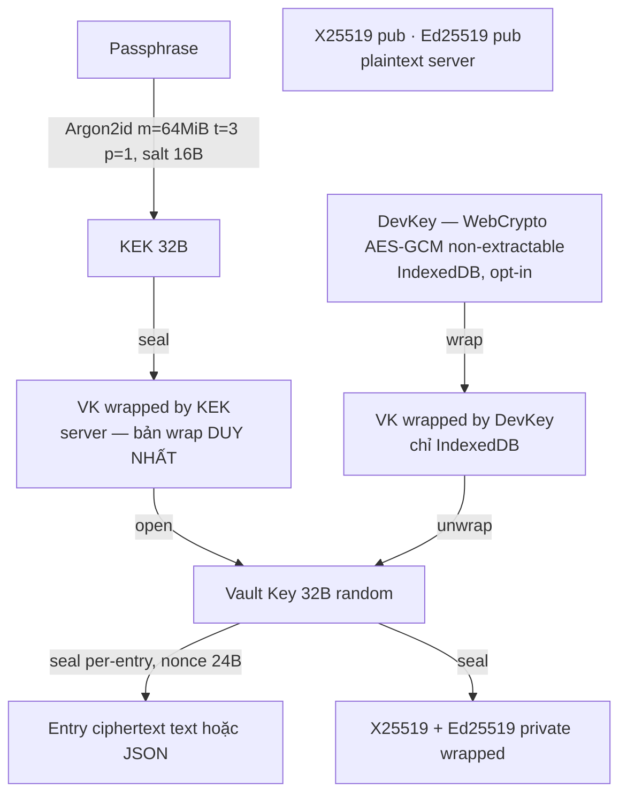
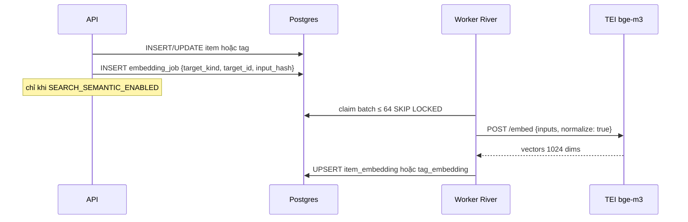

# save-all-by-keyword — Project Specification

> Phiên bản: 0.3 · Ngày: 2026-09-14 · Trạng thái: domain model đã đổi (Item / Tag / typed Entry); các quyết định sản phẩm trước đó vẫn giữ (xem §13 cho phần còn mở)
>
> Tài liệu này là spec tổng thể cho sản phẩm **save-all-by-keyword**: lưu thông tin theo **mục (Item)** — một `name`, nhiều **tag**, nhiều **entry có kiểu** — tìm lại cực nhanh (lexical + semantic trên name và tag), **chỉ thân entry** được **mã hoá đầu-cuối (E2E)**.

## Mục lục

1. [Tổng quan, mục tiêu, non-goals, personas](#1-tổng-quan-mục-tiêu-non-goals-personas)
2. [Domain model](#2-domain-model)
3. [User stories & main flows](#3-user-stories--main-flows)
4. [Kiến trúc tổng thể](#4-kiến-trúc-tổng-thể)
5. [Mô hình mã hoá E2E](#5-mô-hình-mã-hoá-e2e)
6. [Search & suggestion design](#6-search--suggestion-design)
7. [UI/UX spec](#7-uiux-spec)
8. [Data model / Postgres schema](#8-data-model--postgres-schema)
9. [API design](#9-api-design)
10. [Non-functional requirements](#10-non-functional-requirements)
11. [Project structure & dev tooling](#11-project-structure--dev-tooling)
12. [Roadmap](#12-roadmap)
13. [Câu hỏi mở còn lại](#13-câu-hỏi-mở-còn-lại)
14. [Glossary](#14-glossary)

---

## 1. Tổng quan, mục tiêu, non-goals, personas

### 1.1 Tổng quan

**save-all-by-keyword** là web app (online-only) cho phép người dùng lưu nhanh các mẩu thông tin dưới một **mục (Item)**: một tên mô tả (`name`), kèm **nhiều tag**, và **nhiều entry** — mỗi entry có **kiểu lưu** (`text` hoặc `json` ở MVP). Tìm lại bằng cách gõ vài ký tự vào một ô omnibox.

Điểm khác biệt:

- **Search-first**: một ô omnibox vừa tìm **tên mục** và **tag**, vừa thêm nhanh (`name: nội dung`). Gõ `#tag` để lọc / gán tag.
- **Gợi ý thông minh** trên **hai corpus** (item name và tag): prefix, fuzzy, và **semantic** (gõ "mật khẩu wifi" ra mục `wifi-password` hoặc tag `mạng-nhà`) nhờ pgvector. Cùng một model, cùng một semantic toggle.
- **E2E chỉ cho thân entry**: server thấy `name`, tag, kiểu entry, timestamps; **không** thấy text hay JSON. Key chỉ nằm ở browser.
- **Entry có kiểu**: `text` (văn bản tự do) và `json` (tài liệu JSON, UI render **bảng lồng nhau**). Schema sẵn cho `link` / `file` / `image` (không làm ở MVP).
- **Server-first, multi-user, multi-device**: đăng nhập máy khác, nhập encryption passphrase là có dữ liệu.
- **Miễn phí, embedding self-host**: không gói trả phí; vector chạy TEI trong hạ tầng sản phẩm (`BAAI/bge-m3`). Name và tag **không** gửi ra nhà cung cấp AI bên thứ ba.

Tên repo/sản phẩm vẫn là `save-all-by-keyword` (lịch sử). Thực thể chính **không** còn là "keyword". Xem §2 và §14.

### 1.2 Mục tiêu (Goals)

| # | Mục tiêu | Đo lường |
|---|----------|----------|
| G1 | Thêm một text entry mới trong ≤ 3 giây từ lúc focus omnibox | UX test |
| G2 | Gợi ý name/tag hiển thị trong < 150 ms end-to-end khi gõ | p95, 100k item + 20k tag / user |
| G3 | Thân entry (text hoặc JSON) không bao giờ rời browser ở dạng plaintext | Code review + threat model §5.8 |
| G4 | Hỗ trợ đầy đủ tiếng Việt và tiếng Anh (UI + search) | i18n en/vi, embedding multilingual |
| G5 | Mô hình key không chặn chia sẻ Item ở phase sau | Thiết kế §5.3 |
| G6 | Import JSON và xem/sửa như bảng lồng nhau mà **không mất** JSON gốc | UX test + round-trip JSON |

### 1.3 Non-goals (MVP)

- **Không** offline / PWA / local-first sync. App yêu cầu online.
- **Không** tìm kiếm full-text trong thân entry ở phía server (không thể — body đã mã hoá). Client-side content search là Phase 2.
- **Không** chia sẻ dữ liệu giữa user (Phase 3).
- **Không** kiểu `link` / `file` / `image` (schema chừa chỗ; Phase 2).
- **Không** native mobile app, browser extension (Phase 3).
- **Không** collaborative editing, comment, version history chi tiết.
- **Không** recovery key / BIP39 / khôi phục passphrase: quên encryption passphrase = mất vĩnh viễn nội dung entry (quyết định có chủ đích, xem §5).
- **Không** pricing / gói / tier: sản phẩm miễn phí; marketing chỉ landing + docs.
- **Không** embedding API bên thứ ba: không OpenAI, không Gemini, không Cohere. Provider duy nhất: `tei` \| `noop`.
- **Không** "private name" / blind index: `name` và tag luôn plaintext — không có roadmap mã hoá tên.
- **Không** quan hệ entry ↔ nhiều item: một entry thuộc **đúng một** Item.

### 1.4 Personas

| Persona | Mô tả | Nhu cầu chính |
|---------|-------|---------------|
| **Minh — Developer** | Lưu snippet, config, JSON API sample | Gõ `docker: lệnh xoá volume`; import `compose.json` thành bảng; tag `ops`, `home-lab` |
| **Lan — Knowledge worker** | Note họp, ý tưởng, danh sách có cấu trúc | Semantic: "họp marketing tuần này" ra mục `meeting-mkt`; lọc `#okrs` |
| **An — Privacy-conscious** | Số hợp đồng, ghi chú nhạy cảm | Server không đọc body; hiểu `name`/tag là plaintext; chịu trách nhiệm giữ passphrase |

---

## 2. Domain model

### 2.1 Vì sao gọi là **Item** (mục), không phải Keyword / Key

"Keyword" / "key" gợi một **khoá tra cứu unique** — sai với sản phẩm: người dùng mô tả một **mục thông tin** (`name` = tiêu đề / mô tả chính), gắn **nhiều nhãn**, rồi nhét **nhiều mẩu nội dung có kiểu** vào đó. `name` **được phép trùng**.

| Ứng viên | Vì sao không chọn làm mặc định |
|----------|--------------------------------|
| **Keyword / Key** | Sai nghĩa: không phải chìa khoá, không unique, không phải kênh search duy nhất |
| **Note** | Nghèo: một Note thường là một body; ở đây một mục có nhiều entry typed (kể cả bảng JSON) |
| **Record** | Nghe như một hàng DB / form cố định, không khớp "bó thông tin + tag" |

**Chọn trong spec: `Item` (EN) / mục (VI).** URL `/items/:id`, bảng `item`, API `/items`. Đây là khuyến nghị có chủ đích, chưa khoá brand-language cuối — xem Q1 §13.

Thuật ngữ **keyword** chỉ còn trong glossary: *cũ, đã thay bằng `Item.name` + `Tag`*.

### 2.2 Các thực thể

| Entity | Plaintext trên server? | Mô tả |
|--------|------------------------|-------|
| **User** | ✔ | Tài khoản; email, locale, theme, `auto_lock_minutes`, `settings` |
| **AuthIdentity** | ✔ | OAuth (google/github) hoặc password hash |
| **Session** | ✔ | Refresh token hash, device info, thời hạn |
| **Vault** | ✔ (metadata + wrapped keys) | `vault_key` wrap bởi KEK (passphrase); keypair X25519/Ed25519 (pub plaintext, priv wrapped). **Một** bản wrap VK trên server. Mất passphrase = mất khả năng đọc entry |
| **Item** | ✔ `name`, `hint?`, timestamps, counts | Mục per-user. `name` = mô tả chính / title. **Trùng `name` được phép.** Disambiguate ở UI bằng tag + `created_at` |
| **Tag** | ✔ `display`, `normalized` | Nhãn first-class, tái sử dụng giữa các item. Unique per-user theo `normalized` (khác `item.name`) |
| **ItemTag** | ✔ | N–N Item ↔ Tag |
| **Entry** | ✘ body (ciphertext) · ✔ `type`, `position`, envelope meta, size, timestamps | Một mẩu thuộc **đúng một** item. MVP `type`: `text` \| `json` |
| **ItemEmbedding** | ✔ | Vector của `item.name` (+ hint), `model`, `model_version`, `dims` = 1024 |
| **TagEmbedding** | ✔ | Vector của `tag.display` / `normalized` (cùng model) |
| **EmbeddingJob** | ✔ | Hàng đợi embed/re-embed (River); target = item hoặc tag |
| **AuditLog** | ✔ | Sự kiện bảo mật (login, đổi passphrase, export, reset vault…) |
| **DeviceKey** (client-only) | — không có trên server | `DevKey` WebCrypto non-extractable + `seal(VK, DevKey)` trong IndexedDB khi bật "Nhớ thiết bị này" (§5.6) |

**Settings** (cột `app_user.settings` jsonb + cột riêng): `semantic_suggest` (default `true`), `auto_lock_minutes` (default `15`; `0` = never).

### 2.3 Quan hệ

```
User  1 ─── N  Item
User  1 ─── N  Tag
Item  N ─── N  Tag     (item_tag)
Item  1 ─── N  Entry   // entry thuộc đúng một item; không còn N–N entry↔keyword
```

- Xoá Item → soft-delete entries của item đó; gỡ `item_tag`.
- Xoá Tag → gỡ khỏi mọi item; **không** xoá item.
- Reset vault → xoá **entries** (+ vault cũ) → tạo vault mới; **giữ Item + Tag** (plaintext, không phụ thuộc VK).

### 2.4 Quyết định thiết kế

**`Item.name` — plaintext, trùng được.**
User muốn nhiều mục cùng tên (hai "wifi": nhà vs công ty). Server **không** unique `name`. UI phân biệt bằng chip tag + ngày tạo. Trade-off giống keyword cũ: plaintext để search/suggest chạy được.

Chuẩn hoá để search, **không** để identity:

`name_normalized` = NFC → lowercase → trim → collapse whitespace → bỏ dấu câu đầu/cuối. **Giữ dấu tiếng Việt** (`mã` ≠ `ma`). Fuzzy/unaccent ở tầng search (§6).

Độ dài: `name` 1–200 ký tự. `hint` opt-in, ≤ 120 ký tự, plaintext, có nhãn "server đọc được" — dùng khi tên quá ngắn/viết tắt (`k8s`) để embedding tốt hơn.

**`Tag` — first-class, unique theo `normalized`.**
Catalog per-user. `display` giữ cách viết lần đầu (hoặc lần rename). Cùng thuật toán normalize như name. Unique `(user_id, normalized) WHERE deleted_at IS NULL`. Đổi `display` mà `normalized` trùng tag khác → `409 TAG_CONFLICT` (merge tag = Phase 2).

**Giới hạn (ý kiến, dùng xuyên spec):**

| Giới hạn | Giá trị | Lý do |
|----------|---------|-------|
| Tag / item | **20** | Chip UI; quá nhiều tag làm filter mất nghĩa |
| Entry / item | **200** | Mục là một bó, không phải dump vô hạn; vẫn dư cho journal + nhiều bảng |
| Plaintext / entry | **256 KiB** | Text hoặc JSON (sau `JSON.stringify` của document đã parse) |
| Tag `display` | 1–50 ký tự | Nhãn, không phải đoạn văn |
| Catalog tag / user | không cứng; alert vận hành ~ 20k | |
| Item / user | không cứng; alert ~ 50k | |

Xác nhận 20 / 200: Q3 §13.

**Entry typed, body luôn ciphertext.**
`type` là plaintext: UI biết cần renderer text hay bảng **trước khi** decrypt. **Cấu trúc JSON chỉ có sau khi client decrypt** — server chỉ lưu `type='json'` + blob. Không gửi JSON plaintext lên server, kể cả lúc import.

**JSON (group / table)** — luôn giữ document gốc:

- Lưu đúng UTF-8 JSON user import/sửa (không "bình thường hoá" mất key order / số / `null` một cách thầm).
- Object → một bảng field/value.
- Array → hàng; array-of-object → cột = hợp các key.
- Object-trong-ô / array-trong-ô → bảng lồng, expandable.
- Import nhanh: dán hoặc file `.json`; nhận object, array, array lồng, cả JSON primitive; validate parse + size; rồi encrypt như text.

**Không** validate JSON Schema ở MVP (freeform). Schema per-item = mở, xem Q2.

**Search surfaces:**

| Hành động | Kết quả |
|-----------|---------|
| Gõ trong omnibox | Hybrid trên **item names** và **tags** |
| Chọn một tag | Lọc danh sách item có tag đó |
| Chọn một item | Mở chi tiết: chip tag + danh sách entry |
| `#tag` | Chỉ corpus tag (lọc hoặc gán, tuỳ context) |
| `name: text` | Quick-add text entry (quy tắc trùng tên §3.4) |

**Embedding:** chỉ `item.name` (+ hint) và `tag.display`/`normalized`. Không embed body đã mã hoá. Re-embed khi đổi name/hint hoặc đổi tag display.

### 2.5 ER diagram

```mermaid
erDiagram
    USER ||--o{ AUTH_IDENTITY : has
    USER ||--o{ SESSION : has
    USER ||--|| VAULT : owns
    USER ||--o{ ITEM : owns
    USER ||--o{ TAG : owns
    USER ||--o{ AUDIT_LOG : generates
    ITEM ||--o{ ITEM_TAG : tagged
    TAG ||--o{ ITEM_TAG : labels
    ITEM ||--o{ ENTRY : contains
    ITEM ||--o| ITEM_EMBEDDING : has
    TAG ||--o| TAG_EMBEDDING : has
    ITEM ||--o{ EMBEDDING_JOB : queued
    TAG ||--o{ EMBEDDING_JOB : queued

    USER {
        uuid id PK
        text email UK
        text locale
        int auto_lock_minutes "0 = never"
        jsonb settings "semantic_suggest"
        timestamptz created_at
    }
    AUTH_IDENTITY {
        uuid id PK
        uuid user_id FK
        text provider "password|google|github"
        text provider_uid
        text password_hash "argon2id, chỉ provider=password"
    }
    SESSION {
        uuid id PK
        uuid user_id FK
        bytea refresh_token_hash
        text device_label
        timestamptz expires_at
    }
    VAULT {
        uuid user_id PK_FK
        int version
        jsonb kdf "argon2id m=64MiB,t=3,p=1 + salt"
        text vault_key_id
        bytea vault_key_wrapped_by_kek
        bytea x25519_public
        bytea ed25519_public
        bytea private_keys_wrapped
    }
    ITEM {
        uuid id PK
        uuid user_id FK
        text name
        text name_normalized
        text hint
        int entry_count
        timestamptz last_used_at
        timestamptz created_at
    }
    TAG {
        uuid id PK
        uuid user_id FK
        text display
        text normalized
        int item_count
        timestamptz last_used_at
    }
    ITEM_TAG {
        uuid item_id FK
        uuid tag_id FK
    }
    ENTRY {
        uuid id PK
        uuid user_id FK
        uuid item_id FK
        text type "text|json|link|file|image"
        int position
        jsonb envelope
        bytea ciphertext
        int plaintext_len_bucket
    }
    ITEM_EMBEDDING {
        uuid item_id PK_FK
        vector embedding "1024"
        text model
        text model_version
        text input_hash
    }
    TAG_EMBEDDING {
        uuid tag_id PK_FK
        vector embedding "1024"
        text model
        text model_version
        text input_hash
    }
```

---

## 3. User stories & main flows

### 3.1 User stories (ưu tiên MVP)

- **US1** Là user mới, tôi đăng ký email/password hoặc Google/GitHub, đặt **encryption passphrase**, tick checkbox hiểu **không có cách khôi phục** nếu quên.
- **US2** Là user, tôi gõ `wifi: Abc123` vào omnibox → text entry được thêm vào mục `wifi` (tạo mới nếu chưa có; nếu trùng tên xem §3.4).
- **US3** Là user, khi gõ `wi` tôi thấy mục `wifi`, `wifi-office` **và** tag `wifi-khách`; có thể thấy `mạng nhà` (semantic) nếu bật ≈.
- **US4** Là user, tôi mở một mục, thấy chip tag + danh sách entry theo `position`, sửa/xoá entry, thêm/gỡ tag.
- **US5** Là user, tôi import một file/đoạn JSON vào mục → một entry `type=json`, UI hiện bảng lồng nhau, vẫn xem được JSON gốc.
- **US6** Là user, tôi sửa một ô trong bảng lồng nhau (kể cả hàng trong array lồng) → document JSON được cập nhật, encrypt lại, JSON gốc không mất field không nhìn thấy trên bảng.
- **US7** Là user, tên mục trùng: omnibox và trang mục luôn hiện tag + ngày tạo; quick-add khi có nhiều khớp hỏi tôi chọn mục hoặc tạo mới.
- **US8** Là user, gõ `#nhà` để lọc các mục có tag đó; trên trang mục tôi gán/gỡ tag từ catalog (suggest giống name).
- **US9** Là user, máy mới: đăng nhập → nhập passphrase → **unlock vault**.
- **US10** Là user, đổi passphrase mà không re-encrypt entries.
- **US11** Là user, bật "Nhớ thiết bị này" (opt-in, mặc định tắt); "Quên thiết bị này" bất cứ lúc nào.
- **US12** Là user, chọn locale en/vi và auto-lock 5 / **15** / 60 / never.
- **US13** Là user quên passphrase: được nói thẳng là không khôi phục được body; **Reset vault** xoá entries, **giữ items + tags**.
- **US14** Là user, export encrypted backup hoặc decrypted JSON (cảnh báo).

### 3.2 Flow: Sign up → passphrase → xác nhận "không thể khôi phục"

```mermaid
sequenceDiagram
    participant B as Browser
    participant A as Go API
    participant DB as Postgres
    B->>A: POST /auth/signup (email+pw) hoặc OAuth callback
    A->>DB: tạo user, auth_identity, session
    A-->>B: session cookie (HttpOnly)
    Note over B: Bước 1: passphrase (≥ 12 ký tự, zxcvbn ≥ 3) ×2
    Note over B: Bước 2: cảnh báo quên = mất nội dung; checkbox bắt buộc
    B->>B: salt = random(16); KEK = Argon2id(passphrase, salt, m=64MiB,t=3,p=1)  [Web Worker]
    B->>B: VK = random(32)
    B->>B: kp = X25519+Ed25519 keygen
    B->>B: wrapK = seal(VK, KEK); wrapP = seal(priv, VK)
    B->>A: POST /vault {kdf_params, wrapK, pubkeys, wrapP}
    A->>DB: insert vault
    B->>B: VK trong Worker memory; xoá passphrase và KEK
    opt user tick "Nhớ thiết bị này"
        B->>B: DevKey = WebCrypto AES-GCM non-extractable; IndexedDB ← {DevKey, seal(VK, DevKey)}
    end
```

Nếu `AUTH_REQUIRE_EMAIL_VERIFICATION=true` (mặc định **false**), user email/password phải verify email trước khi tạo vault; OAuth coi verified nếu provider trả `email_verified`.

**Không** sinh recovery key, không BIP39, không màn "ghi lại 24 từ".

### 3.3 Flow: Unlock trên thiết bị mới

1. Đăng nhập → session.
2. `GET /vault` → `kdf_params`, `wrapK`.
3. Worker: `KEK = Argon2id(passphrase, salt)` (đúng params trên vault, **không** hạ 64 MiB); `VK = open(wrapK, KEK)`. Sai passphrase → AEAD fail → "Passphrase không đúng".
4. VK ở Worker memory. Nếu tick **"Nhớ thiết bị này"** → `DevKey` + `seal(VK, DevKey)` trong IndexedDB (§5.6). Lần sau trên thiết bị này: unlock **im lặng** bằng DevKey.

### 3.4 Flow: Quick-add `name: text`

Cú pháp: `name: nội dung` (một `name`). Mở rộng: `name #tag1 #tag2: nội dung` — gán tag khi tạo/append.

1. Parse client: tách tại `:` đầu tiên **không nằm trong URL** (`^\s*([^:]+?)\s*:\s*(?!//)(.+)$`). Phần trái: token `name` + các `#tag`.
2. Không có `:` → **search** (§3.5).
3. Khớp item theo `name_normalized` **chính xác**:
   - **0** → `POST /items` tạo mục mới, gán tag nếu có.
   - **1** → append entry vào mục đó.
   - **nhiều** → dialog: liệt kê từng item (name + tag chips + `created_at`) + hành động **Tạo mục mới cùng tên**. Không đoán.
4. Tag trong cú pháp: `POST /tags` upsert theo `normalized`, rồi `PUT` item tags (hợp với tag đã có, trần 20).
5. Encrypt text: `envelope = {v:1, alg:"xchacha20poly1305", key_id, nonce}`; `ciphertext = seal(utf8(text), VK, nonce, aad=canonical(envelope)+entry_id)`.
6. `POST /items/{id}/entries` `{type:"text", envelope, ciphertext, …}` + `Idempotency-Key`.
7. Server tăng `entry_count`, `last_used_at`; enqueue embed nếu item mới / name mới.
8. UI optimistic + toast "Đã lưu vào **wifi**" + Undo 5 s.

Quick-add **chỉ** tạo `type=text`. JSON đi qua modal import (§3.6) hoặc type picker trên trang mục. Nếu clipboard/paste trong ô add là JSON hợp lệ, hiện banner "Phát hiện JSON — [Lưu như bảng]" — không tự đổi type.

`Ctrl+Enter` khi không có `:` → tạo **item mới** với `name` = text đang gõ (kể cả khi đã có item trùng tên).

### 3.5 Flow: Search & suggest

Gõ → debounce 120 ms → `GET /suggest?q=` → dropdown hỗn hợp item + tag.

- Enter trên **item** → mở `/items/:id`.
- Enter trên **tag** → `/items?tag_id=`.
- Gõ bắt đầu bằng `#` (hoặc token `#…`) → `scope=tag`.
- `Tab` trên item → điền `name: ` (add mode).
- `Tab` trên tag → điền `#display ` (tiếp tục lọc/gán).

Chi tiết ranking §6, UI §7.

### 3.6 Flow: Import JSON thành entry bảng

1. Từ trang mục (hoặc command "Import JSON"): modal dán **hoặc** chọn file `.json`.
2. Client `JSON.parse`; từ chối nếu không phải JSON, hoặc UTF-8 size > 256 KiB, hoặc (sau serialize lại để đo) > 256 KiB.
3. Preview: renderer bảng lồng (§7.4) + tab "JSON gốc".
4. User xác nhận item đích (mặc định mục đang mở) + tag tuỳ chọn.
5. Plaintext = **chuỗi JSON gốc** (paste/file), không phải bản pretty-print trừ khi user bật "Format trước khi lưu".
6. Encrypt giống text; `POST /items/{id}/entries` `{type:"json", envelope, ciphertext, plaintext_len_bucket}`.
7. Server **không** parse JSON; chỉ check `type`, envelope, size.

Một lần import = **một** entry chứa cả document (kể cả array 500 object). Không tách phần tử thành nhiều entry.

### 3.7 Flow: Sửa bảng JSON lồng nhau

1. Client đã decrypt → giữ AST JSON trong Worker/memory của card.
2. Sửa ô / thêm hàng / thêm field / xoá hàng → mutate theo JSON Pointer.
3. Serialize lại (table-edit: indent 2 spaces; raw-edit: giữ text user).
4. Validate size; encrypt nonce mới; `PUT /entries/:id` + `If-Match: updated_at`.
5. Field không hiện trên bảng (ví dụ key lạ, `null`) **vẫn nằm trong document** trừ khi user xoá explicit.

### 3.8 Flow: View / edit / delete

- Trang item: entries theo `position` tăng (user kéo thả để reorder → `PATCH /items/{id}/entries/reorder`).
- Decrypt lazy khi render.
- Text: edit inline. JSON: bảng hoặc raw.
- Xoá: soft delete 30 ngày, Undo; purge job.
- Gán tag: mini-omnibox trên chip `+`, cùng engine suggest tag; trần 20 → tooltip, không thêm chip 21.

### 3.9 Flow: Đổi passphrase (rewrap only)

1. **Bắt buộc passphrase hiện tại** (kể cả vault đang unlock / thiết bị đã nhớ): derive KEK, unwrap `wrapK` thành công.
2. `salt' = random`; `KEK' = Argon2id(new, salt', 64MiB, t=3, p=1)`; `wrapK' = seal(VK, KEK')`.
3. `PUT /vault/kek {kdf, wrapK'}` + `If-Match: version`; `vault.version++`; audit `vault.rewrap`.
4. **Không** đụng entries. DevKey wrap vẫn valid (bọc VK). UI đề nghị "Đăng xuất phiên khác"; IndexedDB máy khác tự xoá khi gặp session revoke.

### 3.10 Flow: Quên passphrase (không có recovery)

**Không có recovery key, không email khôi phục, không câu hỏi bí mật.**

1. Link "Tôi quên passphrase" → giải thích: **không ai** đọc/khôi phục body, kể cả vận hành.
2. Còn thiết bị đang "nhớ" → mở app đó (unlock bằng DevKey) → Export decrypted JSON để cứu body → Reset vault → nhập lại (Import decrypted = Phase 2; MVP: giữ file, nhập tay / import JSON từng mục).
3. Không còn thiết bị → **Reset vault**: re-auth → xoá entries + vault → onboard passphrase mới. **Items + tags giữ nguyên.** Audit `vault.reset`.

Thiết bị "nhớ" **không** đặt passphrase mới (vẫn cần passphrase cũ, §3.9).

### 3.11 Flow: Export

- **Encrypted backup** (`.sabk.json`): items, tags, item_tag, entries ciphertext, vault (`kdf`, `wrapK`, pubkeys, `wrapP`). Import lại **chỉ** với passphrase đúng. Server tạo được (không cần VK).
- **Decrypted JSON**: client decrypt mọi entry rồi tải. Modal cảnh báo + re-auth. Audit `export.decrypted`.

---

## 4. Kiến trúc tổng thể

```mermaid
flowchart LR
    subgraph Client["Browser (Next.js app, client components)"]
        UI[UI / Omnibox / JSON tables]
        CR[Crypto module<br/>libsodium-wrappers<br/>Argon2id · XChaCha20-Poly1305 · X25519/Ed25519]
        UI --> CR
    end

    subgraph Edge["Next.js server (SSR)"]
        MK[Landing / Docs<br/>SSR + SEO + locale routing]
        SH[App shell<br/>SSR khung, không SSR dữ liệu]
    end

    subgraph API["Go API (chi)"]
        AU[Auth · Sessions]
        IT[Items · Tags · Suggest · Search]
        EN[Entries ciphertext + type]
        VA[Vault keys]
        EX[Export]
        WK[Worker: embedding jobs]
        EP[Embedding Provider<br/>tei | noop]
    end

    subgraph Data
        PG[(Postgres 16<br/>+ pgvector + pg_trgm)]
        RD[(Redis — optional<br/>rate limit / cache)]
    end

    subgraph Emb["Self-hosted embedding (compose profile semantic / cùng VPC)"]
        TEI[TEI container CPU<br/>BAAI/bge-m3 · 1024 dims<br/>HTTP :8081]
    end

    NG[nginx reverse proxy<br/>key.zone17th.click · TLS] --> Edge
    NG --> API
    UI -- HTTPS JSON --> NG
    MK -.-> UI
    AU & IT & EN & VA & EX --> PG
    WK --> PG
    WK --> EP
    IT -- query embedding --> EP
    EP -- HTTP nội bộ --> TEI
    IT -. cache .-> RD
```

Toàn bộ chạy trong hạ tầng sản phẩm. **Không** có network call ra dịch vụ AI bên thứ ba. Chỉ `item.name` / `tag.display` đi Postgres → Go → TEI nội bộ.

### 4.1 Cái gì chạy ở đâu

| Thành phần | Chạy ở | Ghi chú |
|-----------|--------|---------|
| Landing + docs (không có trang pricing) | Next.js SSR/SSG | SEO, `hreflang` en/vi, sitemap |
| App shell (`/app/*`) | Next.js, `noindex`, client components | Không SSR dữ liệu user (không có VK) |
| **Toàn bộ crypto** | Browser (Web Worker) | Server không nhận passphrase, KEK, VK, plaintext body |
| JSON parse / bảng lồng / import file | Browser | Server không thấy JSON |
| Auth, sessions | Go API | Cookie HttpOnly, SameSite=Lax, refresh rotation |
| Item / Tag CRUD, suggest, search | Go API + Postgres | Lexical (pg_trgm, prefix) + vector (pgvector) trên **hai** bảng |
| Entry CRUD | Go API + Postgres | Blob opaque + `type` + `position`; validate size & envelope |
| Embedding (index) | Go worker (River) → TEI | Async; CPU image; compose profile `semantic`; không public |
| Embedding (query) | Go API → TEI | Sync khi suggest; LRU + circuit breaker (§6.6) |
| Rate limit / cache suggest | Go in-memory (MVP) → Redis khi scale ngang | |
| Reverse proxy / TLS | nginx trước Next.js + Go API | Domain tạm `key.zone17th.click`; cấu hình khi deploy (§11.5) |

### 4.2 Backend stack (Go)

| Lớp | Chọn | Lý do ngắn |
|-----|------|-----------|
| HTTP router | **chi** (`go-chi/chi/v5`) | `net/http`, middleware composable, nhẹ |
| DB driver | **pgx v5** (pool) | Native Postgres, `pgvector-go`, COPY, batch |
| Query layer | **sqlc** | SQL thật, type-safe; hợp pgvector/pg_trgm |
| Migration | **golang-migrate** (SQL files) | CI + `make migrate` |
| Job queue | **River** (`riverqueue/river`) | Không thêm infra; enqueue cùng insert item/tag |
| Validation | `go-playground/validator` | |
| Auth | `golang.org/x/oauth2` + `coreos/go-oidc`; password `alexedwards/argon2id` | |
| Config/log/metrics | `envconfig`, `log/slog`, OpenTelemetry + Prometheus | |
| Test | `testcontainers-go` (Postgres+pgvector) | |

### 4.3 Frontend stack

Next.js **15** App Router, TypeScript, Tailwind + shadcn/ui (Radix), TanStack Query, `next-intl`, `libsodium-wrappers-sumo` trong Web Worker, `cmdk` cho omnibox, Zod. JSON table: renderer riêng (không phụ thuộc grid nặng ở MVP); virtualize khi nhiều hàng.

### 4.4 Embedding provider abstraction

```go
// apps/api/internal/embedding/provider.go
type Provider interface {
    Name() string // ví dụ "tei/BAAI/bge-m3@<model-revision>"
    Dims() int
    MaxBatch() int
    Embed(ctx context.Context, inputs []string) ([][]float32, error)
}
```

MVP: **`tei`** (`POST /embed`, đọc `/info` lúc boot: `model_id`, `model_sha`, dims → `model_version`) và **`noop`** (vector 0, dev/test không TEI). Env: `EMBEDDING_PROVIDER=tei|noop`, `TEI_URL`.

Đổi model (fallback host: `intfloat/multilingual-e5-base`, 768 dims, cần prefix `query:`/`passage:` qua `TEI_INPUT_PREFIX_*`) = đổi env + `ReembedAll`. **Không** implement provider gọi API bên thứ ba.

---

## 5. Mô hình mã hoá E2E

### 5.1 Phạm vi — tuyên bố rõ

| Dữ liệu | Trên server | Lý do |
|---------|-------------|-------|
| Entry body (`text` hoặc JSON UTF-8) | **Ciphertext** | Thứ cần bảo vệ |
| `item.name`, `name_normalized`, `hint` | **Plaintext** | Search, suggest, embedding |
| `tag.display`, `tag.normalized` | **Plaintext** | Search, filter, embedding, catalog |
| `entry.type`, `position`, id, timestamps, `plaintext_len_bucket`, số entry/tag | Plaintext | Renderer, sort, vận hành |
| Email, locale, session, settings | Plaintext | Auth / UX |

**Trade-off chấp nhận:** attacker có DB biết user có **những tên mục và tag nào**, cấu trúc (bao nhiêu entry, type gì, khi nào) — **không** biết chữ trong entry hay JSON.

**Không có "private name".** Search/suggest đòi server đọc name và tag. Bí mật để trong **body**.

**Mitigations:**

- Onboarding: "Tên mục và tag server đọc được. Đừng đặt bí mật vào đó — dùng `bank`, không dùng `bank-vietcombank-0123`."
- `hint` opt-in, nhãn "server có thể đọc".
- Embedding **chỉ** TEI self-host: name/tag không rời hạ tầng.
- Không log `q` (chỉ độ dài + latency).

### 5.2 Nguyên lý

1. Passphrase, KEK, VK, plaintext body **không** rời browser.
2. Một **VK** mã hoá mọi entry (text và JSON như nhau) → đổi passphrase = **rewrap O(1)**.
3. Envelope **versioned**.
4. Keypair bất đối xứng sinh **lúc tạo vault** (sharing Phase 3 không migrate).
5. **Không recovery path.** Bản wrap VK trên server duy nhất: `wrapK`. Quên passphrase = mất body.

### 5.3 Key hierarchy



| Key | Sinh ở | Lưu ở | Dùng để |
|-----|--------|-------|---------|
| Passphrase | user | không lưu | Derive KEK |
| KEK | Worker, `crypto_pwhash` Argon2id | memory tạm | Wrap/unwrap VK |
| **VK** | `randombytes(32)` | server wrapped bởi KEK; Worker memory | Encrypt mọi entry body; wrap private keys |
| DevKey (opt-in) | WebCrypto `generateKey(AES-GCM, extractable=false)` | IndexedDB `sabk.device`; **không** lên server | Unlock im lặng |
| X25519 / Ed25519 | browser | pub: server; priv: wrapped by VK | **Phase 3**: share Item |

**Sharing (Phase 3) không bị chặn:** A sinh `ShareKey_I` cho Item I, re-encrypt entries của I bằng `ShareKey_I`, `crypto_box_seal(ShareKey_I, B.x25519_pub)`. Không đụng VK. Envelope đã có `key_id` (`vk:…` / sau này `sk:…`).

### 5.4 Thuật toán & tham số

| Mục | Chọn | Ghi chú |
|-----|------|---------|
| Thư viện | **libsodium** (`libsodium-wrappers-sumo`) trong Web Worker | §5.7 |
| KDF | **Argon2id** cố định: `memlimit = 64 MiB`, `opslimit = 3`, `parallelism = 1`, salt 16 B | Mọi thiết bị giống nhau. **Không** fallback thấp hơn. Params lưu trên `vault.kdf`; chỉ được **nâng** sau này (unlock params cũ → rewrap params mới) |
| AEAD | **XChaCha20-Poly1305** IETF, key 32 B, nonce 24 B random | Text và JSON cùng alg |
| Wrap | Cùng AEAD, AAD `"vault-key-v1"` / `"priv-keys-v1"` | |
| Keypair | X25519, Ed25519 | Hai seed, một blob wrap |
| Password login | Argon2id server-side, params riêng | Độc lập KDF vault |

JSON plaintext = UTF-8 của document. **Không nén** ở MVP (`ct_enc` dành sau).

### 5.5 Envelope format (versioned)

`entry.envelope` (jsonb) + `entry.ciphertext` (bytea):

```json
{
  "v": 1,
  "alg": "xchacha20poly1305-ietf",
  "key_id": "vk:7f3a…",
  "nonce": "base64url(24 bytes)",
  "ct_enc": "utf8"
}
```

- **AAD** = canonical JSON envelope (không ciphertext) + `entry_id`.
- `plaintext_len_bucket` = `ceil(len/256)*256` — hiển thị "~1 KB", giảm rò rỉ size.
- Trần plaintext 256 KiB; server: `plaintext_len_bucket ≤ 262144` và `octet_length(ciphertext) ≤ 263168` (slack AEAD).
- Client đọc mọi `v` cũ, ghi `v` mới nhất khi edit.

`type` **không** nằm trong envelope — cột riêng, plaintext.

### 5.6 Key lifecycle

| Sự kiện | Hành động |
|--------|-----------|
| Tạo vault | §3.2 — checkbox bắt buộc "quên passphrase = mất nội dung" |
| Unlock | Derive KEK → unwrap VK → Worker memory. Mất khi đóng tab |
| **Auto-lock** | Mặc định **15 phút** idle; user chọn **5 / 15 / 60 / Never** (`auto_lock_minutes`, 0 = never). Phím `L` / nút 🔒 / "Lock now". Lock = `sodium_memzero` VK + xoá cache plaintext entries. **Name, tag, type, list item vẫn hiện**; body hiện `🔒 ••••••`. Không tạo/sửa entry khi locked |
| **"Nhớ thiết bị này"** (MVP, opt-in, **mặc định off**) | Lúc unlock, nếu tick: DevKey non-extractable + wrap VK trong IndexedDB cùng `vault.version`. Lần sau unwrap, không hỏi passphrase. Vault reset / `key_id` khác → xoá IDB. "Quên thiết bị này" = xoá IDB. Logout **không** tự xoá; session revoke → client xoá khi `401 reason=revoked` |
| **Auto-lock × nhớ thiết bị** | Auto-lock **vẫn** chạy (che màn hình, xoá VK memory). Tương tác kế tiếp: **re-unlock im lặng** bằng DevKey, không màn passphrase. Trên máy đã nhớ, auto-lock chỉ là "che nội dung"; bảo vệ thật = khoá màn hình OS. UI nói rõ khi bật nhớ thiết bị |
| Đổi passphrase | Rewrap (§3.9), cần passphrase hiện tại |
| Quên passphrase | Không recovery. Reset vault (§3.10) — giữ items + tags |
| Rotate VK | Phase 2: decrypt/encrypt lại batch; DevKey cũ vô hiệu |
| Xoá tài khoản | Xoá vault + entries + items + tags; audit 90 ngày |

Rủi ro "Nhớ thiết bị": XSS / người ngồi máy / malware trong origin unwrap được VK không cần passphrase. `extractable=false` chặn copy bytes DevKey, không chặn **dùng** key. Chỉ bật trên máy cá nhân có lock màn hình.

### 5.7 libsodium vs WebCrypto

Dùng **libsodium** cho Argon2id, XChaCha20-Poly1305, X25519/Ed25519 (một API, WASM audited). **WebCrypto chỉ** cho DevKey non-extractable. Worker: khỏi block UI, cô lập VK khỏi main thread (giảm bề mặt XSS đọc trực tiếp — không loại trừ XSS).

### 5.8 Threat model

**Bảo vệ được:**

- DB/backup/insider: thấy name, tag, type, metadata, ciphertext — không VK, không body.
- Session bị cắp (không VK): đọc/sửa/xoá item & tag, xoá entry, không đọc body; thay wrap → client thấy `vault.version` / AEAD fail.

**Không bảo vệ được:**

- Malware, extension độc, XSS → lộ VK/plaintext. Máy đã nhớ → JS trong origin unlock không cần passphrase.
- Passphrase yếu + DB lộ → brute-force offline (Argon2id 64 MiB/3/1 làm chậm). zxcvbn ≥ 3.
- Quên passphrase → body mất vĩnh viễn.
- **Name và tag không được bảo vệ** — theo thiết kế.
- Server phát JS độc (supply-chain): giới hạn nội tại của web E2E. CSP, SRI, hash bundle; tương lai extension verifier.
- Metadata: tên, tag, số entry, `type`, thời điểm, size bucket.

---

## 6. Search & suggestion design

### 6.1 Phạm vi

- **MVP: hai corpus plaintext** — `item.name` (+ hint) và `tag.display`/`normalized`. Body ciphertext → server không index.
- **Phase 2:** client-side search trên entry đã decrypt trong session (MiniSearch/FlexSearch trong Worker, không persist index).

Chọn tag → **filter** item (`GET /items?tag_id=`), không "mở tag như một trang nội dung". Chọn item → mở entries.

### 6.2 Ba kênh × hai corpus

| Kênh | Kỹ thuật | Ví dụ |
|------|----------|--------|
| **Prefix** | `normalized LIKE q \|\| '%'` + `text_pattern_ops` | `wi` → item `wifi`, tag `wifi-khách` |
| **Fuzzy / substring** | `pg_trgm` `similarity` / `%` / `word_similarity` + `unaccent` | `wfii` → `wifi`; `ma` → `mã` |
| **Semantic** | pgvector `<=>` cosine, HNSW 1024 dims | `mật khẩu mạng` → item `wifi-password` hoặc tag `mạng-nhà` |
| **Boost** | `last_used_at`, `entry_count` / `item_count` | Mục/tag hay dùng |

Cùng model `bge-m3`, cùng ngưỡng, cùng toggle semantic. Query embed **một lần**, so với **cả** `item_embedding` và `tag_embedding`.

Khi `q` có leading `#` (sau trim): **chỉ** corpus tag; UI ở chế độ filter/assign.

### 6.3 SQL sketches

Lexical items:

```sql
-- $1 user_id, $2 normalized q, $3 limit
WITH q AS (SELECT $2::text AS q, immutable_unaccent($2::text) AS qa)
SELECT i.id, i.name, i.entry_count, i.last_used_at, i.created_at,
       (i.name_normalized LIKE q.q || '%')::int AS prefix_hit,
       GREATEST(similarity(i.name_normalized, q.q),
                word_similarity(q.qa, i.name_unaccent)) AS trgm_score
FROM item i, q
WHERE i.user_id = $1 AND i.deleted_at IS NULL
  AND (i.name_normalized LIKE q.q || '%'
       OR i.name_unaccent % q.qa
       OR q.qa <% i.name_unaccent)
ORDER BY prefix_hit DESC, trgm_score DESC, i.last_used_at DESC
LIMIT $3;
```

Lexical tags: cùng hình trên `tag.normalized` / `tag_unaccent`.

Semantic (items; tags tương tự):

```sql
SELECT i.id, i.name, 1 - (e.embedding <=> $2::vector) AS cos_sim
FROM item_embedding e
JOIN item i ON i.id = e.item_id
WHERE i.user_id = $1 AND i.deleted_at IS NULL
  AND e.model = $3
ORDER BY e.embedding <=> $2::vector
LIMIT 20;
```

Filter `user_id` trước HNSW: pgvector ≥ 0.8 dùng `SET hnsw.iterative_scan = relaxed_order`.

Gắn tag chips cho mỗi item hit: `SELECT tag_id, display FROM item_tag JOIN tag … WHERE item_id IN (…) LIMIT 20` — cần để disambiguate tên trùng trong dropdown.

### 6.4 Hybrid ranking

Chạy lexical item, lexical tag, semantic item, semantic tag **song song** (timeout: lexical 50 ms / nhánh, semantic 80 ms / nhánh; một lần gọi TEI cho query vector). Gộp **RRF** + hard-tier:

\[
\text{score}(x) = \text{tier}(x)\cdot 1000 + \sum_{c\in\{\mathrm{lex},\mathrm{sem}\}}\frac{w_c}{60+\mathrm{rank}_c(x)} + w_r\cdot\mathrm{recency}(x) + w_f\cdot\log(1+\mathrm{count})
\]

- `tier`: 3 prefix, 2 fuzzy (`trgm ≥ 0.35`), 1 semantic only (`cos ≥ 0.55`), 0 recency (`q` rỗng).
- `w_lex = 1.0`, `w_sem = 0.8`, `w_r = 0.05`, `w_f = 0.02`. `count` = `entry_count` (item) hoặc `item_count` (tag).
- Trong dropdown: **không** trộn mù — nhóm ngắn **Tags** rồi **Items** (hoặc xen kẽ nhưng mỗi row có `kind`). Thứ tự trong nhóm: prefix > fuzzy > semantic > recent. Cùng tier: RRF.
- `q` rỗng: 8 item `last_used_at` + 4 tag `last_used_at`. Không gọi TEI.
- `len(q) < 2`: chỉ prefix, cả hai corpus.
- Semantic khi `len(q) ≥ 3` và `semantic_effective`.

```
semantic_effective = SEARCH_SEMANTIC_ENABLED   -- env, default true
                  && user.settings.semantic_suggest  -- default true
                  && circuit_breaker.closed
                  && len(q) >= 3
```

Tắt semantic → lexical-only trên **cả hai** corpus; không gọi TEI; không đọc bảng embedding. Prefix/fuzzy **không đảo thứ tự** khi bật/tắt ≈ — chỉ thêm/bớt hàng tier 1.

`GET /suggest?q=#nhà` hoặc `q=nhà&scope=tag`: chỉ tag.

### 6.5 Indexing strategy

```sql
CREATE UNIQUE INDEX tag_user_norm_uq ON tag (user_id, normalized) WHERE deleted_at IS NULL;
CREATE INDEX tag_user_norm_prefix ON tag (user_id, normalized text_pattern_ops) WHERE deleted_at IS NULL;
CREATE INDEX tag_norm_trgm ON tag USING gin (tag_unaccent gin_trgm_ops);
CREATE INDEX tag_user_recent ON tag (user_id, last_used_at DESC) WHERE deleted_at IS NULL;

CREATE INDEX item_user_name_prefix ON item (user_id, name_normalized text_pattern_ops) WHERE deleted_at IS NULL;
CREATE INDEX item_name_trgm ON item USING gin (name_unaccent gin_trgm_ops);
CREATE INDEX item_user_recent ON item (user_id, last_used_at DESC) WHERE deleted_at IS NULL;
-- không UNIQUE trên name_normalized — trùng tên là hợp lệ

CREATE INDEX item_emb_hnsw ON item_embedding
  USING hnsw (embedding vector_cosine_ops) WITH (m = 16, ef_construction = 128);
CREATE INDEX tag_emb_hnsw ON tag_embedding
  USING hnsw (embedding vector_cosine_ops) WITH (m = 16, ef_construction = 128);
```

Generated `unaccent` columns: `IMMUTABLE` wrapper. `hnsw.ef_search = 64` lúc suggest.

### 6.6 Embedding pipeline



| Target | Input text |
|--------|------------|
| Item | `name` + (`" — "` + `hint` nếu có) |
| Tag | `display` (nếu `display` khác `normalized` rõ rệt, vẫn chỉ `display` — đó là thứ user nhận) |

`input_hash = sha256(model || input)`; skip nếu hash không đổi.

Trigger: tạo/đổi `item.name`/`hint`; tạo/đổi `tag.display`. Gán/gỡ `item_tag` **không** re-embed (văn bản không đổi). Delete → cascade embedding.

`SEARCH_SEMANTIC_ENABLED=false`: không enqueue. Bật lại → `ReembedAll` cho item/tag thiếu vector.

Đổi model: batch 64, concurrency TEI mặc định 2; cột `model` để so cùng model; ≥ 95% xong → flip `active_model`; đổi **dims** → bảng `*_embedding_v2 vector(N)` rồi swap.

Query cache: LRU key `model || normalized(q)`, TTL 24 h.

Degraded: TEI > 300 ms / 5xx / refused → circuit 60 s → lexical-only, `semantic: false, semantic_reason: "degraded"`. Job retry 1 m → 1 h, dead-letter sau 24 h.

### 6.7 Model — self-host

**Quyết định:** TEI (CPU) trong Docker Compose, Go HTTP nội bộ. API bên thứ ba **loại**.

| Tiêu chí | **BAAI/bge-m3** (mặc định) | multilingual-e5-base (fallback host) |
|----------|---------------------------|--------------------------------------|
| Dims | **1024** | 768 |
| vi/en ngắn | Tốt nhất trong nhóm so sánh | Tốt, kém hơn trên từ đơn / code-switch |
| Prefix query/passage | Không | Có — dễ quên |
| RAM CPU fp32 | ~2.3 GB + runtime | ~1.1 GB + runtime |
| Latency 1 input ngắn, 2 vCPU | ~40–90 ms | ~20–40 ms |

Chọn **bge-m3**, `normalize: true`, cosine. Host nhỏ: đổi e5-base + re-embed, hoặc `SEARCH_SEMANTIC_ENABLED=false`. `model` = `"tei/BAAI/bge-m3"`, `model_version` = `model_sha` từ `GET /info`.

### 6.8 Client behaviour

- Debounce 120 ms, AbortController, giữ kết quả cũ (không flicker).
- TanStack cache theo `q`+`scope`, staleTime 30 s; prefix đã có → lọc local ngay.
- Keyboard: `↑↓` · `Enter` mở (item) hoặc lọc (tag) · `Tab` điền · `Ctrl+Enter` tạo item mới · `Esc`.
- Highlight khớp; badge `≈` chỉ khi `semantic: true`.
- Row item: name + tối đa 3 chip tag + `created_at` nếu trùng name trong payload · `entry_count`.
- Row tag: `#display` · `item_count`.
- Đọc `features.semantic_available` + `settings.semantic_suggest` để hiện toggle `≈`.

### 6.9 Performance targets

| Chỉ số | Mục tiêu |
|--------|----------|
| Suggest lexical-only, 100k item + 20k tag / user | **p95 < 40 ms** server |
| Hybrid, query-embed cache hit | **p95 < 100 ms** server |
| Hybrid, cache miss (TEI CPU) | p95 < 350 ms; UI hiện lexical trước, merge semantic sau (có thể 2 request: `semantic=0` rồi full) |
| Embedding job lag (item/tag mới) | p95 < 10 s |
| Entry create | p95 < 150 ms server |

### 6.10 Semantic — hai tầng + toggle omnibox

| Tầng | Cơ chế | Khi tắt |
|------|--------|---------|
| **Deployment** | `SEARCH_SEMANTIC_ENABLED` default `true` | Không cần TEI (compose profile `semantic`); không enqueue; suggest/search lexical; `features.semantic_available: false`; `PATCH semantic_suggest` → `409 SEMANTIC_UNAVAILABLE`; bật lại → `ReembedAll` |
| **User** | `settings.semantic_suggest` default `true`; Settings + toggle **`≈`** trên omnibox | Không gọi TEI cho query user đó; **vẫn** chạy embed job (bật lại là có vector). `semantic_reason: "disabled_user"` |
| **Degraded** | Circuit TEI | Như tắt user, 60 s; `semantic_reason: "degraded"` |

Thứ tự: server → user → breaker → `len(q) ≥ 3`. Tắt user **không** xoá vector.

---

## 7. UI/UX spec

### 7.1 Nguyên tắc

- Một màn chính, một ô. Omnibox command-palette, focus `/` hoặc `Ctrl+K`.
- Quick-add `name: text` là đường chính cho text; JSON có modal + type picker — không bắt user nhớ syntax JSON.
- Vault locked/unlocked luôn thấy trên header.
- Phá huỷ: Undo, không confirm — trừ export decrypted, reset vault, xoá tài khoản.
- Tên trùng: **luôn** kèm tag + ngày, không bắt user nhớ id.

### 7.2 Omnibox

```
┌──────────────────────────────────────────────────────────────────────┐
│  ⌂ save-all-by-keyword                        🔓 Vault   EN ▾   ☾   👤 │
├──────────────────────────────────────────────────────────────────────┤
│   ┌──────────────────────────────────────────────────────────────┐   │
│   │ 🔍  wi▏                                            [≈ on] ⌘K  │   │
│   └──────────────────────────────────────────────────────────────┘   │
│   ┌──────────────────────────────────────────────────────────────┐   │
│   │ Tags                                                         │   │
│   │   #**wi**fi-khách                         4 mục · ~ fuzzy    │   │
│   │ Items                                                        │   │
│   │ ▸ **wi**fi     [nhà] [office]    12 entries · 12/03/2026     │   │
│   │   **wi**fi     [công-ty]          3 entries · 01/06/2026     │   │
│   │   **wi**fi-office                 3 entries · 5d             │   │
│   │   mạng nhà     [home]        ≈ gần nghĩa                      │   │
│   │ ─────────────────────────────────────────────────────────────│   │
│   │   ＋ Tạo mục "wi"                                  Ctrl+Enter │   │
│   │   Gõ  name: nội dung  ·  #tag để lọc                         │   │
│   └──────────────────────────────────────────────────────────────┘   │
│   Gần đây:  [docker] [meeting-mkt]   Tags: [#ops] [#okrs]            │
└──────────────────────────────────────────────────────────────────────┘
```

Hai hàng cùng chữ `wifi` **cố ý** — phân biệt bằng tag + ngày.

Toggle `[≈ on]/[≈ off]` = `semantic_suggest`; **ẩn** khi `semantic_available = false`.

`#` leading:

```
   │ 🔍  #nh▏                                                      │
   │   #**nh**à                                8 mục               │
   │   #**nh**à-bố-mẹ                          2 mục               │
   │   Enter = lọc mục có tag này                                  │
```

Add mode khi có `:`:

```
   │ ＋  wifi #nhà: Abc123@home▏                                    │
   │  Sẽ lưu vào   [wifi ✓ một mục]  tags [nhà]                     │
   │  hoặc: 3 mục tên "wifi" — chọn bên dưới trước khi Enter        │
   │  Nội dung     "Abc123@home"                     🔒 E2E · text  │
```

Khi nhiều khớp tên: Enter không lưu ngay — list chọn + "Tạo mục mới".

### 7.3 Item detail

```
┌──────────────────────────────────────────────────────────────────────┐
│  ← Back        🔍 [ tìm tên, tag, hoặc name: text             ⌘K ]   │
├──────────────────────────────────────────────────────────────────────┤
│  wifi                         ✎ Đổi tên  ⓘ Hint  ⋯                   │
│  [nhà ×] [office ×] [+ Tag]                                          │
│  12 entries · tạo 12/03/2026 · hint: "wifi password nhà & office"    │
│  ─────────────────────────────────────────────────────────────────── │
│  [ + Văn bản ]  [ + JSON / bảng ]  [ Import JSON… ]                  │
│                                                                      │
│  ☰  ┌ text ──────────────────────────────────────────────────────┐  │
│     │ Abc123@home                                      📋  ✎  🗑  │  │
│     │ hôm nay 09:12                                                │  │
│     └──────────────────────────────────────────────────────────────┘  │
│  ☰  ┌ json · bảng ───────────────────────────────────────────────┐  │
│     │ guests                          [Bảng] [JSON]     📋  ✎  🗑  │  │
│     │  name        │ device    │ pass                              │  │
│     │  Phòng khách │ AP-1      │ ••••                              │  │
│     │  ▸ vlan      │ {…}       │     ← expandable                  │  │
│     └──────────────────────────────────────────────────────────────┘  │
└──────────────────────────────────────────────────────────────────────┘
```

- Chip tag: click → filter toàn app theo tag; `×` gỡ; `+` mini-suggest (prefix/fuzzy/semantic như omnibox, `scope=tag`).
- Kéo ☰ đổi `position`.
- Text card: markdown-lite (autolink, inline code).
- JSON card: §7.4.
- Vault locked: cards `🔒 ••••••`; name + tag vẫn đọc được; nhớ thiết bị → tương tác sau tự mở.

### 7.4 JSON table renderer (nested / expandable)

Luôn giữ document gốc trong memory sau decrypt. Hai tab: **Bảng** | **JSON**.

| JSON | UI |
|------|----|
| Object | Bảng 2 cột **Trường** \| **Giá trị**; value object/array → ô có chevron, số con |
| Array of object | Cột = hợp key (ổn định: key lần xuất hiện đầu, rồi key mới append); mỗi element một hàng; thiếu key = ô trống |
| Array of primitive | Một cột `#` + `Giá trị` |
| Array of array | Mỗi hàng là ô expandable "Array (n)" |
| Primitive gốc (`42`, `"ok"`, `null`) | Bảng 1 ô; vẫn là JSON hợp lệ |
| Lồng sâu | Chevron; không giới hạn độ sâu; > 50 hàng / array → trang 50 + virtualize |

- Sửa ô primitive: commit blur / `Enter`; `Esc` huỷ.
- Thêm hàng / thêm field / xoá hàng: menu cạnh bảng. Xoá = mutate JSON, không "giấu".
- Pretty-print chỉ khi user chọn. Import mặc định giữ byte-string gốc nếu parse được (file/paste).
- Copy 📋: copy plaintext text hoặc JSON gốc (không copy "bảng").

**Không** gửi cấu trúc bảng lên server. `type=json` chỉ để chọn renderer sau decrypt.

### 7.5 Import JSON modal

```
┌────────────────────────────────────────────────────────────┐
│  Import JSON                                                │
│  [ Dán ]  [ Chọn file .json ]                               │
│  ┌────────────────────────────────────────────────────────┐ │
│  │ { "vlans": [ { "id": 10, "name": "iot" } ] }           │ │
│  └────────────────────────────────────────────────────────┘ │
│  Preview: bảng lồng · 1 object · ~120 B                     │
│  Lưu vào mục: [ wifi ▾ ]   (hoặc tạo mục)                   │
│  [x] Giữ nguyên định dạng gốc                               │
│           [ Huỷ ]  [ Mã hoá và lưu ]                        │
└────────────────────────────────────────────────────────────┘
```

Lỗi: JSON invalid (pointer dòng), quá 256 KiB, item đã đủ 200 entry.

### 7.6 Unlock / onboarding / Settings

Unlock: như đã chốt — passphrase không lên server; checkbox nhớ thiết bị (mặc định off) kèm cảnh báo máy chung; derive 64 MiB trong Worker; thiết bị đã nhớ **không** hiện màn này.

Onboarding 2 bước: (1) passphrase ≥ 12, zxcvbn ≥ 3, nhập lại; (2) cảnh báo **không khôi phục**, checkbox bắt buộc, optional nhớ thiết bị. Nút "Tạo vault" disabled đến khi tick. Không màn recovery/BIP39.

Copy bước 2 (rút gọn): Settings › Bảo mật và màn "Quên passphrase". Reset vault: **entries mất, mục và tag còn**.

| Nhóm Settings | Mục |
|---------------|-----|
| Tài khoản | Email, locale en/vi, theme, link Google/GitHub, đổi password đăng nhập |
| Bảo mật | Đổi passphrase (cần passphrase hiện tại) · Auto-lock 5/**15**/60/Never · Thiết bị này đã nhớ? · Quên thiết bị · Phiên · Audit · Reset vault |
| Tìm kiếm | Gợi ý gần nghĩa on/off — "mô hình trên máy chủ của chúng tôi (TEI), không gửi name/tag ra bên thứ ba". Ẩn nếu server tắt |
| Dữ liệu | Export encrypted · Export decrypted (cảnh báo + re-auth) · Xoá tài khoản |

### 7.7 Empty / error states

| Trạng thái | Hiển thị |
|-----------|----------|
| Chưa có item | "Gõ `ý tưởng: câu đầu tiên` hoặc import JSON" + 3 ví dụ |
| Suggest trống | "Không khớp `xyz`" + tạo mục + (nếu semantic) không có hàng ≈ thì vẫn CTA |
| Item không entry | "Thêm văn bản hoặc import JSON" |
| Nhiều mục trùng tên (quick-add) | Picker bắt buộc |
| Quá 20 tag / item | Chip `+` disabled, tooltip |
| Quá 200 entry / item | Nút thêm disabled |
| Entry > 256 KiB | Chặn client; server 413 |
| Semantic off / degraded | Như §6.10 — không error toast |
| Vault locked | Overlay entry; name/tag/search sống; nhớ thiết bị → tự mở lại |
| Offline | Banner vàng; **không** queue offline |
| Decrypt fail | Card đỏ + trợ giúp |
| JSON invalid lúc edit raw | Không lưu, underline parse error |

### 7.8 Theme, responsive, a11y, shortcuts

- Dark/light: `prefers-color-scheme` + override per-user; token shadcn.
- ≥ 1024 px: cột trái recent items/tags, phải nội dung. < 768 px: một cột, omnibox sticky, dropdown full-width.
- a11y: `combobox`+`listbox`, contrast ≥ 4.5:1, `prefers-reduced-motion`, axe trong CI. Bảng JSON: keyboard vào ô, chevron `Enter`.
- Shortcuts: `/` hoặc `Ctrl/⌘+K` · `Esc` · `↑↓ Enter Tab` · `Ctrl+Enter` tạo item · `Ctrl+S` lưu · `L` lock · `?`.
- i18n: `next-intl`; marketing `/(marketing)/[locale]/…`, `en` mặc định (`/` = en, `/vi/...`); app `/app/*` không gắn locale trên URL — `user.locale` ← `Accept-Language` ← `en`. Messages `en.json` / `vi.json`; CI fail thiếu key.

---

## 8. Data model / Postgres schema

```sql
CREATE EXTENSION IF NOT EXISTS pgcrypto;
CREATE EXTENSION IF NOT EXISTS citext;
CREATE EXTENSION IF NOT EXISTS pg_trgm;
CREATE EXTENSION IF NOT EXISTS unaccent;
CREATE EXTENSION IF NOT EXISTS vector;

CREATE FUNCTION immutable_unaccent(text) RETURNS text
  LANGUAGE sql IMMUTABLE PARALLEL SAFE AS $$
    SELECT public.unaccent('public.unaccent', $1)
  $$;

CREATE TABLE app_user (
  id                 uuid PRIMARY KEY DEFAULT gen_random_uuid(),
  email              citext UNIQUE NOT NULL,
  email_verified_at  timestamptz,
  locale             text NOT NULL DEFAULT 'en' CHECK (locale IN ('en','vi')),
  theme              text NOT NULL DEFAULT 'system',
  auto_lock_minutes  int  NOT NULL DEFAULT 15 CHECK (auto_lock_minutes IN (0, 5, 15, 60)),
  settings           jsonb NOT NULL DEFAULT '{"semantic_suggest": true}'::jsonb,
  created_at         timestamptz NOT NULL DEFAULT now(),
  deleted_at         timestamptz
);

CREATE TABLE auth_identity (
  id            uuid PRIMARY KEY DEFAULT gen_random_uuid(),
  user_id       uuid NOT NULL REFERENCES app_user(id) ON DELETE CASCADE,
  provider      text NOT NULL CHECK (provider IN ('password','google','github')),
  provider_uid  text,
  password_hash text,
  created_at    timestamptz NOT NULL DEFAULT now(),
  UNIQUE (provider, provider_uid),
  UNIQUE (user_id, provider)
);

CREATE TABLE session (
  id                 uuid PRIMARY KEY DEFAULT gen_random_uuid(),
  user_id            uuid NOT NULL REFERENCES app_user(id) ON DELETE CASCADE,
  refresh_token_hash bytea NOT NULL UNIQUE,
  device_label       text,
  ip_hash            bytea,
  user_agent         text,
  created_at         timestamptz NOT NULL DEFAULT now(),
  last_seen_at       timestamptz NOT NULL DEFAULT now(),
  expires_at         timestamptz NOT NULL,
  revoked_at         timestamptz
);
CREATE INDEX session_user_idx ON session (user_id) WHERE revoked_at IS NULL;

CREATE TABLE vault (
  user_id                  uuid PRIMARY KEY REFERENCES app_user(id) ON DELETE CASCADE,
  version                  int  NOT NULL DEFAULT 1,
  kdf                      jsonb NOT NULL,
  -- {"alg":"argon2id13","ops":3,"mem":67108864,"parallelism":1,"salt":"b64"}
  vault_key_id             text  NOT NULL,
  vault_key_wrapped_by_kek bytea NOT NULL,
  x25519_public            bytea NOT NULL,
  ed25519_public           bytea NOT NULL,
  private_keys_wrapped     bytea NOT NULL,
  created_at               timestamptz NOT NULL DEFAULT now(),
  updated_at               timestamptz NOT NULL DEFAULT now()
);

CREATE TABLE item (
  id               uuid PRIMARY KEY DEFAULT gen_random_uuid(),
  user_id          uuid NOT NULL REFERENCES app_user(id) ON DELETE CASCADE,
  name             text NOT NULL CHECK (char_length(name) BETWEEN 1 AND 200),
  name_normalized  text NOT NULL CHECK (char_length(name_normalized) BETWEEN 1 AND 200),
  name_unaccent    text GENERATED ALWAYS AS (immutable_unaccent(name_normalized)) STORED,
  hint             text CHECK (hint IS NULL OR char_length(hint) <= 120),
  entry_count      int  NOT NULL DEFAULT 0,
  last_used_at     timestamptz NOT NULL DEFAULT now(),
  created_at       timestamptz NOT NULL DEFAULT now(),
  updated_at       timestamptz NOT NULL DEFAULT now(),
  deleted_at       timestamptz
);
CREATE INDEX item_user_name_prefix ON item (user_id, name_normalized text_pattern_ops)
  WHERE deleted_at IS NULL;
CREATE INDEX item_name_trgm ON item USING gin (name_unaccent gin_trgm_ops);
CREATE INDEX item_user_recent ON item (user_id, last_used_at DESC) WHERE deleted_at IS NULL;
CREATE INDEX item_user_created ON item (user_id, created_at DESC) WHERE deleted_at IS NULL;

CREATE TABLE tag (
  id            uuid PRIMARY KEY DEFAULT gen_random_uuid(),
  user_id       uuid NOT NULL REFERENCES app_user(id) ON DELETE CASCADE,
  display       text NOT NULL CHECK (char_length(display) BETWEEN 1 AND 50),
  normalized    text NOT NULL CHECK (char_length(normalized) BETWEEN 1 AND 50),
  tag_unaccent  text GENERATED ALWAYS AS (immutable_unaccent(normalized)) STORED,
  item_count    int  NOT NULL DEFAULT 0,
  last_used_at  timestamptz NOT NULL DEFAULT now(),
  created_at    timestamptz NOT NULL DEFAULT now(),
  updated_at    timestamptz NOT NULL DEFAULT now(),
  deleted_at    timestamptz
);
CREATE UNIQUE INDEX tag_user_norm_uq ON tag (user_id, normalized) WHERE deleted_at IS NULL;
CREATE INDEX tag_user_norm_prefix ON tag (user_id, normalized text_pattern_ops)
  WHERE deleted_at IS NULL;
CREATE INDEX tag_norm_trgm ON tag USING gin (tag_unaccent gin_trgm_ops);
CREATE INDEX tag_user_recent ON tag (user_id, last_used_at DESC) WHERE deleted_at IS NULL;

CREATE TABLE item_tag (
  item_id    uuid NOT NULL REFERENCES item(id) ON DELETE CASCADE,
  tag_id     uuid NOT NULL REFERENCES tag(id) ON DELETE CASCADE,
  created_at timestamptz NOT NULL DEFAULT now(),
  PRIMARY KEY (item_id, tag_id)
);
CREATE INDEX item_tag_tag_idx ON item_tag (tag_id, item_id);

CREATE TABLE entry (
  id                   uuid PRIMARY KEY DEFAULT gen_random_uuid(),
  user_id              uuid NOT NULL REFERENCES app_user(id) ON DELETE CASCADE,
  item_id              uuid NOT NULL REFERENCES item(id) ON DELETE CASCADE,
  type                 text NOT NULL CHECK (type IN ('text','json','link','file','image')),
  position             int  NOT NULL DEFAULT 0,
  envelope             jsonb NOT NULL,
  ciphertext           bytea NOT NULL CHECK (octet_length(ciphertext) <= 263168),
  plaintext_len_bucket int  NOT NULL CHECK (plaintext_len_bucket <= 262144),
  created_at           timestamptz NOT NULL DEFAULT now(),
  updated_at           timestamptz NOT NULL DEFAULT now(),
  deleted_at           timestamptz
);
CREATE INDEX entry_item_pos_idx ON entry (item_id, position) WHERE deleted_at IS NULL;
CREATE INDEX entry_user_updated_idx ON entry (user_id, updated_at DESC) WHERE deleted_at IS NULL;
CREATE INDEX entry_purge_idx ON entry (deleted_at) WHERE deleted_at IS NOT NULL;

CREATE TABLE item_embedding (
  item_id       uuid PRIMARY KEY REFERENCES item(id) ON DELETE CASCADE,
  embedding     vector(1024) NOT NULL,
  model         text NOT NULL,
  model_version text NOT NULL,
  input_hash    bytea NOT NULL,
  embedded_at   timestamptz NOT NULL DEFAULT now()
);
CREATE INDEX item_emb_hnsw ON item_embedding
  USING hnsw (embedding vector_cosine_ops) WITH (m = 16, ef_construction = 128);
CREATE INDEX item_emb_model_idx ON item_embedding (model);

CREATE TABLE tag_embedding (
  tag_id        uuid PRIMARY KEY REFERENCES tag(id) ON DELETE CASCADE,
  embedding     vector(1024) NOT NULL,
  model         text NOT NULL,
  model_version text NOT NULL,
  input_hash    bytea NOT NULL,
  embedded_at   timestamptz NOT NULL DEFAULT now()
);
CREATE INDEX tag_emb_hnsw ON tag_embedding
  USING hnsw (embedding vector_cosine_ops) WITH (m = 16, ef_construction = 128);
CREATE INDEX tag_emb_model_idx ON tag_embedding (model);

-- Sketch nếu không dùng bảng River; production ưu tiên river_job
CREATE TABLE embedding_job (
  id          bigserial PRIMARY KEY,
  target_kind text NOT NULL CHECK (target_kind IN ('item','tag')),
  target_id   uuid NOT NULL,
  input_hash  bytea NOT NULL,
  attempts    int NOT NULL DEFAULT 0,
  run_after   timestamptz NOT NULL DEFAULT now(),
  last_error  text,
  created_at  timestamptz NOT NULL DEFAULT now(),
  UNIQUE (target_kind, target_id)
);
CREATE INDEX embedding_job_due_idx ON embedding_job (run_after);

CREATE TABLE audit_log (
  id         bigserial PRIMARY KEY,
  user_id    uuid REFERENCES app_user(id) ON DELETE SET NULL,
  event      text NOT NULL,
  ip_hash    bytea,
  user_agent text,
  meta       jsonb,
  created_at timestamptz NOT NULL DEFAULT now()
);
CREATE INDEX audit_user_time_idx ON audit_log (user_id, created_at DESC);

CREATE TABLE idempotency_key (
  user_id    uuid NOT NULL,
  key        text NOT NULL,
  response   jsonb NOT NULL,
  created_at timestamptz NOT NULL DEFAULT now(),
  PRIMARY KEY (user_id, key)
);
```

Ghi chú:

- `entry_count` / `item_count`: trigger hoặc cập nhật trong cùng tx API. Trần 200 entry / 20 tag enforce ở API (`409 ITEM_ENTRY_LIMIT` / `ITEM_TAG_LIMIT`).
- `last_used_at`: khi tạo entry, mở item, gán tag; throttle 5 phút.
- `entry.user_id` phải khớp `item.user_id` (check trong API hoặc constraint trigger).
- MVP API chỉ chấp `type` ∈ {`text`,`json`}; `link`/`file`/`image` giữ CHECK cho migration sau.
- Không RLS ở MVP; Phase 2 cân nhắc `SET LOCAL app.user_id`.
- Purge: `DELETE FROM entry WHERE deleted_at < now() - interval '30 days'`.
- **Không** cột recovery, **không** `is_private`, **không** `vector(512)`.

---

## 9. API design

REST + JSON, base `/api/v1`. OpenAPI 3.1 → `openapi-typescript`. ConnectRPC cân nhắc Phase 2 (extension/mobile).

### 9.1 Conventions

- Auth: cookie `sabk_session` (HttpOnly, Secure, SameSite=Lax, path `/api`), JWT access ~10 phút + refresh rotation. CSRF: `X-CSRF-Token` cho method không an toàn.
- Lỗi: RFC 9457 `application/problem+json`.
- Pagination: cursor `?cursor=&limit=` ≤ 100; `{items, next_cursor}`.
- Idempotency: `Idempotency-Key` cho `POST /items`, `POST /tags`, `POST /items/{id}/entries`, `POST /items/{id}/entries/import-json`, `POST /vault`; giữ 24 h.
- Rate limit: suggest 20 rps burst 40; write 10 rps; auth 5/phút/IP; export 3/giờ.
- `ciphertext` base64url trong JSON (MVP).

### 9.2 Endpoints

| Nhóm | Method & path | Mô tả |
|------|---------------|-------|
| Auth | `POST /auth/signup` · `POST /auth/login` | email+password |
| | `GET /auth/oauth/{google\|github}/start` · `/callback` | PKCE + state |
| | `POST /auth/refresh` · `POST /auth/logout` · `GET /auth/me` | `me` gồm `settings`, `features.semantic_available` |
| | `GET /auth/sessions` · `DELETE /auth/sessions/{id}` | |
| Me | `PATCH /me/settings` | `{semantic_suggest?, auto_lock_minutes?, locale?, theme?}` |
| Vault | `GET /vault` | kdf, wrapK, pubkeys, version — **không** recovery field |
| | `POST /vault` | tạo lần đầu (409 nếu có) |
| | `PUT /vault/kek` | rewrap passphrase (`If-Match: version`) |
| | `DELETE /vault` | reset: xoá entries, giữ items+tags; re-auth |
| Items | `GET /items?tag_id&q&cursor&limit&sort=recent\|alpha\|created` | `tag_id` = filter; `q` lexical nhẹ (trang list) |
| | `POST /items` `{name, hint?, tag_ids?}` | **không** upsert theo name — luôn tạo trừ khi client gửi id. Trùng name = 201 mới |
| | `GET /items/{id}` · `PATCH /items/{id}` `{name?, hint?}` · `DELETE /items/{id}` | đổi name → re-embed job |
| | `PUT /items/{id}/tags` `{tag_ids[]}` | thay bộ tag; max 20 |
| | `POST /items/{id}/tags` `{tag_id}` · `DELETE /items/{id}/tags/{tag_id}` | |
| | `PATCH /items/{id}/entries/reorder` `{entry_ids[]}` | permutation đủ entries chưa xoá |
| Tags | `GET /tags?cursor&limit&sort=recent\|alpha` | catalog |
| | `POST /tags` `{display}` | 200 nếu `normalized` đã có (upsert) |
| | `GET /tags/{id}` · `PATCH /tags/{id}` `{display}` · `DELETE /tags/{id}` | 409 `TAG_CONFLICT` nếu normalize trùng tag khác |
| Suggest | `GET /suggest?q=&limit=8&scope=all\|item\|tag` | hybrid hai corpus; `#` → client gửi `scope=tag` |
| | `GET /search?q=&cursor&limit&scope=` | cùng rank, nhiều kết quả hơn |
| Entries | `GET /items/{id}/entries?cursor&limit` | ciphertext + `type` + `position`; theo position |
| | `POST /items/{id}/entries` | `{type, envelope, ciphertext, plaintext_len_bucket}` — `text`\|`json` |
| | `POST /items/{id}/entries/import-json` | **cùng body mã hoá** như POST entries, `type` buộc `json`; field thêm `source: paste\|file`, `filename?` (plaintext meta). Không nhận raw JSON |
| | `GET /entries/{id}` · `PUT /entries/{id}` (`If-Match`) · `DELETE` · `POST …/restore` | không đổi `item_id` ở MVP (không move) |
| | `GET /entries/changes?since=` | delta multi-device; MVP = mọi đổi sau timestamp |
| Export | `POST /exports` `{kind:"encrypted"}` → 202 · `GET /exports/{id}` | decrypted: client-side + `POST /audit/export-decrypted` |
| Meta | `GET /healthz` · `GET /readyz` · `GET /metrics` | |

**Không có:** `PUT /vault/recovery`, `/keywords`, `PUT /entries/{id}/keywords`, merge-keyword.

### 9.3 Ví dụ

**`GET /api/v1/suggest?q=wi&limit=6`**

```json
{
  "query": "wi",
  "mode": "hybrid",
  "semantic": true,
  "items": [
    {
      "kind": "tag",
      "id": "t01…",
      "display": "wifi-khách",
      "tier": "prefix",
      "score": 3018.0,
      "item_count": 4,
      "last_used_at": "2026-09-10T00:00:00Z",
      "match": {"field": "display", "ranges": [[0, 2]]}
    },
    {
      "kind": "item",
      "id": "i6d…",
      "name": "wifi",
      "tags": [{"id": "t11…", "display": "nhà"}, {"id": "t12…", "display": "office"}],
      "tier": "prefix",
      "score": 3021.4,
      "entry_count": 12,
      "created_at": "2026-03-12T00:00:00Z",
      "last_used_at": "2026-09-14T02:12:00Z",
      "match": {"field": "name", "ranges": [[0, 2]]}
    },
    {
      "kind": "item",
      "id": "i7e…",
      "name": "wifi",
      "tags": [{"id": "t20…", "display": "công-ty"}],
      "tier": "prefix",
      "score": 3019.0,
      "entry_count": 3,
      "created_at": "2026-06-01T00:00:00Z",
      "last_used_at": "2026-09-01T00:00:00Z",
      "match": {"field": "name", "ranges": [[0, 2]]}
    }
  ]
}
```

**`POST /api/v1/items/{id}/entries`** (`Idempotency-Key`)

```json
{
  "type": "json",
  "envelope": {
    "v": 1,
    "alg": "xchacha20poly1305-ietf",
    "key_id": "vk:7f3a1c9e02b4d6f8",
    "nonce": "Qm9vbV9ub25jZV8yNF9ieXRlc19oZXJl"
  },
  "ciphertext": "base64url…",
  "plaintext_len_bucket": 512
}
```

`201`: `{id, type, position, created_at, updated_at, item_id}` — không có plaintext.

**`POST /api/v1/items/{id}/entries/import-json`** — cùng `envelope`/`ciphertext`, thêm `{"source":"file","filename":"vlans.json"}`. Server ghi audit meta, vẫn không parse body.

**`PUT /api/v1/vault/kek`** (`If-Match: "3"`)

```json
{"kdf":{"alg":"argon2id13","ops":3,"mem":67108864,"parallelism":1,"salt":"…"},"vault_key_wrapped_by_kek":"base64url…"}
```

→ `200 {"version":4}`; `412` nếu lệch.

**Lỗi**

```json
{
  "type": "https://sabk.app/errors/conflict",
  "title": "Too many entries on this item",
  "status": 409,
  "code": "ITEM_ENTRY_LIMIT",
  "detail": "Maximum 200 entries per item"
}
```

---

## 10. Non-functional requirements

### 10.1 Performance

Xem §6.9. Thêm: TTFB landing (SSG) < 200 ms; app shell LCP < 2 s trên 4G; libsodium WASM lazy sau login (~300 KB, gzip ~120 KB). Argon2id 64 MiB trên laptop mục tiêu ~0.5–1.5 s, mobile tầm trung ~2–4 s — **không** hạ mem; máy quá yếu: cảnh báo "thiết bị chậm", params vẫn 64 MiB. Host app (Postgres + Go + Next + TEI bge-m3) tính ~8 GB RAM khi bật semantic; host nhỏ hơn thì `SEARCH_SEMANTIC_ENABLED=false` hoặc e5-base.

### 10.2 Security checklist

- [ ] **CSP** nghiêm: `default-src 'self'; script-src 'self' 'wasm-unsafe-eval'; connect-src 'self'; frame-ancestors 'none'; object-src 'none'`; không inline script (nonce cho Next.js).
- [ ] **SRI** / hash bundle mỗi release (`/.well-known/build-manifest`).
- [ ] Cookies `HttpOnly; Secure; SameSite=Lax`; CSRF token; refresh rotation + reuse detection.
- [ ] Password login: Argon2id server-side (`m=64MiB,t=3,p=1`), HIBP k-anonymity tùy chọn; email verification theo `AUTH_REQUIRE_EMAIL_VERIFICATION` (default **false**).
- [ ] Vault KDF: Argon2id client **cố định** `ops=3, mem=64MiB, p=1`, salt 16 B; lưu trên vault; chỉ được nâng, không fallback thấp hơn.
- [ ] Passphrase ≥ 12, zxcvbn ≥ 3; **không** gửi lên server.
- [ ] Rate limit §9.1; lockout tăng dần; CAPTCHA (Turnstile) sau 5 lần login sai.
- [ ] OAuth: PKCE, `state`, `nonce`; chỉ email verified từ provider; link account khi đã đăng nhập.
- [ ] Server validate envelope, `type` ∈ {`text`,`json`} (MVP), ciphertext ≤ 263168 B, `plaintext_len_bucket` ≤ 256 KiB, `key_id` khớp `vault.vault_key_id`.
- [ ] Trần 20 tag / 200 entry per item ở API.
- [ ] Audit §8; UI "Hoạt động bảo mật".
- [ ] Headers: HSTS preload, `X-Content-Type-Options`, `Referrer-Policy: same-origin`, `Permissions-Policy` tối thiểu, COOP/COEP nếu cần SharedArrayBuffer.
- [ ] Dependabot/Renovate, `govulncheck`, `npm audit`, SBOM.
- [ ] Secrets qua env; `.env.example`; không secret trong repo.
- [ ] Không log `q`, không log body; access log = path pattern + status + latency.
- [ ] Pentest / review crypto trước GA.

### 10.3 Observability

- OpenTelemetry (API → DB → TEI), Prometheus: `suggest_latency_seconds{mode,scope}`, `embedding_job_lag_seconds`, `embedding_provider_errors_total`, `vault_unlock_failures_total` (không user id), `entries_created_total{type}`.
- `slog` JSON + request id; Sentry FE (scrub mọi field có thể là plaintext: chỉ error type + stack).
- Alert: p95 suggest > 200 ms trong 5 phút; TEI circuit open > 10 phút; dead-letter > 0; 5xx > 1 %.

### 10.4 Privacy statement (docs / marketing)

> Chúng tôi **không đọc được nội dung** bạn lưu trong entry: text và JSON được mã hoá trên thiết bị bằng khoá chỉ bạn có. Chúng tôi **thấy** tên mục (`name`), tag, hint (nếu nhập), kiểu entry (`text` / `json`), thời điểm, số lượng và kích thước xấp xỉ. Tên mục và tag được gửi **chỉ** tới mô hình embedding **tự chạy trên máy chủ của chúng tôi** (TEI, không phải nhà cung cấp AI bên thứ ba) khi gợi ý "gần nghĩa" đang bật. Bạn tắt semantic trong Settings hoặc bằng nút `≈`. **Không có recovery key.** Quên encryption passphrase thì nội dung entry mất vĩnh viễn; reset vault xoá entry, giữ lại mục và tag.

### 10.5 Backup & DR

- Postgres: WAL + base backup hàng ngày (pgBackRest hoặc managed), PITR 7 ngày, restore test hàng tháng. Backup chứa ciphertext + name/tag plaintext; mã hoá at-rest.
- RPO 15 phút, RTO 2 giờ (MVP).
- Vector **tái tạo** được từ name/tag → ưu tiên thấp hơn ciphertext, nhưng re-embed 10M vector tốn CPU/thời gian → vẫn backup `item_embedding` / `tag_embedding`.

---

## 11. Project structure & dev tooling

### 11.1 Monorepo layout

```
save-all-by-keyword/
├─ apps/
│  ├─ web/                      # Next.js 15 (App Router)
│  │  ├─ app/
│  │  │  ├─ (marketing)/[locale]/{page,docs}/…   # SSR/SSG, SEO — không /pricing
│  │  │  └─ app/…                                # authed app, noindex
│  │  ├─ features/{omnibox,item,tag,entry,json-table,vault,auth}/
│  │  ├─ lib/crypto/            # libsodium worker + envelope (unit-tested, no React)
│  │  ├─ lib/api/               # OpenAPI client
│  │  ├─ messages/{en,vi}.json
│  │  └─ e2e/                   # Playwright
│  └─ api/                      # Go module
│     ├─ cmd/{api,worker,migrate}/
│     ├─ internal/
│     │  ├─ http/
│     │  ├─ auth/  vault/  item/  tag/  entry/  suggest/  export/
│     │  ├─ embedding/{provider.go,tei,noop}
│     │  ├─ jobs/
│     │  └─ db/{migrations/*.sql, queries/*.sql, sqlc generated}
│     ├─ api/openapi.yaml
│     └─ sqlc.yaml
├─ packages/
│  └─ shared-types/             # envelope schema, error codes
├─ docs/
│  ├─ SPEC.md
│  ├─ adr/
│  └─ threat-model.md
├─ infra/
│  ├─ docker-compose.yml        # postgres pg16+pgvector, api, worker, web
│  │                           # tei: profile "semantic"
│  └─ nginx/                    # key.zone17th.click — cấu hình khi deploy
├─ .github/workflows/{web.yml,api.yml,e2e.yml}
├─ Makefile  ·  Taskfile.yml
├─ pnpm-workspace.yaml  ·  turbo.json
└─ README.md
```

### 11.2 Docker Compose (dev)

```yaml
services:
  db:
    image: pgvector/pgvector:pg16
    environment: { POSTGRES_USER: sabk, POSTGRES_PASSWORD: sabk, POSTGRES_DB: sabk }
    ports: ["5432:5432"]
    volumes: [dbdata:/var/lib/postgresql/data]
  api:
    build: ./apps/api
    command: ["/api"]
    env_file: .env
    depends_on: [db]
    ports: ["8080:8080"]
  worker:
    build: ./apps/api
    command: ["/worker"]
    env_file: .env
    depends_on: [db]
  web:
    build: ./apps/web
    environment: { NEXT_PUBLIC_API_URL: http://localhost:8080 }
    ports: ["3000:3000"]
  tei:
    profiles: ["semantic"]
    image: ghcr.io/huggingface/text-embeddings-inference:cpu-latest
    command: ["--model-id", "BAAI/bge-m3"]
    ports: ["8081:80"]
    volumes: [tei-data:/data]
volumes: { dbdata: {}, tei-data: {} }
```

Dev mặc định `EMBEDDING_PROVIDER=noop` — không cần TEI. `make dev` = compose (không profile semantic) + `pnpm dev`. Semantic local: `docker compose --profile semantic up` + `EMBEDDING_PROVIDER=tei` + `TEI_URL=http://tei:80` (hoặc `http://localhost:8081`).

`AUTH_REQUIRE_EMAIL_VERIFICATION=false` trong `.env.example`.

### 11.3 CI outline

| Workflow | Bước |
|----------|------|
| `api.yml` | `go vet`, `staticcheck`, `govulncheck`, `sqlc diff`, unit, testcontainers pgvector, build |
| `web.yml` | `pnpm lint`, `tsc --noEmit`, Vitest `lib/crypto` (test vector cố định) + json-table fixtures, i18n key parity, build, Lighthouse marketing |
| `e2e.yml` | Compose → Playwright: signup → passphrase + checkbox → item + text entry → import JSON → unlock context mới → suggest name/tag → `#tag` filter; axe |
| release | Tag `v*` trên `main` → images, SBOM, bundle hashes |

### 11.4 Conventions

- Branch: `develop` → `main`. Feature `feat/<scope>-<short>`, PR vào `develop`, squash. Hotfix từ `main`, merge ngược `develop`.
- Conventional Commits (`feat:`, `fix:`, `docs:`, `chore:`).
- Go: `gofumpt`, `golangci-lint`; package theo domain. TS: ESLint + Prettier, strict.
- Đổi crypto/envelope: ADR + test vector + review 2 người.
- Migration forward-only: `NNNN_description.up.sql` / `.down.sql`.

### 11.5 Domain & proxy

Domain tạm: **`key.zone17th.click`**. nginx (TLS) terminate rồi proxy `/` → Next.js, `/api` → Go. Chi tiết vhost làm sau khi có deploy; không chặn MVP local (`localhost:3000` / `:8080`).

---

## 12. Roadmap

### Phase 1 — MVP (8–10 tuần)

| Milestone | Nội dung | Done when |
|-----------|----------|-----------|
| M1 Skeleton (tuần 1–2) | Monorepo, compose (kèm profile `semantic`), CI, Go health, Next shell, next-intl en/vi, landing SSG **không pricing** | `make dev` chạy; preview en/vi |
| M2 Auth (tuần 2–3) | Email/password, Google, GitHub, sessions, CSRF, rate limit, audit; `AUTH_REQUIRE_EMAIL_VERIFICATION` default false | E2E login/logout |
| M3 Vault (tuần 3–5) | libsodium worker, onboarding passphrase + checkbox "không khôi phục", unlock, đổi passphrase, auto-lock, **Nhớ thiết bị** (opt-in, mặc định off) | Test vector; unlock context mới; DevKey silent unlock |
| M4 Items, tags, typed entries (tuần 5–7) | CRUD item (trùng name), tag catalog, `item_tag` (max 20), entry `text` + `json` (max 200), omnibox `name: text` + `#tag`, picker trùng tên, JSON table lồng + import modal | US2–US8 |
| M5 Suggest (tuần 7–9) | Lexical name+tag, TEI `bge-m3` 1024, hybrid RRF, hai tầng semantic + `≈`, degraded | p95 §6.9 trên dataset synthetic |
| M6 Polish (tuần 9–10) | Empty/error, a11y, dark, encrypted export, privacy page, pentest nội bộ | Beta |

MVP **bao gồm**: text entry, JSON-as-table, search/filter name **và** tag. **Không** gồm: recovery, pricing, provider OpenAI/Gemini/Cohere, private name, kiểu link/file/image.

### Phase 2 — Mở rộng (~8 tuần)

- Client-side content search trên entry đã decrypt (Worker).
- Kiểu thêm: `link` (unfurl **client-side**), `file` / `image` (blob mã hoá, object storage).
- Import decrypted JSON / encrypted backup UI; merge tag khi rename trùng; move entry giữa item (tuỳ).
- Multi-device: `/entries/changes`, SSE, quản lý phiên (Nhớ thiết bị **đã có từ MVP**).
- JSON Schema **tuỳ chọn** per item — chỉ nếu Q2 chốt làm.
- RLS defense-in-depth; ConnectRPC evaluation.

### Phase 3 — Sharing & client khác

- Chia sẻ **Item** (read-only) qua X25519 sealed box + ShareKey; accept/revoke; "shared with me".
- Browser extension: quick-save + trusted verifier.
- Public API token scoped.
- Native mobile: ngoài scope cho đến khi web ổn.

---

## 13. Câu hỏi mở còn lại

Các quyết định sau **đã chốt**, không hỏi lại: web online-only; Next 15 + Go (chi, pgx, sqlc, River) + Postgres 16 + pgvector + pg_trgm; multi-user server-first; E2E chỉ body; không recovery; `AUTH_REQUIRE_EMAIL_VERIFICATION` default false; không private name; TEI + `bge-m3` 1024; provider `tei`\|`noop`; semantic hai tầng + `≈`; 256 KiB/entry; miễn phí; domain `key.zone17th.click`; nhớ thiết bị MVP opt-in default off; auto-lock 15 phút (5/15/60/never) và silent re-unlock nếu nhớ thiết bị; Argon2id 64 MiB / t=3 / p=1 không fallback; i18n en+vi; auth email/password + Google + GitHub; passphrase riêng; libsodium Worker; XChaCha20-Poly1305; envelope versioned; X25519/Ed25519 lúc tạo vault.

| # | Câu hỏi | Khuyến nghị trong spec này |
|---|---------|----------------------------|
| Q1 | Tên tiếng Anh của thực thể chính: **Item** vs Record vs Note? | **Item** (VI: mục) — trung tính, URL `/items`, không gợi "một note / một hàng DB". Chưa khoá brand copy cuối |
| Q2 | Entry `json`: **freeform** hay bắt JSON Schema? | **Freeform** ở MVP (mọi JSON hợp lệ ≤ 256 KiB). Schema per-item = Phase 2 nếu có nhu cầu form cố định |
| Q3 | Trần **20 tag / item** và **200 entry / item**? | Giữ như đề xuất — đủ rộng, chặn dump; dễ nâng bằng migration + hằng số |

Không còn câu hỏi về recovery, OpenAI, pricing, private keyword, nhớ thiết bị "có vào MVP không", hay KDF mem thấp hơn.

---

## 14. Glossary

| Thuật ngữ | Nghĩa |
|-----------|-------|
| **Item** (mục) | Thực thể chính: có `name` (title/mô tả, **trùng được**, plaintext), tag, và nhiều entry. Khuyến nghị EN trong spec |
| **name** | Trường title/mô tả chính của Item; server plaintext để search |
| **Tag** | Nhãn first-class, catalog per-user, unique theo `normalized`; plaintext |
| **ItemTag** | Bảng nối N–N Item ↔ Tag |
| **Entry** | Một mẩu thuộc **một** item; `type` plaintext; body ciphertext |
| **type** | `text` \| `json` (MVP); schema sẵn `link` \| `file` \| `image` |
| **json (group/table)** | Entry lưu JSON document; UI bảng lồng nhau; luôn giữ JSON gốc |
| **Keyword** | *Cũ, đã thay bằng `Item.name` + `Tag`.* Không còn entity keyword, không N–N entry↔keyword |
| **Hint** | Mô tả ngắn plaintext opt-in trên Item, hỗ trợ embedding |
| **Omnibox** | Ô vừa search name/tag vừa quick-add `name: text`; `#tag` lọc/gán |
| **E2E** | Mã hoá/giải mã body chỉ trên thiết bị; server giữ ciphertext |
| **Passphrase** | Cụm riêng, khác password đăng nhập; derive KEK |
| **KEK** | Key derive Argon2id từ passphrase; wrap/unwrap VK |
| **VK (Vault Key)** | Khoá đối xứng 32 B; mã hoá mọi entry body |
| **DevKey** | WebCrypto non-extractable trên thiết bị đã "nhớ"; không có trên server |
| **Wrap / seal** | AEAD một key bằng key khác |
| **Envelope** | `{v, alg, key_id, nonce}` đi kèm ciphertext |
| **AEAD** | XChaCha20-Poly1305 IETF |
| **Argon2id** | KDF chống brute-force GPU/ASIC; vault cố định 64 MiB / t=3 / p=1 |
| **pgvector** | Vector + ANN (HNSW) trong Postgres |
| **pg_trgm** | Fuzzy trigram |
| **HNSW** | Chỉ mục ANN; ở đây `vector(1024)` |
| **RRF** | Gộp hạng: \(\sum 1/(k+\mathrm{rank})\) |
| **Tier** (ranking) | Ưu tiên UX prefix > fuzzy > semantic > recent — **không** phải gói giá |
| **TEI** | Hugging Face Text Embeddings Inference, self-host |
| **bge-m3** | Model embedding mặc định, 1024 dims, multilingual |
| **Re-embed** | Tính lại vector khi đổi name/tag hoặc đổi model |
| **Degraded mode** | Suggest lexical-only khi TEI lỗi |
| **Sealed box** | `crypto_box_seal` — sharing Item (Phase 3) |
| **River** | Job queue Postgres-backed (Go) |
| **sqlc** | Sinh Go type-safe từ SQL |
