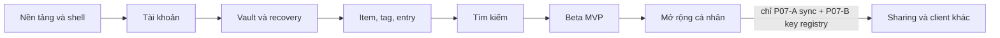

# engram — Bộ spec triển khai theo phase

> Bản 1.0 · 2026-09-15 · Trạng thái: kế hoạch, chưa triển khai.
> Baseline: [SPEC.md](../SPEC.md) v0.7, yêu cầu sản phẩm v0.6 và [mockup UI](../../mockups/README.md) hiện có.

## 1. Cách dùng

Đọc file này, rồi file của phase sắp thực hiện. Spec tổng thể quyết định hành vi/dữ liệu; mockup quyết định thị giác theo §7.0; bộ phase quyết định thứ tự, phạm vi bàn giao và bằng chứng nghiệm thu. Mọi thay đổi contract trong lúc triển khai phải cập nhật spec tổng thể/OpenAPI tương ứng, không để một phase tự tạo luật trái spec.

`P01`–`P08` là **phase triển khai**, thay cách đánh số cũ để tránh nhầm "Phase 1" với toàn bộ MVP:

| Roadmap trước v0.7 | Phase triển khai mới | Điều kiện hoàn thành |
|---|---|---|
| Phase 1 — MVP, M1–M6 | P01–P06 | Hoàn tất toàn bộ gate P06, không chỉ có giao diện demo |
| Phase 2 — Mở rộng | P07 | Các mốc bắt buộc P07; phần tuỳ chọn có quyết định phạm vi riêng |
| Phase 3 — Sharing/client khác | P08 | Sharing, extension và API token; native mobile vẫn conditional |

P01–P06 đủ chi tiết để chia task triển khai. P07–P08 có mục tiêu, contract/invariant và acceptance cho từng mốc, nhưng phải hoàn tất các quyết định được liệt kê ở đầu phase trước khi code tính năng liên quan. Không tự đưa các phần hậu MVP vào MVP.

## 2. Danh sách phase

| Phase / spec | Đầu ra dùng được | Phụ thuộc | Cổng nghiệm thu |
|---|---|---|---|
| [P01 — Nền tảng và UI shell](P01-foundation.md) | Local stack, CI, token app, landing demo, shell responsive | Repo/spec/mockup hiện tại | Build + health + đối chiếu thị giác |
| [P02 — Tài khoản và session](P02-auth.md) | Signup/login OAuth/password, settings tài khoản, re-auth, audit/session | P01 | Auth thật, chặn truy cập sai user, re-auth đúng action |
| [P03 — Vault và recovery](P03-vault.md) | Passphrase + 10 RK + PRF passkey + DevKey, auto-lock, rewrap/recovery | P02 | Crypto vector + recovery/concurrency + thiết bị mới |
| [P04 — Item, tag và entry](P04-content.md) | Lưu/sửa text và JSON lossless, quick-add, duplicate picker, dữ liệu bền vững | P03; shell P01 | Một vòng tạo → sửa → mở lại → xoá/restore bằng dữ liệu thật |
| [P05 — Tìm kiếm](P05-search.md) | Prefix/fuzzy + semantic, ranking ổn định, jobs, exact/HNSW, model rollout | P04 | Relevance/performance + semantic không làm nhảy lexical |
| [P06 — Beta MVP](P06-beta.md) | Export, docs/privacy, QA tổng thể, quan sát/backup/restore, deploy | P01–P05 | Không còn blocker MVP; bằng chứng release và DR |
| [P07 — Mở rộng cá nhân](P07-personal-expansion.md) | Rotate VK, import backup, sync, body search, media, passkey login | P06 | Mỗi mốc mở rộng có migration/recovery và acceptance riêng |
| [P08 — Sharing và client khác](P08-sharing-clients.md) | Chia sẻ read-only, extension, API token scoped | P06; **P07-A (sync/resync) và P07-B (key registry + rotate VK)** — không cần trọn P07 | Quyền truy cập + key lifecycle qua nhiều user/client |

Đây là thứ tự **bàn giao**, không yêu cầu đợi mọi việc mới bắt đầu đọc/thiết kế phần sau. Có thể thiết kế mockup P03 trong P02 và benchmark parser JSON khi làm crypto, nhưng không đánh dấu phase downstream xong khi dependency chưa qua gate. Chỉ lập lịch theo tuần sau khi biết nhân lực/hardware; mốc 8–10 tuần cũ không còn được xem là cam kết cho toàn bộ phạm vi này.

## 3. Quy tắc chung cho mọi phase

- Tên sản phẩm luôn `engram`; repo và tiền tố protocol `sabk` hiện tại giữ nguyên. Không đổi tên cookie, IndexedDB, hash domain/AAD chỉ vì rebrand.
- UI port từ [tokens.css](../../mockups/tokens.css), [tw.js](../../mockups/tw.js) và HTML hiện có. Giữ Plus Jakarta Sans / Inter / Sometype Mono theo vai trò hiện tại; không thay font/accent/layout tuỳ hứng. Tailwind Play CDN và Google Fonts import của demo không được bê nguyên vào production; build CSS, phục vụ font phù hợp CSP nhưng giữ hình thức.
- Hành vi mock chỉ để minh hoạ: không dùng `window.SAK`, dữ liệu `__raw`/`__pairs`, toast giả hoặc `data-plain` làm logic production. Riêng landing cho phép fixture công khai, tách khỏi session/vault/API dữ liệu người dùng.
- Màn chưa có mockup phải có bản thiết kế trong `mockups/` và cập nhật §7.0 **trước khi implement màn đó**. Đây là bước trong phase, không trì hoãn mọi thiết kế đến P06. Toàn bộ màn MVP (U1–U20) đã có file trong `mockups/`; phần còn thiếu là các ô ghi "bổ sung" bên trong file đã có, và các màn P07/P08.
- En/vi, light/dark, keyboard, loading/error và responsive đi cùng tính năng từ đầu. So mockup ở tối thiểu 390px và 1440px, kiểm tra thêm 768px; bảng được scroll trong container, không làm tràn cả trang. Tôn trọng reduced motion, focus và contrast ≥ 4.5:1 cho text thường.
- Server không nhận plaintext body, passphrase mã hoá, RK, VK hoặc PWK; cả log/telemetry cũng vậy. Name/tag/hint là plaintext. Mọi query/mutation kiểm tra user, kể cả ID liên quan, jobs và export.
- OpenAPI/schema/test case được cập nhật cùng behavior. Các route bổ sung ghi trong phase là **contract cần bổ sung** vào OpenAPI và §9 trước khi implement, không giả định endpoint đó đã có.
- A11y/security/test quan trọng thuộc gate của phase phát sinh. P06 kiểm tra tích hợp và release, không phải nơi làm bù toàn bộ các control còn thiếu.

## 4. Bản đồ màn hình và mockup

| UI ID | Màn/cụm | Chuẩn hiện có / thiết kế cần thêm | Phase phụ trách |
|---|---|---|---|
| U1 | Landing, demo omnibox công khai | [landing.html](../../mockups/landing.html) | P01; copy/docs/release P06 |
| U2 | Header, rail tag, vault pill, app shell | [index.html](../../mockups/index.html) | P01; wiring P02–P05 |
| U3 | Passphrase + lưới 10 RK + add passkey | [onboarding.html](../../mockups/onboarding.html) | P03-A/B |
| U4 | Unlock máy mới, RK recovery, re-auth handoff | [unlock.html](../../mockups/unlock.html), [recovery.html](../../mockups/recovery.html); re-auth handoff ở [auth.html](../../mockups/auth.html) | P03 |
| U5 | Locked state trong app | [index.html](../../mockups/index.html), [item.html](../../mockups/item.html) | P03; tích hợp dữ liệu P04 |
| U6 | Settings tài khoản | [settings.html](../../mockups/settings.html) `#taikhoan`; bổ sung các dialog còn thiếu | P02 |
| U7 | Settings passphrase, RK, passkey, phiên, audit, reset | [settings.html](../../mockups/settings.html) `#baomat` | Session/audit base P02; vault P03; reset với entries P04 |
| U8 | Quick-add và token tag | [index.html](../../mockups/index.html) | P04; suggestion P05 |
| U9 | Chọn giữa các mục trùng tên | [index.html](../../mockups/index.html) + dialog trong [mock.js](../../mockups/mock.js) | P04 |
| U10 | Mục gần đây | [index.html](../../mockups/index.html) | P04 |
| U11 | Name, hint, tag, danh sách entry | [item.html](../../mockups/item.html) | P04 |
| U12 | Text xem/sửa/copy | [item.html](../../mockups/item.html) | P04 |
| U13 | JSON table/raw, lồng nhau, source-span edit | [item.html](../../mockups/item.html) | P04 |
| U14 | Import JSON vào một item | [item.html](../../mockups/item.html) `#importDlg` | P04; khác import toàn bộ backup ở P07 |
| U15 | Lexical rồi Gần nghĩa | [index.html](../../mockups/index.html) | P05 |
| U16 | Settings semantic | [settings.html](../../mockups/settings.html) `#timkiem` | P05 |
| U17 | Export encrypted/decrypted, xoá tài khoản | [settings.html](../../mockups/settings.html) `#dulieu`; bổ sung encrypted export/progress/confirm | P06 |
| U18 | Empty/error/offline/degraded | [states.html](../../mockups/states.html); mỗi phase bổ sung state của mình | P02 auth, P03 vault, P04 data, P05 search; P06 rà đủ |
| U19 | Signup/login/OAuth return/re-auth | [auth.html](../../mockups/auth.html) | P02 |
| U20 | Docs/privacy | [docs.html](../../mockups/docs.html) | P06 |

## 5. Chênh lệch mockup cần giải quyết khi port

Đây là backlog cụ thể đọc từ source mockup ngày 2026-09-15, không phải yêu cầu thay toàn bộ thiết kế. Giữ layout/token; điều chỉnh copy, state hoặc interaction theo spec rồi cập nhật mockup liên quan trong phase chủ quản.

| Chênh lệch | Contract phải theo | Chủ quản |
|---|---|---|
| `settings.html` nói bản in RK trước lần đổi passphrase cũng ngừng hoạt động | Đổi passphrase không đổi VK/RK; consume chỉ xoá wrapper live, backup copy vẫn dùng được | P03 |
| Nút "Thu hồi tất cả" RK và số slot mock | Hành động MVP là rotate đủ 10 wrap mới + xác nhận lưu + re-auth; không xoá hết rồi để không có key mới | P03 |
| `mock.js` giữ plaintext trong `dataset.plain` khi lock | Production phải xoá plaintext cache/DOM/editor state và VK; không chỉ che CSS | P03/P04 |
| Mock autocomplete `Tab`, picker và Undo chỉ chạy một phần | Theo §3.4/§3.5: item Tab điền `name: `, tag Tab điền token; picker gắn ID; Undo thực sự hoàn tác mutation | P04/P05 |
| Import demo dùng `JSON.parse`; renderer dùng `__raw`/`__pairs` | Parser có spans, raw text là nguồn lưu, key order/duplicates/number lexeme thật được giữ | P04 |
| Settings có "Nhúng lại tất cả", nói user bật lại sẽ re-embed | User toggle vẫn index; `ReembedAll` là tác vụ vận hành. Không tự thêm quyền chạy toàn bộ job cho user | P05 |
| Settings dữ liệu chỉ thể hiện export decrypted | MVP có cả encrypted và decrypted; phân biệt re-auth/cảnh báo/đầu ra và lỗi từng loại | P06 |

## 6. Bao phủ yêu cầu và quyết định còn thiếu

| Nhóm yêu cầu gốc | Owner / gate | Ghi chú phạm vi |
|---|---|---|
| US1 | P02 + P03 | Onboarding không hoàn tất nếu thiếu 10 RK |
| US2, US4–US8 | P04 | JSON import entry nằm trong MVP |
| US3 | P05 | Prefix/fuzzy + semantic hai corpus |
| US9–US11, US13, US15–US17 | P03; P04 kiểm chứng trên dữ liệu thật | Passkey unlock/remembered device là MVP |
| US12 | P02 locale/theme, P03 auto-lock | Settings en/vi và auto-lock 5/15/60 phút hoặc không bao giờ (`auto_lock_minutes=0`), mặc định 15 |
| US14 | P06 | Encrypted/decrypted export đều MVP |
| §8–§9 CRUD/changes | P04 | Delta timestamp MVP; SSE/cursor bền vững thêm ở P07 |
| §10 security/privacy/DR | Từng phase; gate phát hành P06 | Không đợi cuối mới làm tenant checks/CSP/CSRF |
| Login-with-passkey, media, backup import, rotate VK | P07 | Chưa thuộc MVP |
| Sharing, extension, API token | P08 | Mobile, JSON Schema, ConnectRPC chỉ làm khi scope được chốt |

Các khoảng trống cần đóng đúng phase, không hỏi lại các quyết định đã có:

- **P01:** route web thống nhất dưới `/app`; dev proxy cùng origin cho cookie/CSP; một cấu hình feature `noop` không quảng cáo semantic available.
- **P02:** contract account/email/password/link identity/audit còn thiếu ở §9; OAuth re-auth phải nêu mức đảm bảo từng provider, không coi callback silent là password re-entry.
- **P03:** byte layout wrap, chuẩn hoá RK, lifetime WebAuthn challenge và verify registration. Mockup onboarding/unlock/recovery đã có, còn phải chốt contract tương ứng. Có ADR + vector trước crypto implementation theo §11.4.
- **P04:** exact name lookup có pagination (không dùng top-K suggestion đoán số trùng), phục hồi Item/Tag để Undo có nghĩa, conflict/If-Match và retry quick-add nhiều mutation; entry delta với deletion.
- **P05:** quota item/tag/semantic cho `limit`, cache snapshot/selection, SQL plan và ngưỡng benchmark; quản lý active/pending embedding generation và provider tương ứng.
- **P06:** format export hoàn chỉnh, endpoint xoá tài khoản và retention, nơi lưu export job/output, DR runbook; không xem smoke test là pentest/crypto review.
- **P07/P08:** xem bảng quyết định đầu file; phần chưa định nghĩa phải có ADR/mockup/OpenAPI trước code.

Khuyến nghị Q2/Q3 đang dùng để chia phase: JSON freeform, 20 tag/item, 200 entry/item, 256 KiB/entry. Đây là baseline triển khai của spec, không đánh dấu user đã đưa ra quyết định mới ngoài baseline đó.

## 7. Bằng chứng nghiệm thu

Mỗi phase dùng checklist có ID trong file riêng. Khi thực hiện, lưu kết quả vào `docs/phases/evidence/Pxx.md` (file tương lai): revision code, môi trường/runtime, mockup revision, lệnh kiểm tra/kết quả, screenshot bằng dữ liệu giả, giới hạn chưa xác minh và checklist đạt/chưa đạt. Chỉ có kế hoạch/test case không tính là test đã pass; blocker bắt buộc còn mở thì phase chưa Done.

P06 phát hành khi toàn bộ MVP có đường chạy thật, vượt gate tích hợp, privacy copy đúng, kiểm tra crypto theo quy định repo hoàn tất và restore rehearsal có kết quả. P07/P08 chưa triển khai không chặn beta. Việc tạo tài liệu này không tạo task bên ngoài, commit, deploy hoặc tự bắt đầu code.
